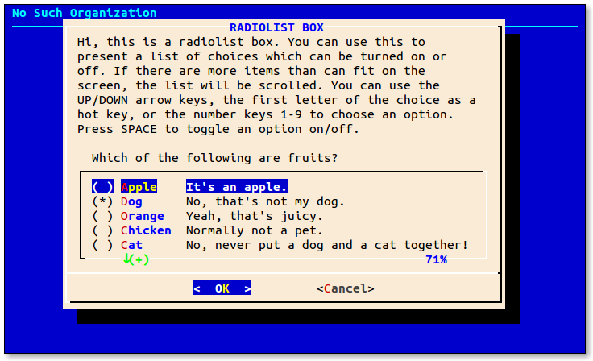
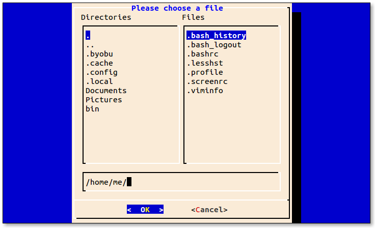
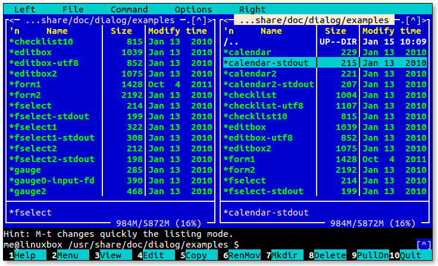
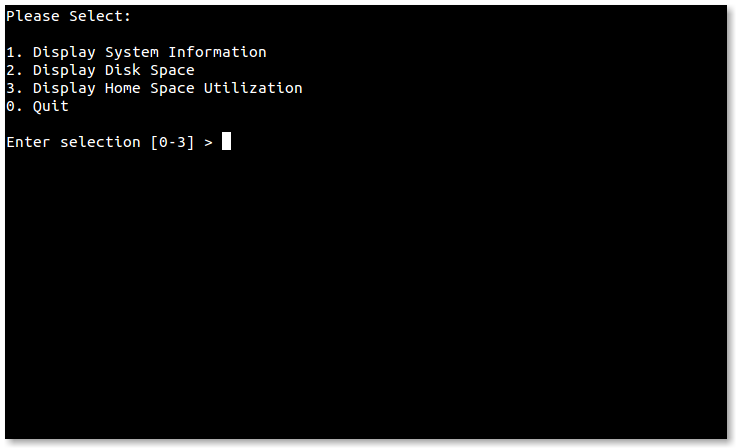
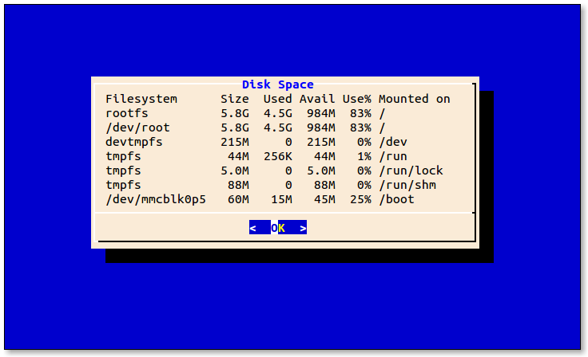

+++
title = "dialog"
weight = 6
date = 2023-06-08T14:00:15+08:00
description = ""
isCJKLanguage = true
draft = false
+++

# dialog

https://linuxcommand.org/lc3_adv_dialog.php

If we look at contemporary software, we might be surprised to learn that the majority of code in most programs today has very little to do with the real work for which the program was intended. Rather, the majority of code is used to create the user interface. Modern graphical programs need large amounts of CPU time and memory for their sophisticated eye candy. This helps explain why command line programs usually use so little memory and CPU compared to their GUI counterparts.

Still, the command line interface is often inconvenient. If only there were some way to emulate common graphical user interface features on a text display.

In this adventure, we’re going to look at `dialog`, a program that does just that. It displays various kinds of *dialog boxes* that we can incorporate into our shell scripts to give them a much friendlier face. `dialog` dates back a number of years and is now just one member of a family of programs that attempt to solve the user interface problem for command line users. The More Redirection adventure is a suggested prerequisite to this adventure.

## Features

`dialog` is a fairly large and complex program (it has almost 100 command line options), but compared to the typical graphical user interface, it’s a real lightweight. Still, it is capable of many user interface tricks. With `dialog`, we can generate the following types of dialog boxes (version 1.2 shown):

| Dialog           | Option          | Description                                                  |
| :--------------- | :-------------- | :----------------------------------------------------------- |
| Build List       | `--buildlist`   | Displays two lists, side-by-side. The list on the left contains unselected items, the list on the right selected items. The user can move items from one list to the other. |
| Calendar         | `--calendar`    | Displays a calendar and allow the user to select a date.     |
| Checklist        | `--checklist`   | Presents a list of choices and allow the user to select one or more items. |
| Directory Select | `--dselect`     | Displays a directory selection dialog.                       |
| Edit Box         | `--editbox`     | Displays a rudimentary text file editor.                     |
| Form             | `--form`        | Allows the user to enter text into multiple fields.          |
| File Select      | `--fselect`     | A file selection dialog.                                     |
| Gauge            | `--gauge`       | Displays a progress indicator showing the percentage of completion. |
| Info Box         | `--infobox`     | Displays a message (with an optional timed pause) and terminates. |
| Input Box        | `--inputbox`    | Prompts the user to enter/edit a text field.                 |
| Menu Box         | `--menubox`     | Displays a list of choices.                                  |
| Message Box      | `--msgbox`      | Displays a text message and waits for the user to respond.   |
| Password Box     | `--passwordbox` | Similar to an input box, but hides the user’s entry.         |
| Pause            | `--pause`       | Displays a text message and a countdown timer. The dialog terminates when the timer runs out or when the user presses either the OK or Cancel button. |
| Program Box      | `--programbox`  | Displays the output of a piped command. When the command completes, the dialog waits for the user to press an OK button. |
| Progress Box     | `--progressbox` | Similar to the program box except the dialog terminates when the piped command completes, rather than waiting for the user to press OK. |
| Radio List       | `--radiolist`   | Displays a list of choices and allows the user to select a single item. Any previously selected item becomes unselected. |
| Range Box        | `--rangebox`    | Allows the user to select a numerical value from within a specified range using a keyboard-based slider. |
| Tail Box         | `--tailbox`     | Displays a text file with real-time updates. Works like the command `tail -f`. |
| Text Box         | `--textbox`     | A simple text file viewer. Supports many of the same keyboard commands as `less`. |
| Time Box         | `--timebox`     | A dialog for entering a time of day.                         |
| Tree View        | `--treeview`    | Displays a list of items in a tree-shaped hierarchy.         |
| Yes/No Box       | `--yesno`       | Displays a text message and gives the user a chance to respond with either “Yes” or “No.” |

Here are some examples:

Screen shot of the yesno dialog

Screen shot of the radiolist dialog

Screen shot of the fselect dialog

## Availability

dialog is available from most distribution repositories as the package “dialog”. Besides the program itself, the dialog package includes a fairly comprehensive man page and a large set of sample programs that demonstrate the various dialog boxes it can display. After installation on a Debian-based system, these sample programs can be found in the `/usr/share/doc/dialog/examples` directory. Other distributions are similar.

By the way, using [Midnight Commander](https://linuxcommand.org/lc3_adv_mc.php) to browse the examples directory is a great way to run the example programs and to study the scripts themselves:

Browsing the examples with Midnight Commander

## How it Works

On the surface, `dialog` appears straightforward. We launch `dialog` followed by one or more common options (options that apply regardless of the desired dialog box) and then the box option and its associated parameters. The tricky part of using `dialog` is getting data out of it.

The data that `dialog` takes in (such as a string entered into a input box) is normally returned on standard error. This is because `dialog` uses standard output to display text on the terminal when it is drawing the dialog box itself. There are a couple of techniques we can use to handle the returned data. Let’s take a look at them.

### Method 1: Store the Results in a Temporary File

The first method is to use a temporary file. The sample programs supplied with `dialog` provide some examples (this script has been modified from the original for clarity):

```
#!/bin/bash

# inputbox - demonstrate the input dialog box with a temporary file

# Define the dialog exit status codes
: ${DIALOG_OK=0}
: ${DIALOG_CANCEL=1}
: ${DIALOG_HELP=2}
: ${DIALOG_EXTRA=3}
: ${DIALOG_ITEM_HELP=4}
: ${DIALOG_ESC=255}

# Create a temporary file and make sure it goes away when we're dome
tmp_file=$(tempfile 2>/dev/null) || tmp_file=/tmp/test$$
trap "rm -f $tmp_file" 0 1 2 5 15

# Generate the dialog box
dialog --title "INPUT BOX" \
  --clear  \
  --inputbox \
"Hi, this is an input dialog box. You can use \n
this to ask questions that require the user \n
to input a string as the answer. You can \n
input strings of length longer than the \n
width of the input box, in that case, the \n
input field will be automatically scrolled. \n
You can use BACKSPACE to correct errors. \n\n
Try entering your name below:" \
16 51 2> $tmp_file

# Get the exit status
return_value=$?

# Act on it
case $return_value in
  $DIALOG_OK)
    echo "Result: `cat $tmp_file`";;
  $DIALOG_CANCEL)
    echo "Cancel pressed.";;
  $DIALOG_HELP)
    echo "Help pressed.";;
  $DIALOG_EXTRA)
    echo "Extra button pressed.";;
  $DIALOG_ITEM_HELP)
    echo "Item-help button pressed.";;
  $DIALOG_ESC)
    if test -s $tmp_file ; then
      cat $tmp_file
    else
      echo "ESC pressed."
    fi
    ;;
esac
```

The first part of the script defines some constants that are used to represent the six possible exit status values supported by `dialog`. They are used to tell the calling script which button on the dialog box (or alternately, the Esc key) was used to terminate the dialog. The construct used to do this is somewhat interesting. First, each line begins with the null command “:” which is a command that does nothing. Yes, really. It intentionally does nothing, because sometimes we need a command (for syntax reasons) but don’t actually want to do anything. Following the null command is a parameter expansion. The expansion is similar in form to one we covered in Chapter 34 of TLCL:

```
${`*parameter*`:=`*value*`}
```

This sets a default value for a parameter (variable) that is either unset (it does not exist at all), or is set, but empty. The author of the example code is being very cautious here and has removed the colon from the expansion. This changes the meaning of the expansion to mean that a default value is set only if the parameter is unset rather than unset or empty.

The next part of the example creates a temporary file named `tmp_file` by using the `tempfile` command, which is a program used to create a temporary file in a secure manner. Next, we set a trap to make sure that the temporary file is deleted if the program is somehow terminated. Neatness counts!

At last, we get to the `dialog` command itself. We start off setting a title for the input box and specify the `--clear` option to tell `dialog` that we want to erase any previous dialog box from the screen. Next, we indicate the type of dialog box we want and its required arguments. These include the text to be displayed above the input field, and the desired height and width of the box. Though the example specifies exact dimensions for the box, we could also specify zero for both values and `dialog` will attempt to automatically determine the correct size.

Since `dialog` normally outputs its results to standard error, we redirect its file descriptor to our temporary file for storage.

The last thing we have to do is collect the exit status of the command in a variable (`return_value`) so that we can figure out which button the user pressed to terminate the dialog box. At the end of the script, we look at this value and act accordingly.

### Method 2: Use Command Substitution and Redirection

The second method of receiving data from `dialog` involves redirection. In the script that follows, we pass the results from `dialog` to a variable rather than a file. To do this, we need to first perform some redirection.

```
#!/bin/bash

# inputbox - demonstrate the input dialog box with redirection

# Define the dialog exit status codes
: ${DIALOG_OK=0}
: ${DIALOG_CANCEL=1}
: ${DIALOG_HELP=2}
: ${DIALOG_EXTRA=3}
: ${DIALOG_ITEM_HELP=4}
: ${DIALOG_ESC=255}

# Duplicate (make a backup copy of) file descriptor 1 
# on descriptor 3
exec 3>&1
 
# Generate the dialog box while running dialog in a subshell
result=$(dialog \
  --title "INPUT BOX" \
  --clear  \
  --inputbox \
"Hi, this is an input dialog box. You can use \n
this to ask questions that require the user \n
to input a string as the answer. You can \n
input strings of length longer than the \n
width of the input box, in that case, the \n
input field will be automatically scrolled. \n
You can use BACKSPACE to correct errors. \n\n
Try entering your name below:" \
16 51 2>&1 1>&3)

# Get dialog's exit status
return_value=$?

# Close file descriptor 3
exec 3>&-

# Act on the exit status
case $return_value in
  $DIALOG_OK)
    echo "Result: $result";;
  $DIALOG_CANCEL)
    echo "Cancel pressed.";;
  $DIALOG_HELP)
    echo "Help pressed.";;
  $DIALOG_EXTRA)
    echo "Extra button pressed.";;
  $DIALOG_ITEM_HELP)
    echo "Item-help button pressed.";;
  $DIALOG_ESC)
    if test -n "$result" ; then
      echo "$result"
    else
      echo "ESC pressed."
    fi
    ;;
esac
```

At first glance, the redirection may seem nonsensical. First, we duplicate file descriptor 1 (stdout) to descriptor 3 using `exec` (this was covered in [More Redirection](https://linuxcommand.org/lc3_adv_redirection.php)) to create a backup copy of descriptor 1.

The next step is to perform a command substitution and assign the output of the dialog command to the variable `result`. The command includes redirections of descriptor 2 (stderr) to be the duplicate of descriptor 1 and lastly, descriptor 1 is restored to its original value by duplicating descriptor 3 which contains the backup copy. What might not be immediately apparent is why the last redirection is needed. Inside the subshell, standard output (descriptor 1) does not point to the controlling terminal. Rather, it is pointing to a pipe that will deliver its contents to the variable `result`. Since dialog needs standard output to point to the terminal so that it can display the input box, we have to redirect standard error to standard output (so that the output from `dialog` ends up in the `result` variable), then redirect standard output back to the controlling terminal.

So, which method is better, temporary file or command substitution? Probably command substitution, since it avoids file creation.

## Before and After

Now that we have a basic grip on how to use `dialog`, let’s apply it to a practical example.

Here we have an “ordinary” script. It’s a menu-driven system information program similar to one discussed in Chapter 29 of TLCL:

```
#!/bin/bash

# while-menu: a menu-driven system information program

DELAY=3 # Number of seconds to display results

while true; do
  clear
  cat << _EOF_
Please Select:

1. Display System Information
2. Display Disk Space
3. Display Home Space Utilization
0. Quit

_EOF_

  read -p "Enter selection [0-3] > "

  if [[ $REPLY =~ ^[0-3]$ ]]; then
    case $REPLY in
      1)
        echo "Hostname: $HOSTNAME"
        uptime
        sleep $DELAY
        continue
        ;;
      2)
        df -h
        sleep $DELAY
        continue
        ;;
      3)
        if [[ $(id -u) -eq 0 ]]; then
          echo "Home Space Utilization (All Users)"
          du -sh /home/* 2> /dev/null
        else
          echo "Home Space Utilization ($USER)"
          du -sh $HOME 2> /dev/null
        fi
        sleep $DELAY
        continue
        ;;
      0)
        break
        ;;
    esac
  else
    echo "Invalid entry."
    sleep $DELAY
  fi
done
echo "Program terminated."
```

A script displaying a text menu

The script displays a simple menu of choices. After the user enters a selection, the selection is validated to make sure it is one of the permitted choices (the numerals 0-3) and if successfully validated, a `case` statement is used to carry out the selected action. The results are displayed for the number of seconds defined by the `DELAY` constant, after which the whole process is repeated until the user selects the menu choice to exit the program.

Here is the script modified to use `dialog` to provide a new user interface:

```
#!/bin/bash

# while-menu-dialog: a menu driven system information program

DIALOG_CANCEL=1
DIALOG_ESC=255
HEIGHT=0
WIDTH=0

display_result() {
  dialog --title "$1" \
    --no-collapse \
    --msgbox "$result" 0 0
}

while true; do
  exec 3>&1
  selection=$(dialog \
    --backtitle "System Information" \
    --title "Menu" \
    --clear \
    --cancel-label "Exit" \
    --menu "Please select:" $HEIGHT $WIDTH 4 \
    "1" "Display System Information" \
    "2" "Display Disk Space" \
    "3" "Display Home Space Utilization" \
    2>&1 1>&3)
  exit_status=$?
  exec 3>&-
  case $exit_status in
    $DIALOG_CANCEL)
      clear
      echo "Program terminated."
      exit
      ;;
    $DIALOG_ESC)
      clear
      echo "Program aborted." >&2
      exit 1
      ;;
  esac
  case $selection in
    1 )
      result=$(echo "Hostname: $HOSTNAME"; uptime)
      display_result "System Information"
      ;;
    2 )
      result=$(df -h)
      display_result "Disk Space"
      ;;
    3 )
      if [[ $(id -u) -eq 0 ]]; then
        result=$(du -sh /home/* 2> /dev/null)
        display_result "Home Space Utilization (All Users)"
      else
        result=$(du -sh $HOME 2> /dev/null)
        display_result "Home Space Utilization ($USER)"
      fi
      ;;
  esac
done
```

Script displaying a dialog menu

Displaying results with a msgbox

As we can see, the script has some structural changes. First, we no longer have to validate the user’s selection. The menu box only allows valid choices. Second, there is a function defined near the beginning to display the output of each selection.

We also notice that several of `dialog`’s common options have been used:

- **`--no-collapse`** prevents `dialog` from reformatting message text. Use this when the exact presentation of the text is needed.
- **`--backtitle`** sets the title of the background under the dialog box.
- **`--clear`** clears the background of any previous dialog box.
- **`--cancel-label`** sets the string displayed on the “cancel” button. In this script, it is set to “Exit” since that is a better description of the action taken when it is selected.

## Limitations

While it’s true that `dialog` can produce many kinds of dialog boxes, care must be taken to remember that `dialog` has significant limitations. Some of the dialog boxes have rather odd behaviors compared to their traditional GUI counterparts. For example, the edit box used to edit text files cannot perform cut and paste and files to be edited cannot contain tab characters. The behavior of the file box is more akin to the shell’s tab completion feature than to a GUI file selector.

## Summing Up

The shell is not really intended for large, interactive programs, but using `dialog` can make small to moderate interactive programs possible. It provides a useful variety of dialog boxes, allowing many types of user interactions which would be very difficult to implement with the shell alone. If we keep our expectations modest, `dialog` can be a great tool.

## Further Reading

- The dialog man page is well-written and contains a complete listing of its numerous options.
- dialog normally includes a large set of example programs which can be found in the `/usr/share/doc/dialog` directory.
- The dialog project home page can be found at https://invisible-island.net/dialog/