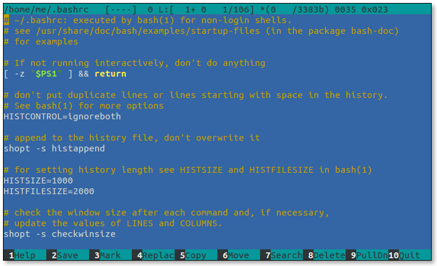
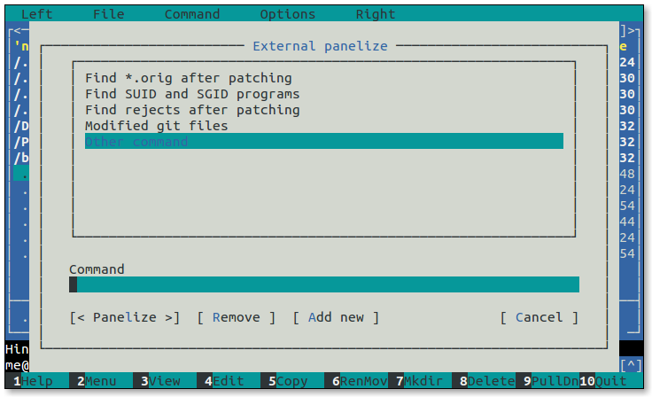

+++
title = "Midnight Commander"
weight = 1
date = 2023-06-08T13:58:44+08:00
description = ""
isCJKLanguage = true
draft = false
+++

# Midnight Commander

https://linuxcommand.org/lc3_adv_mc.php

At the beginning of Chapter 4 in TLCL there is a discussion of GUI-based file managers versus the traditional command line tools for file manipulation such as `cp`, `mv`, and `rm`. While many common file manipulations are easily done with a graphical file manager, the command line tools provide additional power and flexibility.

In this adventure we will look at Midnight Commander, a character-based directory browser and file manager that bridges the two worlds of the familiar graphical file manager and the common command line tools.

The design of Midnight Commander is based on a common concept in file managers: dual directory panes where the listings of two directories are shown at the same time. The idea is that files are moved or copied from the directory shown in one pane to the directory shown in the other. Midnight Commander can do this, and much, much more.

## Features

Midnight Commander is quite powerful and boasts an extensive set of features:

- Performs all the common file and directory manipulations such as copying, moving, renaming, linking, and deleting.
- Allows manipulation of file and directory permissions.
- Can treat remote systems (via FTP or SSH) as though they were local directories.
- Can treat archive files (like .tar and .zip) as though they were local directories.
- Allows creation of a user-defined “hotlist” of frequently used directories.
- Can search for files based on file name or file contents, and treat the search results like a directory.

## Availability

[Midnight Commander](http://www.midnight-commander.org/) is part of the GNU project. It is installed by default in some Linux distributions, and is almost always available in every distribution’s software repositories as the package “mc”.

## Invocation

To start Midnight Commander, enter the command `mc` followed optionally by either 1 or 2 directories to browse at start up.

## Screen Layout

Midnight Commander screen layout

1. **Left and Right Directory Panels**

   The center portion of the screen is dominated by two large *directory panels*. One of the two panels (called the *current panel*) is active at any one time. To change which panel is the current panel, press the `Tab` key.

2. **Function Key Labels**

   The bottom line on the display contains function key (F1-F10) shortcuts to the most commonly used functions.

3. **Menu Bar**

   The top line of the display contains a set of pull-down menus. These can be activated by pressing the `F9` key.

4. **Command Line**

   Just above the function key labels there is a shell prompt. Commands can be entered in the usual manner. One especially useful command is `cd` followed by a directory pathname. This will change the directory shown in the current directory panel.

5. **Mini-Status Line**

   At the very bottom of the directory panel and above the command line is the *mini-status line*. This area is used to display supplemental information about the currently selected item such as the targets of symbolic links.

## Using the Keyboard and Mouse

Being a character-based application with a lot of features means Midnight Commander has a lot of keyboard commands, some of which it shares with other applications; others are unique. This makes Midnight Commander a bit challenging to learn. Fortunately, Midnight Commander also supports mouse input on most terminal emulators (and on the console if the `gpm` package is installed), so it’s easy to pick up the basics. Learning the keyboard commands is needed to take full advantage of the program’s features, however.

Another issue when using the keyboard with Midnight Commander is interference from the window manager and the terminal emulator itself. Many of the function keys and Alt-key combinations that Midnight Commander uses are intercepted for other purposes by the terminal and window manager.

To work around this problem, Midnight Commander allows the `Esc` key to function as a Meta-key. In cases where a function key or Alt-key combination is not available due to interference from outside programs, use the `Esc` key instead. For example, to input the `F1` key, press and release the `Esc` key followed by the “1” key (use “0” for `F10`). The same method works with troublesome Alt-key combinations. For example, to enter `Alt-t`, press and release the `Esc` key followed by the “t” key. To close dialog boxes in Midnight Commander, press the `Esc` key twice.

## Navigation and Browsing

Before we start performing file operations, it’s important to learn how to use the directory panels and navigate the file system.

As we can see, there are two directory panels, the left panel and the right panel. At any one time, one of the panels is active and is called the *current panel*. The other panel is conveniently called the *other panel* in the Midnight Commander documentation.

The current panel can be identified by the highlighted bar in the directory listing, which can be moved up and down with the arrow keys, `PgUp`, `PgDn`, etc. Any file or directory which is highlighted is said to be *selected*.

Select a directory and press `Enter`. The current directory panel will change to the selected directory. Highlighting the topmost item in the listing selects the parent directory. It is also possible to change directories directly on the command line below the directory panels. To do so, simply enter `cd` followed by a path name as usual.

Pressing the `Tab` key switches the current panel.

### Changing the Listing Format

The directory listing can be displayed in several different formats. Pressing `Alt-t` cycles through them. There is a dual column format, a format resembling the output of `ls -l`, and others.

There is also an “information mode.” This will display detailed file system information in the other panel about the selected item in the current panel. To invoke this mode, type `Ctrl-x i`. To return the other panel to its normal state, type `Ctrl-x i` again.

Directory panel in information mode

### Setting the Directory on the Other Panel

It is often useful to select a directory in the current panel and have its contents listed on the other panel; for example, when moving files from a parent directory into a subdirectory. To do this, select a directory and type `Alt-o`. To force the other panel to list the same directory as the current panel, type `Alt-i`.

### The Directory Hotlist

Midnight Commander can store a list of frequently visited directories. This “hotlist” can displayed by pressing `Ctrl-\`.

Directory hotlist

To add a directory to the hotlist while browsing, select a directory and type `Ctrl-x h`.

### Directory History

Each directory panel maintains a list of directories that it has displayed. To access this list, type `Alt-H`. From the list, a directory can be selected for browsing. Even without the history list display, we can traverse the history list forward and backward by using the `Alt-u` and `Alt-y` keys respectively.

### Using the Mouse

We can perform many Midnight Commander operations using the mouse. A directory panel item can be selected by clicking on it and a directory can be opened by double clicking. Likewise, the function key labels and menu bar items can be activated by clicking on them. What is not so apparent is that the directory history can be accessed and traversed. At the top of each directory panel there are small arrows (circled in the image below). Clicking on them will show the directory history (the up arrow) and move forward and backward through the history list (the right and left arrows).

There is also an arrow to the extreme lower right edge of the command line which reveals the command line history.

Directory and command line history mouse controls

## Viewing and Editing Files

An activity often performed while directory browsing is examining the content of files. Midnight Commander provides a capable file viewer which can be accessed by selecting a file and pressing the `F3` key.

File viewer

As we can see, when the file viewer is active, the function key labels at the bottom of the screen change to reveal viewer features. Files can be searched and the viewer can quickly go to any position in the file. Most importantly, files can be viewed in either ASCII (regular text) or hexadecimal, for those cases when we need a really detailed view.

File viewer in hexadecimal mode

It is also possible to put the other panel into “quick view” mode to view the currently selected file. This is especially nice if we are browsing a directory full of text files and want to rapidly view the files, as each time a new file is selected in the current panel, it’s instantly displayed in the other. To start quick view mode, type `Ctrl-x q`.

Quick view mode

Once in quick view mode, we can press `Tab` and the focus changes to the other panel in quick view mode. This will change the function key labels to a subset of the full file viewer. To exit the quick view mode, press `Tab` to return to the directory panel and press `Alt-i`.

### Editing

Since we are already viewing files, we will probably want to start editing them too. Midnight Commander accommodates us with the `F4` key, which invokes a text editor loaded with the selected file. Midnight Commander can work with the editor of your choice. On Debian-based systems we are prompted to make a selection the first time we press `F4`. Debian suggests `nano` as the default selection, but various flavors of `vim` are also available along with Midnight Commander’s own built-in editor, `mcedit`. We can try out `mcedit` on its own at the command line for a taste of this editor.

mcedit

## Tagging Files

We have already seen how to select a file in the current directory panel by simply moving the highlight, but operating on a single file is not of much use. After all, we can perform those kinds of operations more easily by entering commands directly on the command line. However, we often want to operate on multiple files. This can be accomplished through *tagging*. When a file is tagged, it is marked for some later operation such as copying. This is why we choose to use a file manager like Midnight Commander. When one or more files are tagged, file operations (such as copying) are performed on the tagged files and selection has no effect.

### Tagging Individual Files

To tag an individual file or directory, select it and press the `Insert` key. To untag it, press the `Insert` key again.

### Tagging Groups of Files

To tag a group of files or directories according to a selection criteria, such as a wildcard pattern, press the `+` key. This will display a dialog where the pattern may be specified.

File tagging dialog

This dialog stores a history of patterns. To traverse it, use Ctrl up and down arrows.

It is also possible to un-tag a group of files. Pressing the `/` key will cause a pattern entry dialog to display.

## We Need a Playground

To explore the basic file manipulation features of Midnight Commander, we need a “playground” like we had in Chapter 4 of TLCL.

### Creating Directories

The first step in creating a playground is creating a directory called, aptly enough, `playground`. First, we will navigate to our home directory, then press the F7 key.

Create Directory dialog

Type “playground” into the dialog and press `Enter`. Next, we want the other panel to display the contents of the playground directory. To do this, highlight the `playground` directory and press `Alt-o`.

Now let’s put some files into our playground. Press `Tab` to switch the current panel to the playground directory panel. We’ll create a couple of subdirectories by repeating what we did to create `playground`. Create subdirectories `dir1` and `dir2`. Finally, using the command line, we will create a few files:

```
me@linuxbox: ~/playground $ touch file1 file2 "ugly file"
```

The playground

### Copying and Moving Files

Okay, here is where things start to get weird.

Select `dir1`, then press `Alt-o` to display `dir1` in the other panel. Select the file `file1` and press F5 to copy (The F6-RenMov command is similar). We are now presented with this formidable-looking dialog box:

Copy dialog

To see Midnight Commander’s default behavior, just press `Enter` and `file1` is copied into directory `dir1` (i.e., the file is copied from the directory displayed in current panel to the directory displayed in the other panel).

That was straightforward, but what if we want to copy `file2` to a file in `dir1` named `file3`? To do this, we select `file2` and press F5 again and enter the new filename into the Copy dialog:

Renaming a file during copy

Again, this is pretty straightforward. But let’s say we tagged a group of files and wanted to copy and rename them as they are copied (or moved). How would we do that? Midnight Commander provides a way of doing it, but it’s a little strange.

The secret is the source mask in the copy dialog. At first glance, it appears that the source mask is simply a file selection wildcard, but first appearances can be deceiving. The mask does filter files as we would expect, but only in a limited way. Unlike the range of wildcards available in the shell, the wildcards in the source mask are limited to “?” (for matching single characters) and "*" (for matching multiple characters). What’s more, the wildcards have a special property.

It works like this: let’s say we had a file name with an embedded space such as “ugly file” and we want to copy (or move) it to `dir1` as the file “uglyfile”, instead. Using the source mask, we could enter the mask "* *" which means break the source file name into two blocks of text separated by a space. This wildcard pattern will match the file `ugly file`, since its name consists of two strings of characters separated by a space. Midnight Commander will associate each block of text with a number starting with 1, so block 1 will contain “ugly” and block 2 will contain “file”. Each block can be referred to by a number as with regular expression grouping. So to create a new file name for our target file without the embedded space, we would specify “\1\2” in the “to” field of the copy dialog like so:

Using grouping

The “?” wildcard behaves the same way. If we make the source mask “???? ????” (which again matches the file `ugly file`), we now have eight pieces of text that we can rearrange at will. For example, we could make the “to” mask “\8\7\6\5\4\3\2\1”, and the resulting file name would be “elifylgu”. Pretty neat.

Midnight Commander can also perform case conversion on file names. To do this, we include some additional escape sequences in the to mask:

- \u Converts the next character to uppercase.
- \U Converts all characters to uppercase until another sequence is encountered.
- \l Converts the next character to lowercase.
- \L Converts all characters to lowercase until another sequence is encountered.

So if we wanted to change the name `ugly file` to camel case, we could use the mask “\u\L\1\u\L\2” and we would get the name `UglyFile`.

### Creating Links

Midnight Commander can create both hard and symbolic links. They are created using these 3 keyboard commands which cause a dialog to appear where the details of the link can be specified:

- `Ctrl-x l` creates a hard link, in the directory shown in the current panel.
- `Ctrl-x s` creates a symbolic link in the directory shown in the other panel, using an absolute directory path.
- `Ctrl-x v` creates a symbolic link in the directory shown in the other panel, using a relative directory path.

The two symbolic link commands are basically the same. They differ only in the fact that the paths suggested in the Symbolic Link dialog are absolute or relative.

We’ll demonstrate creating a symbolic link by creating a link to `file1`. To do this, we select `file1` in the current panel and type `Ctrl-x s`. The Symbolic Link dialog appears and we can either enter a name for the link or we can accept the program’s suggestion. For the sake of clarity, we will change the name to `file1-sym`.

Symbolic link dialog

### Setting File Modes and Ownership

File modes (i.e., permissions) can be set on the selected or tagged files by typing `Ctrl-x c`. Doing so will display a dialog box in which each attribute can be turned on or off. If Midnight Commander is being run with superuser privileges, file ownership can be changed by typing `Ctrl-x o`. A dialog will be displayed where the owner and group owner of selected/tagged files can be set.

Chmod dialog

To demonstrate changing file modes, we will make `file1` executable. First, we will select `file1` and then type `Ctrl-x c`. The Chmod command dialog will appear, listing the file’s mode settings. By using the arrow keys we can select the check box labeled “execute/search by owner” and toggle its setting by using the space bar.

### Deleting Files

Pressing the `F8` key deletes the selected or tagged files and directories. By default, Midnight Commander always prompts the user for confirmation before deletion is performed.

We’re done with our playground for now, so it’s time to clean up. We will enter `cd` at the shell prompt to get the current panel to list our home directory. Next, we will select `playground` and press `F8` to delete the playground directory.

Delete confirmation dialog

## Power Features

Beyond basic file manipulation, Midnight Commander offers a number of additional features, some of which are very interesting.

### Virtual File Systems

Midnight Commander can treat some types of archive files and remote hosts as though they are local file systems. Using the `cd` command at the shell prompt, we can access these.

For example, we can look at the contents of tar files. To try this out, let’s create a compressed tar file containing the files in the `/etc` directory. We can do this by entering this command at the shell prompt:

```
me@linuxbox ~ $ tar czf etc.tgz /etc
```

Once this command completes (there will be some “permission denied” errors but these don’t matter for our purposes), the file `etc.tgz` will appear among the files in the current panel. If we select this file and press `Enter`, the contents of the archive will be displayed in the current panel. Notice that the shell prompt does not change as it does with ordinary directories. This is because while the current panel is displaying a list of files like before, Midnight Commander cannot treat the virtual file system in the same way as a real one. For example, we cannot delete files from the tar archive, but we can copy files from the archive to the real file system.

Virtual file systems can also treat remote file systems as local directories. In most versions of Midnight Commander, both FTP and FISH (FIles transferred over SHell) protocols are supported and, in some versions, SMB/CIFS as well.

As an example, let’s look at the software library FTP site at Georgia Tech, a popular repository for Linux software. Its name is ftp.gtlib.gatech.edu. To connect with `/pub` directory on this site and browse its files, we enter this `cd` command:

```
me@linuxbox ~ $ cd ftp://ftp.gtlib.gatech.edu/pub
```

Since we don’t have write permission on this site, we cannot modify any any files there, but we can copy files from the remote server to our local file system.

The FISH protocol is similar. This protocol can be used to communicate with any Unix-like system that runs a secure shell (SSH) server. If we have write permissions on the remote server, we can operate on the remote system’s files as if they were local. This is extremely handy for performing remote administration. The `cd` command for FISH protocol looks like this:

```
me@linuxbox ~ $ cd sh://user@remotehost/dir
```

### Finding Files

Midnight Commander has a useful file search feature. When invoked by pressing `Alt-?`, the following dialog will appear:

Find dialog

On this dialog we can specify: where the search is to begin, a colon-separated list of directories we would like to skip during our search, any restriction on the names of the files to be searched, and the content of the files themselves. This feature is well-suited to searching large trees of source code or configuration files for specific patterns of text. For example, let’s look for every file in `/etc` that contains the string “bashrc”. To do this, we would fill in the dialog as follows:

Search for files containing “bashrc”

Once the search is completed, we will see a list of files which we can view and/or edit.

Search results

### Panelizing

There is a button at the bottom of the search results dialog labeled “Panelize.” If we click it, the search results become the contents of the current panel. From here, we can act on the files just as we can with any others.

In fact, we can create a panelized list from any command line program that produces a list of path names. For example, the `find` program. To do this, we use Midnight Commander’s “External Panelize” feature. Type `Ctrl-x !` and the External Panelize dialog appears:

External panelize dialog

On this dialog we see a predefined list of panelized commands. Midnight Commander allows us to store commands for repeated use. Let’s try it by creating a panelized command that searches the system for every file whose name has the extension `.JPG` starting from the current panel directory. Select “Other command” from the list and type the following command into the “Command” field:

```
find . -type f -name "*.JPG"
```

After typing the command we can either press `Enter` to execute the command or, for extra fun, we can click the “Add new” button and assign our command a name and save it for future use.

### Sub-shells

We may, at any time, move from the Midnight Commander to a full shell session and back again by pressing `Ctrl-o`. The sub-shell is a copy of our normal shell, so whatever environment our usual shell establishes (aliases, shell functions, prompt strings, etc.) will be present in the sub-shell as well. If we start a long-running command in the sub-shell and press `Ctrl-o`, the command is suspended until we return to the sub-shell. Note that once a command is suspended, Midnight Commander cannot execute any further external commands until the suspended command terminates.

## The User Menu

So far we have avoided discussion of the mysterious `F2` command. This is the user menu, which may be Midnight Commander’s most powerful and useful feature. The user menu is, as the name suggests, a menu of user-defined commands.

When we press the `F2` key, Midnight Commander looks for a file named `.mc.menu` in the current directory. If the file does not exist, Midnight Commander looks for `~/.config/mc/menu`. If that file does not exist, then Midnight Commander falls back to a system-wide menu file named `/usr/share/mc/mc.menu`.

The neat thing about this scheme is that each directory can have its own set of user menu commands, so that we can create commands appropriate to the contents of the current directory. For example, if we have a “Pictures” directory, we can create commands for processing images; if we have a directory full of HTML files, we can create commands for managing a web site, and so on.

So, after we press `F2` the first time, we are presented with the default user menu that looks something like this:

The User Menu

### Editing the User Menu

The default user menu contains several example entries. These are by no means set in stone. We are encouraged to edit the menu and create our own entries. The menu file is ordinary text and it can be edited with any text editor, but Midnight Commander provides a menu editing feature found in the “Command” pulldown menu. The entry is called “Edit menu file.”

If we select this entry, Midnight Commander offers us a choice of “Local” and “User.” The Local entry allows us to edit the `.mc.menu` file in the current directory while selecting User will cause us to edit the `~/.config/mc/menu` file. Note that if we select Local and the current directory does not contain a menu file, Midnight Commander will copy the default menu file into current directory as a starting point for our editing.

### Menu File Format

Some parts of the user menu file format are pretty simple; other parts, not so much. We’ll start with the simple parts first.

A menu file consists of one or more entries. Each entry contains:

- A single character (usually a letter) that will act as a hot key for the entry when the menu is displayed.
- Following the hot key, on the same line, is the description of the menu entry as it will appear on the menu.
- On the following lines are one or more commands to be performed when the menu entry is selected. These are ordinary shell commands. Any number of commands may be specified, so quite sophisticated operations are possible. Each command must be indented by at least one space or tab.
- A blank line to separate one menu entry from the next.
- Comments may appear on their own lines. Each comment line starts with a `#` character.

Here is an example user menu entry that creates an HTML template in the current directory:

```
# Create a new HTML file

H   Create a new HTML file
    { echo "<html>"
    echo "\t<head>\n\t</head>"
    echo "\t<body>\n\t</body>"
    echo "</html>"; }  > new_page.html
```

Notice the absence of the `-e` option on the `echo` commands used in this example. Normally, the `-e` option is required to interpret the backslash escape sequences like `\t` and `\n`. The reason they are omitted here is that Midnight Commander does not use `bash` as the shell when it executes user menu commands. It uses `sh` instead. Different distributions use different shell programs to emulate `sh` . For example, Red Hat-based distributions use `bash` but Debian-based distributions like Ubuntu and Raspberry Pi OS use `dash` instead. `dash` is a compact shell program that is `sh` compatible but lacks many of the features found in `bash`. The `dash` man page describes the features of that shell.

This command will reveal which program is actually providing the `sh` emulation (i.e., is symbolically linked to `sh`):

```
me@linuxbox ~ $ ls -l /bin/sh
```

### Macros

With that bit of silliness out of the way, let’s look at how we can get a user menu entry to act on currently selected or tagged files. First, it helps to understand a little about how Midnight Commander executes user menu commands. It’s done by writing the commands to a file (essentially a shell script) and then launching `sh` to execute the contents of the file. During the process of writing the file, Midnight Commander performs *macro substitution*, replacing embedded symbols in the menu entry with alternate values. These macros are single alphabetic characters preceded by a percent sign. When Midnight Commander encounters one of these macros, it substitutes the value the macro represents. Here are the most commonly used macros:

| Macro | Meaning                                                      |
| :---- | :----------------------------------------------------------- |
| %f    | Selected file’s name                                         |
| %x    | Selected file’s extension                                    |
| %b    | Selected file’s name stripped of extension (basename)        |
| %d    | Name of the current directory                                |
| %t    | The list of tagged files                                     |
| %s    | If files are tagged, they are used, else the selected file is used. |

Let’s say we wanted to create a user menu entry that would resize a JPEG image using the ever-handy `convert` program from the ImageMagick suite. Using macros, we could write a menu entry like this, which would act on the currently selected file:

```
#   Resize an image using convert

R   Resize image to fit within 800 pixel bounding square
    size=800
    convert "%f" -resize ${size}x${size} "%b-${size}.%x"
```

Using the `%b` and `%x` macros, we are able to construct a new output file name for the resized image. There is still one potential problem with this menu entry. It’s possible to run the menu entry command on a directory, or a non-image file (Doing so would not be good).

We could include some extra code to ensure that `%f` is actually the name of an image file, but Midnight Commander also provides a method for only displaying menu entries appropriate to the currently selected (or tagged) file(s).

### Conditionals

Midnight Commander supports two types of *conditionals* that affect the behavior of a menu entry. The first, called an *addition conditional* determines if a menu entry is displayed. The second, called *default conditional* sets the default entry on a menu.

A conditional is added to a menu entry just before the first line. A conditional starts with either a `+` (for an addition) or a `=` (for a default) followed by one or more *sub-conditions*. Sub-conditions are separated by either a `|` (meaning or) or a `&` (meaning and) allowing us to express some complex logic. It is also possible to have a combined addition and default conditional by beginning the conditional with `=+` or `+=`. Two separate conditionals, one addition and one default, are also permitted preceding a menu entry.

Let’s look at sub-conditions. They consist of one of the following:

| Sub-condition | Description                                  |
| :------------ | :------------------------------------------- |
| f *pattern*   | Match currently selected file                |
| F *pattern*   | Match last selected in other panel           |
| d *pattern*   | Match currently selected directory           |
| D *pattern*   | Match last selected directory in other panel |
| t *type*      | Type of currently selected file              |
| T *type*      | Type of last selected file in other panel    |
| x *filename*  | File is executable                           |
| ! *sub-cond*  | Negate result of sub-condition               |

*pattern* is either a shell pattern (i.e., wildcards) or a regular expression according to the global setting configured in the Options/Configuration dialog. This setting can be overridden by adding `shell_patterns=0` as the first line of the menu file. A value of 1 forces use of shell patterns, while a value of 0 forces regular expressions instead.

*type* is one or more of the following:

| Type | Description      |
| :--- | :--------------- |
| r    | regular file     |
| d    | directory        |
| n    | not a directory  |
| l    | link             |
| x    | executable file  |
| t    | tagged           |
| c    | character device |
| b    | block device     |
| f    | FIFO (pipe)      |
| s    | socket           |

While this seems really complicated, it’s not really that bad. To change our image resizing entry to only appear when the currently selected file has the extension `.jpg` or `.JPG`, we would add one line to the beginning of the entry (regular expressions are used in this example):

```
#   Resize an image using convert

+ f \.jpg$ | f \.JPG$
R   Resize image to fit within 800 pixel bounding square
    size=800
    convert "%f" -resize ${size}x${size} "%b-${size}.%x"
```

The conditional begins with `+` meaning that it’s an addition condition. It is followed by two sub-conditions. The `|` separating them signifies an “or” relationship between the two. So, the finished conditional means “display this entry if the selected file name ends with `.jpg` or the selected file name ends with `.JPG`.”

The default menu file contains many more examples of conditionals. It’s worth a look.

## Summing Up

Even though it takes a little time to learn, Midnight Commander offers a lot of features and facilities that make file management easier when using the command line. This is particularly true when operating on a remote system where a graphical user interface may not be available. The user menu feature is especially good for specialized file management tasks. With a little configuration, Midnight Commander can become a powerful tool in our command line arsenal.

## Further Reading

- The *Midnight Commander man page* is extensive and discusses even more features than we have covered here.
- *[midnight-commander.org](http://midnight-commander.org/)* is the official site for the project.