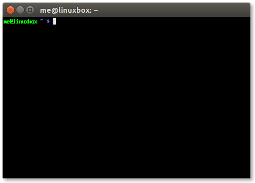
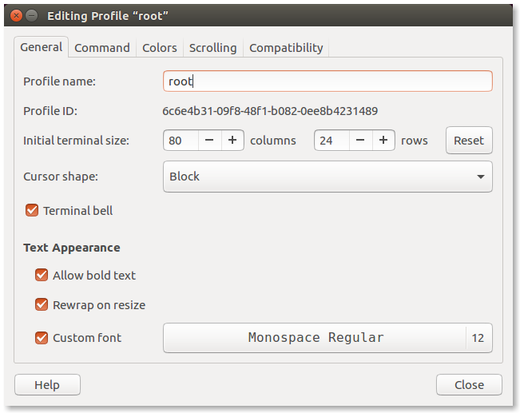
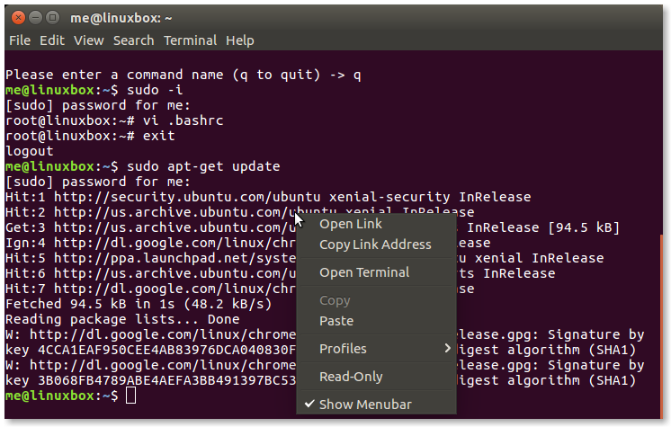
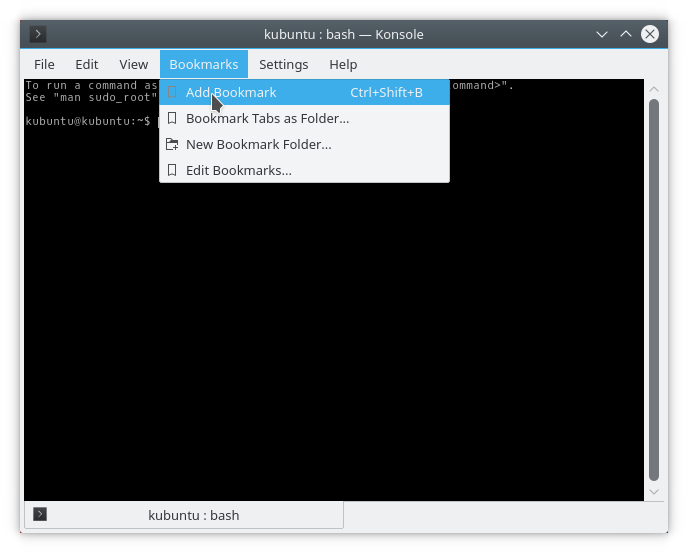
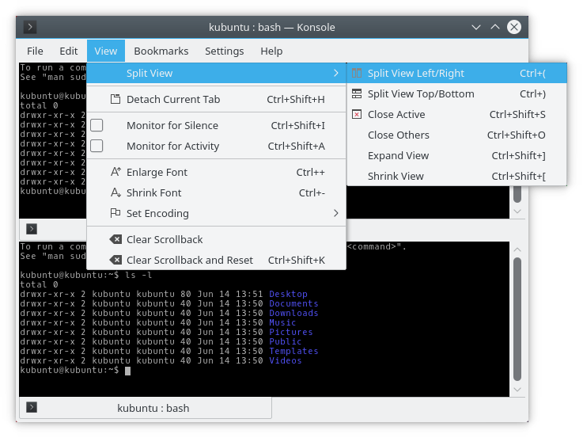
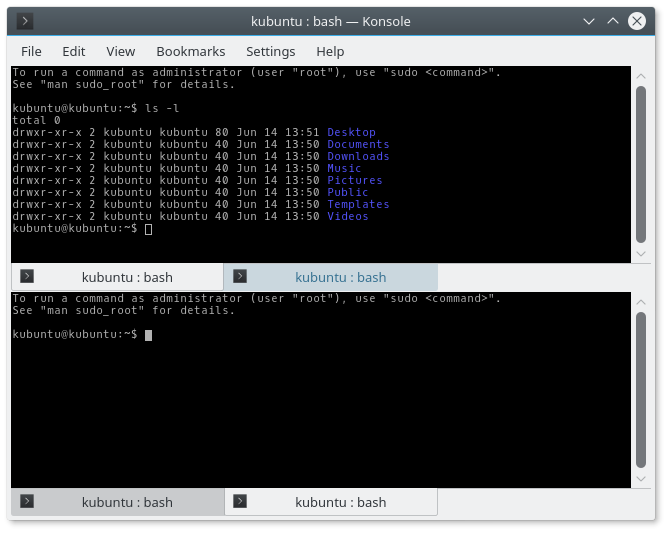

+++
title = "Power Terminals"
weight = 9
date = 2023-06-08T14:01:04+08:00
description = ""
isCJKLanguage = true
draft = false

+++

# Power Terminals

https://linuxcommand.org/lc3_adv_powerterm.php

Over the course of our many lessons and adventures, we have learned a lot about the shell, and explored many of the common command line utilities found on Linux systems. There is, however, one program we have overlooked, and it may be among the most important and most frequently used of them all– our terminal emulator.

In this adventure, we are going to dig into these essential tools and look at a few of the different terminal programs and the many interesting things we can do with them.

## A Typical Modern Terminal

Graphical desktop environments like GNOME, KDE, LXDE, Unity, etc. all include terminal emulators as standard equipment. We can think of this as a safety feature because, if the desktop environment suffers from some lack of functionality (and they all do), we can still access the shell and actually get stuff done.

Modern terminal emulators are quite flexible and can be configured in many ways:

gnome-terminal preferences dialog

### Size

Terminal emulators display a window that can be adjusted to any size from the sublime to the ridiculous. Many terminals allow configuration of a default size.

The “normal” size for a terminal is 80 columns by 24 rows. These dimensions were inherited from the size of common hardware terminals, which, in turn, were influenced by the format of IBM punch cards (80 columns by 12 rows). Some applications expect 80 by 24 to be the minimum size, and will not display properly when the size is smaller. Making the terminal larger, on the other hand, is preferable in most situations, particularly when it comes to terminal height. 80 columns is a good width for reading text, but having additional height provides us with more context when working at the command line.

Another common width is 132 columns, derived from the width of wide fan-fold computer paper. Though this is too wide for comfortable reading of straight text (for example, a man page), it’s fine for other purposes, such as viewing log files.

The 80-column default width has implications for the shell scripts and other text-based programs we write. We should format our printed output to fit within the limits of an 80-character line for best effect.

### Tabs

A single terminal window with the ability to contain several different shell sessions is a valuable feature found in most modern terminal emulators. This is accomplished through the use of *tabs*.

gnome-terminal with tabs

Tabs are a fairly recent addition to terminal emulators, first appearing around 2003 in both GNOME’s `gnome-terminal` and KDE’s `konsole`.

### Profiles

Another feature found in some modern terminals is multiple configuration profiles. With this feature, we can have separate configurations for different tasks. For example, if we are responsible for maintaining a remote server, we might have a separate profile for the terminal that we use to manage it.

### Fonts, Colors, and Backgrounds

Most terminal emulators allow us to select fonts, colors, and backgrounds for our terminal sessions. The three most important criteria for selecting fonts, colors, and backgrounds are: 1. legibility, 2. legibility, and 3. legibility. Many people post screen shots of their Linux desktops online, and there is a great fascination with “stylish” fonts, faint colors, and pseudo-transparent terminal windows, but we use our terminals for very serious things, so we should treat our terminals very seriously, too. No one wants to make a mistake while administering a system because they misread something on the screen. Choose wisely.

## Past Favorites

When the first graphical environments began appearing for Unix in the mid-1980s, terminal emulators were among the first applications that were developed. After all, the GUIs of the time had very little functionality and people still needed to do their work. Besides, the graphical desktop allowed users to display multiple terminal windows- a powerful advantage at the time.

### xterm

The granddaddy of all graphical terminals is `xterm`, the standard terminal emulator for the X Window System. Originally released in 1984, it’s still under active maintenance. Since it is a standard part of X, it is included in many Linux distributions. `xterm` was very influential, and most modern terminal programs emulate its behavior in one way or another.

xterm with default configuration

In its default configuration, `xterm` looks rather small and pathetic, but almost everything about `xterm` is configurable. When we say “configurable,” we don’t mean there is a pretty “Preferences” dialog. This is Unix! Like many early X applications, it relies on an Xresources file for its configuration. This file can be either global (`/etc/X11/Xresources`) or local to the user (`~/.Xresources`). Each item in this file consists of an application class and a setting. If we create the file ~/.Xresources with the following content:

```
XTerm.vt100.geometry: 80x35
XTerm.vt100.faceName: Liberation Mono:size=11
XTerm.vt100.cursorBlink: true
```

then we get a terminal like this:

Configured xterm

A complete list of the Xresources configuration values for `xterm` appears in its man page.

While `xterm` does not appear to have menus, it actually has 3 different ones, which are made visible by holding the `Ctrl` key and pressing a mouse button. Different menus appear according to which button is pressed. The scroll bar on the side of the terminal has a behavior like ancient X applications. Hint: after enabling the scroll bar with the menu, use the middle mouse button to drag the slider.

Though `xterm` offers neither tabs nor profiles, it does have one strange extra feature: it can display a Tektronix 4014 graphics terminal emulator window. The Tektronix 4014 was an early and very expensive storage tube graphics display that was popular with computer aided design systems in the 1970s. It’s extremely obscure today. The normal xterm text window is called the VT window. The name comes from the DEC VT220, a popular computer terminal of the same period. `xterm`, and most terminals today, emulate this terminal to a certain extent. `xterm` is not quite the same as the VT terminal, and it has its own specific `terminfo` entry (see the tput adventure for some background on `terminfo`). Terminals set an environment variable named `TERM` that is used by X and `terminfo` to identify the terminal type, and thus send it the correct control codes. To see the current value of the `TERM` variable, we can do this:

```
me@linuxbox ~ $ echo $TERM
```

Even if we are using a modern terminal, such as `gnome-terminal`, we will notice that the `TERM` variable is often set to “xterm” or “xterm-color”. That’s how much influence `xterm` had. We still use it as the standard.

### rxvt

By the standards of the time, `xterm` was a heavyweight program but, as time went by, some of its features were rarely used such as the Tektronix emulation. Around 1990, in an attempt to create a simpler, lighter terminal emulator, Robert Nation wrote `rxvt` as part of the FVWM window manager, an early desktop environment for Unix-like systems.

`rxvt` has a smaller feature set than `xterm` and emulates the DEC VT 102 terminal rather than the more advanced VT 220. `rxvt` sets the `TERM` variable to “rxvt”, which is widely supported. Like `xterm`, `rxvt` has menus that are displayed by holding the `Ctrl` key and pressing different mouse buttons.

`rxvt` is still under active maintenance, and there is a popular modern implementation forked from the original called `urxvt` (rxvt-Unicode) by Mark Lehmann, which supports Unicode (multi-byte characters used to express a wider range of written languages than ASCII). One interesting feature in `urxvt` is a daemon mode that allows launching multiple terminal windows all sharing the same instance of the program- a potential memory saver.

urxvt with default configuration

Like `xterm`, `rxvt` uses Xresources to control its configuration. The default `rxvt` configuration is very spare. Adding the following settings to our Xresources file will make it more palatable (`urxvt` shown):

```
URxvt.geometry: 80x35
URxvt.saveLines: 10000
URxvt.scrollBar: false
URxvt.foreground: white
URxvt.background: black
URxvt.secondaryScroll: true
URxvt.font: xft:liberation mono:size=11
URxvt.cursorBlink: true
```

## Modern Power Terminals

Most modern graphical desktop environments include a terminal emulator program. Some are more feature-rich than others. Let’s look at some of the most powerful and popular ones.

### gnome-terminal

The default terminal application for GNOME and its derivatives such as Ubuntu’s Unity is `gnome-terminal`. Possibly the world’s most popular terminal app, it’s a good, full-featured program. It has many features we expect in modern terminals, like multiple tabs and profile support. It also allows many kinds of customization.

#### Tabs

Busy terminal users will often find themselves working in multiple terminal sessions at once. It may be to perform operations on several machines at the same time, or to manage a complex set of tasks on a single system. This problem can be addressed either by opening multiple terminal windows, or by having multiple tabs in a single window.

The File menu in `gnome-terminal` offers both choices (well, in older versions anyway). In newer versions, use the keyboard shortcut `Ctrl-Shift-T` to open a tab. Tabs can be rearranged with the mouse, or can be dragged out of the window to create a new window. With `gnome-terminal`, we can even drag a tab from one terminal window to another.

#### Keyboard Shortcuts

Since, in an ideal universe, we never lift our fingers from the keyboard, we need ways of controlling our terminal without resorting to a mouse. Fortunately, `gnome-terminal` offers a large set of keyboard shortcuts for common operations. Here are some of the most useful ones, defined by default:

| Shortcut     | Action                                                  |
| :----------- | :------------------------------------------------------ |
| Ctrl-Shift-N | New Window                                              |
| Ctrl-Shift-W | Close Window                                            |
| F11          | View terminal full screen                               |
| Shift-PgUp   | Scroll up                                               |
| Shift-PgDn   | Scroll down                                             |
| Shift-Home   | Scroll to the beginning                                 |
| Shift-End    | Scroll to the end                                       |
| Ctrl-Shift-T | New Tab                                                 |
| Ctrl-Shift-Q | Close Tab                                               |
| Ctrl-PgUp    | Next Tab                                                |
| Ctrl-PgDn    | Previous Tab                                            |
| Alt-n        | Where n is a number in the range of 1 to 9, go to tab n |

Keyboard shortcuts are also user configurable.

While it is well known that `Ctrl-c` and `Ctrl-v` cannot be used in the terminal window to perform copy and paste, `Ctrl-Shift-C` and `Ctrl-Shift-V` will work in their place with `gnome-terminal`.

#### Profiles

Profiles are one of the great, unsung features of many terminal programs. This may be because their advantages are perhaps not intuitively obvious. Profiles are particularly useful when we want to visually distinguish one terminal session from another. This is especially true when managing multiple machines. In this case, having a different background color for the remote system’s session may help us avoid typing a command into the wrong session. We can even incorporate a default command (like `ssh`) into a profile to facilitate the connection to the remote system.

Let’s make a profile for a root shell. First, we’ll go to the File menu and select “New Profile…” and when the dialog appears enter the name “root” as our new profile:

gnome-terminal new profile dialog

Next, we’ll configure our new profile and choose the font and default size of the terminal window. Then we will choose a command for the terminal window when it is opened. To create a root shell, we can use the command `sudo -i`. We will also make sure to specify that the terminal should exit when the command exits.

Setting the command in the configuration dialog

Finally, we’ll select some colors. How about white text on a dark red background? That should convey an appropriate sense of gravity when we use a root shell.

Setting the colors in configuration dialog

Once we finish our configuration, we can test our shell:

Root profile gnome-terminal

We can configure terminal profiles for any command line program we want: Midnight Commander, `tmux`, whatever.

Here is another example. We will create a simple man page viewer. With this terminal profile, we can have a dedicated terminal window to only display man pages. To do this, we first need to write a short script to prompt the user for the name of which command to look up, and display the man page in a (nearly) endless loop:

```
#!/bin/bash

# man_view - simple man page viewer

while true; do
  echo -en "\nPlease enter a command name (q to quit) -> "
  read
  [[ "$REPLY" == "q" ]] && break
  [[ -n "$REPLY" ]] && { man $REPLY || sleep 3; }
  clear
done
```

We’ll save this file in our `~/bin` directory and use it as our custom command for our terminal profile.

Next, we create a new terminal profile and name it “man page”. Since we are designing a window for man pages, we can play with the window size and color. We’ll set the window tall and a little narrow (for easier reading) and set the colors to green text on a black background for that retro terminal feeling:

Man page gnome-terminal window

#### Opening Hyperlinks and Email Addresses

One of the neat tricks `gnome-terminal` can do is copy and/or open URLs. When it detects a URL in the stream of displayed text, it displays it with an underline. Right-clicking on the link displays a menu of operations:

gnome-terminal URL context menu

#### Resetting the Terminal

Sometimes, despite our best efforts, we do something dumb at the terminal, like attempting to display a non-text file. When this happens, the terminal emulator will dutifully interpret the random bytes as control codes and we’ll notice that the terminal screen fills with garbage and nothing works anymore. To escape this situation, we must reset the terminal. `gnome-terminal` provides a function for this located in its Terminal menu.

### konsole

`konsole`, the default terminal application for the KDE desktop, has a feature set similar to that of `gnome-terminal`. This, of course, makes sense since `konsole` directly “competes” with `gnome-terminal`. For instance, both `gnome-terminal` and `konsole` support tabs and profiles in a similar fashion.

`konsole` does have a couple of unique features not found in `gnome-terminal`. `konsole` has bookmarks, and `konsole` can split the screen into regions allowing more than one view of the same terminal session to be displayed at the same time.

#### Bookmarks

`konsole` allows us to store the location of directories as bookmarks. Locations may also include remote locations accessible via `ssh`. For example, we can define a bookmark such as `ssh:me@remotehost`, and it will attempt to connect with the remote system when the bookmark is used.

konsole bookmarks menu

#### Split View

konsole’s split view feature

`konsole`’s unique split view feature allows us to have two views of a single terminal session. This seems odd at first glance, but is useful when examining long streams of output. For example, if we needed to copy text from one portion of a long output stream to the command line at the bottom, this could be handy. Further, we can get views of different terminal sessions, by using using tabs in conjunction with split views, since while the tabs will appear in all of the split views, they can be switched independently in each view:

konsole with tabs and split view

### guake

`gnome-terminal` has spawned a couple of programs that reuse many of its internal parts to create different terminal applications. The first is `guake`, a terminal that borrows a design feature from a popular first-person shooter game. When running, `guake` normally hides in the background, but when the F12 key is pressed, the terminal window “rolls down” from the top of the screen to reveal itself. This can be handy if terminal use is intermittent, or if screen real estate is at a premium.

`guake` shares many of the configuration options with `gnome-terminal`, as well as the ability to configure what key activates it, which side of the screen it rolls from, and its size.

Though `guake` supports tabs, it does not (as of this writing) support profiles. However, we can approximate profiles with a little clever scripting:

```
#!/bin/bash

# gtab - create pseudo-profiles for guake

if [[ $1 == "" ]]; then
  guake --new-tab=. --show
  exit
fi

case $1 in
  root) # Create a root shell tab
    guake --new-tab=. --fgcolor=\#ffffff --bgcolor=\#5e0000
    guake --show    # Switch to new fg/bg colors
    guake --rename-current-tab=root
    guake --execute-command='sudo -i; exit'
    ;;
  man) # Create a manual page viewer tab
    guake --new-tab=. --fgcolor=\#00ef00 --bgcolor=\#000000
    guake --show    # Switch to new fg/bg colors
    guake --rename-current-tab="man viewer"
    guake --execute-command='man_view; exit'
    ;;
  *)
    echo "No such tab. Try either 'root' or 'man'" >&2
    exit 1
    ;;
esac
```

After saving this script, we can open new tabs in `guake` by entering the command `gtab` followed by an optional profile, either “root” or “man” to duplicate what we did with the `gnome-terminal` profiles above. Entering `gtab` without an option simply opens a new tab in the current working directory.

As we can see, `guake` has a number of interesting command line options that allow us to program its behavior.

For KDE users, there is a similar program called `yakuake`.

### terminator

Like `guake`, `terminator` builds on the `gnome-terminal` code to create a very popular alternative terminal. The main feature addition is split window support.

terminator with split screens

By right-clicking in the `terminator` window, `terminator` displays its menu where we can see the options for splitting the current terminal either vertically or horizontally.

The terminator menu

Once split, each terminal pane can dragged and dropped. Panes can also be resized with either the mouse or a keyboard shortcut. Another nice feature of `terminator` is the ability to set the focus policy to “focus follows mouse” so that we can change the active pane by simply hovering the mouse over the desired pane without have to perform an extra click to make the pane active.

The preferences dialog supports many of the same configuration features as that of `gnome-terminal`, including profiles with custom commands:

The terminator preferences dialog

A good way to use `terminator` is to expand its window to full screen and then split it into multiple panes:

Full screen terminator window with multiple panes

We can even automate this by going into Preferences/Layouts and storing our full screen layout (let’s call it “2x2”) then, by invoking terminator this way:

```
terminator --maximise --layout=2x2
```

to get our layout instantly.

## Terminals for Other Platforms

### Android

While we might not think of an Android phone or tablet as a Linux computer, it actually is, and we can get terminal apps for it which are useful for administering remote systems.

#### Connectbot

Connectbot is a secure shell client for Android. With it, we can log into any system running an SSH server. To the remote system, Connectbot looks like a terminal using the GNU Screen terminal type.

One problem with using a terminal emulator on Android is the limitations of the native Google keyboard. It does not have all the keys required to make full use of a terminal session. Fortunately, there are alternate keyboards that we can use on Android. A really good one is Hacker’s Keyboard by Klaus Weidner. It supports all the normal keys, `Ctrl`, `Alt`, `F1-F10`, arrows, `PgUp`, `PgDn`, etc. Very handy when working with `vi` on a phone.

Connectbot with Hacker’s Keyboard on Android

#### Termux

The Termux app for Android is unexpectedly amazing. It goes beyond being merely an SSH client; it provides a full shell environment on Android without having to root the device.

After installation, there is a minimal base system with a shell (`bash`) and many of the most common utilities. Initially, these utilities are the ones built into `busybox` (a compact set of utilities joined into a single program that is often used in embedded systems to save space), but the `apt` package management program (like on Debian/Ubuntu) is provided to allow installation of a wide variety of Linux programs.

Termux displaying builtin shell commands

We can have dot files (like `.bashrc`) and even write shell scripts and compile and debug programs in Termux. Pretty neat.

When executing `ssh`, Termux looks like an “xterm-256color” terminal to remote systems.

### Chrome/Chrome OS

Google makes a decent SSH client for Chrome and Chrome OS (which is Linux, too, after all) that allows logging on to remote systems. Called Secure Shell, it uses hterm (HTML Terminal, a terminal emulator written in JavaScript) combined with an SSH client. To remote systems, it looks like a “xterm-256color” terminal. It works pretty well, but lacks some features that advanced SSH users may need.

Secure Shell is available at the Chrome Web Store.

Secure Shell running on Chrome OS

## Summing Up

Given that our terminal emulators are among our most vital tools, they should command more of our attention. There are many different terminal programs with potentially interesting and helpful features, many of which, most users rarely, if ever, use. This is a shame since many of these features are truly *useful* to the busy command line user. We have looked at a few of the ways these features can be applied to our daily routine, but there are certainly many more.

## Further Reading

- “The Grumpy Editor’s guide to terminal emulators” by Jonathan Corbet: https://lwn.net/Articles/88161/

### xterm:

- xterm on Wikipedia: https://en.wikipedia.org/wiki/Xterm
- Homepage for the current maintainer of xterm, Thomas Dickey: https://invisible-island.net/xterm/

### Tektronix 4014:

- Tektronix 4014 on Wikipedia: https://en.wikipedia.org/wiki/Tektronix_4010
- Some background on the 4014 at Chilton Computing: http://www.chilton-computing.org.uk/acd/icf/terminals/p005.htm

### rxvt:

- Home page for rxvt: http://rxvt.sourceforge.net/

### urxvt (rxvt-Unicode):

- Home page for the rxvt-Unicode project: http://software.schmorp.de/pkg/rxvt-unicode.html

### gnome-terminal:

- Help pages for gnome-terminal: https://help.gnome.org/users/gnome-terminal/stable/

### konsole:

- The Konsole Manual at the KDE Project: https://docs.kde.org/stable5/en/applications/konsole/index.html

### guake:

- The home page for the guake project: http://guake-project.org/
- The Arch Wiki entry for guake (contains a lot of useful information but some is Arch Linux specific): https://wiki.archlinux.org/index.php/Guake

### terminator:

- The home page for the terminator project: https://gnometerminator.blogspot.com/p/introduction.html

### Connectbot:

- Connectbot at the Google Play Store: https://play.google.com/store/apps/details?id=org.connectbot&hl=en

### Hacker’s Keyboard:

- Hacker’s Keyboard at the Google Play Store: https://play.google.com/store/apps/details?id=org.pocketworkstation.pckeyboard&hl=en

### Termux:

- Termux at the Google Play Store: https://play.google.com/store/apps/details?id=com.termux&hl=en

### Secure Shell

- Secure Shell at the Chrome Web Store: https://chrome.google.com/webstore/detail/secure-shell-app/pnhechapfaindjhompbnflcldabbghjo
- Secure Shell FAQ: https://chromium.googlesource.com/apps/libapps/+/master/nassh/doc/FAQ.md