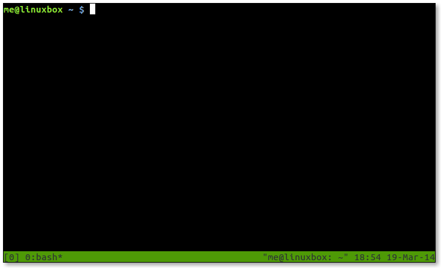
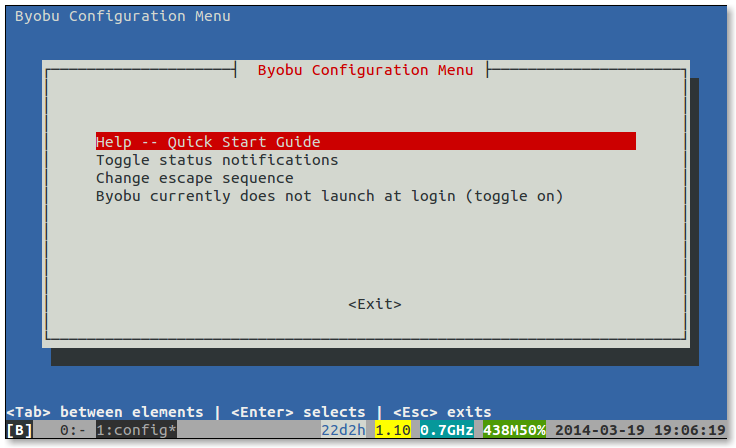

+++
title = "Terminal Multiplexers"
weight = 2
date = 2023-06-08T13:59:12+08:00
description = ""
isCJKLanguage = true
draft = false

+++

# Terminal Multiplexers

https://linuxcommand.org/lc3_adv_termmux.php

It’s easy to take the terminal for granted. After all, modern terminal emulators like gnome-terminal, konsole, and the others included with Linux desktop environments are feature-rich applications that satisfy most of our needs. But sometimes we need more. We need to have multiple shell sessions running in a single terminal. We need to display more than one application in a single terminal. We need to move a running terminal session from one computer to another. In short, we need a *terminal multiplexer*.

Terminal multiplexers are programs that can perform these amazing feats. In this adventure, we will look at three examples: GNU screen, tmux, and byobu.

## Some Historical Context

If we were to go back in time to say, the mid-1980s, we might find ourselves staring at a computer terminal; a box with an 80-column wide, 24-line high display and a keyboard connected to a shared, central Unix computer via an RS-232 serial connection and, possibly, an acoustic-coupler modem and a telephone handset. On the display screen there might be a shell prompt not unlike the prompt we see today during a Linux terminal session. However, unlike today, the computer terminal of the 1980s did not have multiple windows or tabs to display multiple applications or shell sessions. We only had one screen and that was it. Terminal multiplexers were originally developed to help address this limitation. A terminal multiplexer allows multiple sessions and applications to be displayed and managed on a single screen. While modern desktop environments and terminal emulator programs support multiple windows and tabbed terminal sessions, which mitigate the need of terminal multiplexers for some purposes, terminal multiplexers still offer some features that will greatly enhance our command-line experience.

## GNU Screen

GNU screen goes way back. First developed in 1987, screen appears to be the first program of its type and it defined the basic feature set found in all subsequent terminal multiplexers.

### Availability

As its name implies, GNU screen is part of the GNU Project. Though it is rarely installed by default, it is available in most distribution repositories as the package “screen”.

### Invocation

We can start using GNU screen by simply entering the `screen` command at the shell prompt. Once the command is launched, we will be presented with a shell prompt.

### Multiple Windows

At this point, screen is running and has created its first *window* . The terminology used by screen is a little confusing. It is best to think of it this way: screen manages a *session* consisting of one or more *windows* each containing a shell or other program. Furthermore, screen can divide a terminal display into multiple *regions*, each displaying the contents of a window.

Whew! This will start to make sense as we move forward.

In any case, we have screen running now, and it’s displaying its first window. Let’s enter a command in the current window:

```
me@linuxbox: ~ $ top
```

Initial screen window

So far, so good. Now, let’s create another window. To do this, we type `Ctrl-a` followed by the character “c”. Our terminal screen should clear and we should see a new shell prompt. So what just happened to our first window with `top` running in it? It’s still there, running in the background. We can return to the first window by typing `Ctrl-a p` (think “p” for “previous”).

Before we go any further, let’s talk about the keyboard. Controlling screen is pretty simple. Every command consists of `Ctrl-a` (called the “command prefix” or “escape sequence”) followed by another character. We have already seen two such commands: `Ctrl-a c` to create a new window, and `Ctrl-a p` to switch from the current window to the previous one. Typing the command `Ctrl-a ?` will display a list of all the commands.

GNU screen has several commands for switching from one window to another. Like the “previous” command, there is a “next” command `Ctrl-a n`. Windows are numbered, starting with 0, and may be chosen directly by typing `Ctrl-a` followed by a numeral from 0 to 9. It is also possible list all the windows by typing `Ctrl-a "`. This command will display a list of windows, where we can choose a window.

Screen window list

As we can see, windows have names. The default name for a window is the name of the program the window was running at the time of its creation, hence both of our windows are named “bash”. Let’s change that. Since we are running `top` in our first window, let’s make its name reflect that. Switch to the first window using any of the methods we have discussed, and type the command `Ctrl-a A` and we will be prompted for a window name. Simple.

Okay, so we have created some windows, how do we destroy them? A window is destroyed whenever we terminate the program running in it. After all windows are destroyed, screen itself will terminate. Since both of our windows are running bash, we need only exit each respective shell to end our screen session. In the case of a program that refuses to terminate gracefully, `Ctrl-a k` will do the trick.

Let’s terminate the shell running `top` by typing `q` to exit `top` and then enter `exit` to terminate `bash`, thereby destroying the first window. We are now taken to the remaining window still running its own copy of `bash`. We can confirm this by typing `Ctrl-a "` to view the window list again.

It’s possible to create windows and run programs without an underlying shell. To do this, we enter `screen` followed by the name of the program we wish to run, for example:

```
me@linuxbox: ~ $ screen vim ~/.bashrc
```

We can even do this in a screen window. Issuing a `screen` command in a screen window does not invoke a new copy of screen. It tells the existing instance of screen to carry out an operation like creating a new window.

### Copy and Paste

Given that GNU screen was developed for systems that have neither a graphical user interface nor a mouse, it makes sense that screen would provide a way of copying text from one screen window to another. It does this by entering what is called *scrollback mode*. In this mode, screen allows the text cursor to move freely throughout the current window and through the contents of the *scrollback buffer*, which contains previous contents of the window.

We start scrollback mode by typing `Ctrl-a [`. In scrollback mode we can use the arrow keys and the `Page Up` and `Page Down` keys to navigate the scrollback buffer. To copy text, we first need to mark the beginning and end of the text we want to copy. This is done by moving the text cursor to the beginning of the desired text and pressing the space bar. Next, we move the cursor to the end of the desired text (which is highlighted as we move the cursor) and press the space bar again to mark the end of the text to be copied. Marking text exits scrollback mode and copies the marked text into screen’s internal buffer. We can now paste the text into any screen window. To do this, we go to the desired window and type `Ctrl-a ]`.

Text marked for copying

### Multiple Regions

GNU screen can also divide the terminal display into separate regions, each providing a view of a screen window. This allows us to view 2 or more windows at the same time. To split the terminal horizontally, type the command `Ctrl-a S`, to split it vertically, type `Ctrl-a |`. Newly created regions are empty (i.e., they are not associated with a window). To display a window in a region, first move the focus to the new region by typing `Ctrl-a Tab` and then either create a new window, or chose an existing window to display using any of the window selection commands we have already discussed. Regions may be further subdivided to smaller regions and we can even display the same window in more than one region.

Regions

Using multiple regions is very convenient when working with large terminal displays. For example, if we split the display into two horizontal regions, we can edit a script in one region and perform testing of the script in the other. Or we could read a man page in one region and try out a command in the other.

There are two commands for deleting regions: `Ctrl-a Q` removes all regions except the current one, and `Ctrl-a X` removes the current region. Note that removing a region does not remove its associated window. Windows continue to exist until they are destroyed.

### Detaching Sessions

Perhaps the most interesting feature of screen is its ability to detach a session from the terminal itself. Just as it is able to display its windows on any region of the terminal, screen can also display its windows on any terminal or no terminal at all.

For example, we could start a screen session on one computer, say at the office, detach the session from the local terminal, go home and log into our office computer remotely, and reattach the screen session to our home computer’s terminal. During the intervening time, all jobs on our office computer have continued to execute.

There are a number of commands used to manage this process.

- `screen -list` lists the screen sessions running on a system. If there is more than one session running, the `pid.tty.host` string shown in the listing can be appended to the `-d/-D` and `-r/-R` options below to specify a particular session.
- `screen -d -r` detaches a screen session from the previous terminal and reattaches it to the current terminal.
- `screen -D -R` detaches a screen session from the previous terminal, logs the user off the old terminal and attaches the session to the new terminal creating a new session if no session existed. According to the screen documentation, this is the author’s favorite.

The `-d/-D` and `-r/-R` options can be used independently, but they are most often used together to detach and reattach an existing screen session in a single step.

We can demonstrate this process by opening two terminals. Launch screen on the first terminal and create a few windows. Now, go to the second terminal and enter the command `screen -D -R`. This will the cause the first terminal to vanish (the user is logged off) and the screen session to move to the second terminal fully intact.

### Customizing Screen

Like many of the interactive GNU utilities, screen is very customizable. During invocation, screen reads the `/etc/screenrc` and `~/.screenrc` files if they exist. While the list of customizable features is extensive (many having to do with terminal display control on a variety of Unix and Unix-like platforms), we will concern ourselves with key bindings and startup session configuration since these are the most commonly used.

First, let’s look a sample `.screenrc` file:

```
# This is a comment

# Set some key bindings

bind k              # Un-bind the "k" key (set it to do nothing)
bind K kill         # Make `Ctrl-a K` destroy the current window
bind } history      # Make `Ctrl-a }` copy and paste the current
                    # command line

# Define windows 7, 8, and 9 at startup

screen -t "mdnght cmdr" 7 mc
screen -t htop 8 htop
screen -t syslog 9 tailf /var/log/syslog
```

As we can see, the format is pretty simple. The `bind` directive is followed by the key and the screen command it is to be bound to. A complete list of the screen commands can found in the screen man page. All of the screen commands we have discussed so far are simply key bindings like those in the example above. We can redefine them at will.

The three lines at the end of our example `.screenrc` file create windows at startup. The commands set the window title (the `-t` option), a window number, and a command for the window to contain. This way, we can set up a screen session to be automatically built when we start screen which contains a complete multi-window, command-line environment running all of our favorite programs.

## tmux

Despite its continuing popularity, GNU screen has been criticized for its code complexity (to the point of being called “unmaintainable”) and its resource consumption. In addition, it is reported that screen is no longer actively developed. In response to these concerns, a newer program, tmux, has attracted widespread attention.

tmux is modern, friendlier, more efficient, and generally superior to screen in most ways. Conceptually, tmux is very similar to screen in that it also supports the concept of sessions, windows and regions (called *panes* in tmux). In fact, it even shares a few keyboard commands with screen.

### Availability

tmux is widely available, though not as widely as screen. It’s available in most distribution repositories. The package name is “tmux”.

### Invocation

The program is invoked with the command `tmux new` to create a new session. We can optionally add `-s <session_name>` to assign a name to the new session and `-n <window_name>` to assign a name to the first window. If no option to the `new` command is supplied, the `new` itself may be omitted; it will be assumed. Here is an example:

```
me@linuxbox: ~ $ tmux new -s "my session" -n "window 1"
```

Once the program starts, we are presented with a shell prompt and a pretty status bar at the bottom of the window.

Initial tmux window

### Multiple Windows

tmux uses the keyboard in a similar fashion to screen, but rather than using `Ctrl-a` as the command prefix, tmux uses `Ctrl-b`. This is good since `Ctrl-a` is used when editing the command line in bash to move the cursor to the beginning of the line.

Here are the basic commands for creating windows and navigating them:

| Command    | Description                                          |
| :--------- | :--------------------------------------------------- |
| `Ctrl-b ?` | Show the list of key bindings (i.e., help)           |
| `Ctrl-b c` | Create a new window                                  |
| `Ctrl-b n` | Go to next window                                    |
| `Ctrl-b p` | Go to previous window                                |
| `Ctrl-b 0` | Go to window 0. Numbers 1-9 are similar.             |
| `Ctrl-b w` | Show window list. The status bar lists windows, too. |
| `Ctrl-b ,` | Rename the current window                            |

### Multiple Panes

Like screen, tmux can divide the terminal display into sections called panes. However, unlike the implementation of regions in screen, panes in tmux do not merely provide viewports to various windows. In tmux they are complete pseudo-terminals associated with the window. Thus a single tmux window can contain multiple terminals.

| Command             | Description                 |
| :------------------ | :-------------------------- |
| `Ctrl-b "`          | Split pane horizontally     |
| `Ctrl-b %`          | Split pane vertically       |
| `Ctrl-b arrow`      | Move to adjoining pane      |
| `Ctrl-b Ctrl-arrow` | Resize pane by 1 character  |
| `Ctrl-b Alt-arrow`  | Resize pane by 5 characters |
| `Ctrl-b x`          | Destroy current pane        |

We can demonstrate the behavior of panes by creating a session and a couple of windows. First, we will create a session, name it, and name the initial window:

```
me@linuxbox: ~ $ tmux new -s PaneDemo -n Window0
```

Next, we will create a second window and give it a name:

```
me@linuxbox: ~ $ tmux neww -n Window1
```

We could have done this second step with `Ctrl-b` commands, but seeing the command-line method prepares us for something coming up a little later.

Assuming that all has gone well, we now find ourselves in a tmux session named “PaneDemo” and a window named “Window1”. Now we will split the window in two horizontally by typing `Ctrl-b "`. We still have only two windows (Window0 and Window1), but now have two shell prompts on Window1. We can switch back and forth between the two panes by typing `Ctrl-b` followed by up arrow or down arrow.

Just for fun, let’s type `Ctrl-b t` and a digital clock appears in the current pane. It’s just a cute thing that `tmux` can do.

Multiple panes

We can terminate the clock display by typing `q`. If we move to the first window by typing `Ctrl-b 0`, we see that the panes remain associated with Window1 and have no effect on Window0.

Returning to Window1, let’s adjust the size of the panes. We do this by typing `Ctrl-b Alt-arrow` to move the boundary up or down by 5 lines. Typing `Ctrl-b Ctrl-arrow` will move the boundary by 1 line.

It’s possible to break a pane out into a new window of its own. This is done by typing `Ctrl-b !`.

`Ctrl-b x` is used to destroy a pane. Note that, unlike screen, destroying a pane in tmux also destroys the pseudo-terminal running within it, along with any associated programs.

### Copy Mode

Like screen, tmux has a copy mode. It is invoked by typing `Ctrl-b [`. In copy mode, we can move the cursor freely within the scrollback buffer. To mark text for copying, we first type `Ctrl-space` to begin selection, then move the cursor to make our selection. Finally, we type `Alt-w` to copy the selected text.

Admittedly, this procedure is a little awkward. A little later we’ll customize `tmux` to make the copy mode act more like the vim’s visual copying mode.

Text marked for copying

As with the digital clock, we return to normal mode by typing “q”. Now we can paste our copied text by typing `Ctrl-b ]`.

### Detaching Sessions

With tmux it’s easier to manage multiple sessions than with screen. First, we can give sessions descriptive names, either during creation, as we saw with our “PaneDemo” example above, or by renaming an existing session with `Ctrl-b $`. Second, it’s easy to switch sessions on-the-fly by typing `Ctrl-b s` and choosing a session from the presented list.

While we are in a session, we can type `Ctrl-b d` to detach it and, in essence, put tmux into the background. This is useful if we want to create new a session by entering the `tmux new` command.

If we start a new terminal (or log in from a remote terminal) and wish to attach an existing session to it, we can issue the command `tmux ls` to display a list of available sessions. To attach a session, we enter the command `tmux attach -d -t <session_name>`. The “-d” option causes the session to be detached from its previous terminal. Without this option, the session will be attached to both its previous terminal and the new terminal. If only one session is running, a `tmux attach` will connect to it and leave any existing connections intact.

### Customizing tmux

As we would expect, tmux is *extremely* configurable. When tmux starts, it reads the files `/etc/tmux.conf` and `~./.tmux.conf` if they exist. It is also possible to start tmux with the `-f` option and specify an alternate configuration file. This way, we can have multiple custom configurations.

The number of configuration commands is extensive, just as it is with screen. The tmux man page has the full list.

As an example, here is a hypothetical configuration file that changes the command prefix key from `Ctrl-b` to `Ctrl-a` and creates a new session with 4 windows:

```
# Sample tmux.conf file

# Change the command prefix from Ctrl-b to Ctrl-a
unbind-key C-b
set-option -g prefix C-a
bind-key C-a send-prefix

#####
# Create session with 4 windows
#####

# Create session and first window
new-session -d -s MySession

# Create second window and vertically split it
new-window
split-window -d -h

# Create third window (and name it) running Midnight Commander
new-window -d -n MdnghtCmdr mc

# Create fourth window (and name it) running htop
new-window -d -n htop htop

# Give focus to the first window in the session
select-window -t 0
```

Since this configuration creates a new session, we should launch tmux by entering the command `tmux attach` to avoid the default behavior of automatically creating a new session. Otherwise, we end up with an additional and unwanted session.

Here’s a useful configuration file that remaps the keys used to create panes and changes copy and paste to behave more like `vim`.

```
# Change bindings for pane-splitting from " and % to | and -
unbind '"'
unbind %
bind | split-window -h
bind - split-window -v

# Enable mouse control (clickable windows, panes, resizable panes)
set -g mouse on

# Set color support to allow visual mode highlighting to work in vim
set -g default-terminal "screen-256color"

# Make copy work like vi
# Start copy ^b-[
# Use vi movement keys (arrows, etc.)
# Select with v, V
# Yank and end copy mode with y
# Paste with ^b-]
# View all vi key bindings with ^b-: followed with list-keys -T copy-mode-vi
set-window-option -g mode-keys vi
bind-key -T copy-mode-vi 'v' send -X begin-selection
bind-key -T copy-mode-vi 'y' send -X copy-selection-and-cancel
```

## byobu

byobu (pronounced “BEE-oh-boo”) from the Japanese word for “a folding, decorative, multi-panel screen” is not a terminal multiplexer *per se*, but rather, it is a wrapper around either GNU screen or tmux (the default is `tmux`). It aims to create a simplified user interface with an emphasis on presenting useful system information on the status bar.

### Availability

byobu was originally developed by Canonical employee Dustin Kirkland, and as such is usually found in Ubuntu and other Debian-based distributions. Recent versions are more portable than the initial release, and it is beginning to appear in a wider range of distributions. It is distributed as the package “byobu”.

### Invocation

byobu can be launched simply by entering the command `byobu` followed optionally by any options and commands to be passed to the backend terminal multiplexer (i.e., tmux or screen). For this adventure, we will confine our discussion to the tmux backend as it supports a larger feature set.

Initial byobu window

### Usage

Unlike screen and tmux, byobu doesn’t use a command prefix such as `Ctrl-a` to start a command. byobu relies extensively on function keys instead. This makes byobu somewhat easier to learn, but in exchange, it gives up some of the power and flexibility of the underlying terminal multiplexer. That said, byobu still provides an easy-to-use interface for the most useful features and it also provides a key (`F12`) which acts as command prefix for tmux commands. Below is an excerpt from the help file supplied with byobu when using tmux as the backend:

```
  F1                            * Used by X11 *
    Shift-F1                    Display this help
  F2                            Create a new window
    Shift-F2                    Create a horizontal split
    Ctrl-F2                     Create a vertical split
    Ctrl-Shift-F2               Create a new session
  F3/F4                         Move focus among windows
    Shift-F3/F4                 Move focus among splits
    Ctrl-F3/F4                  Move a split
    Ctrl-Shift-F3/F4            Move a window
    Alt-Up/Down                 Move focus among sessions
    Shift-Left/Right/Up/Down    Move focus among splits
    Ctrl-Shift-Left/Right       Move focus among windows
    Ctrl-Left/Right/Up/Down     Resize a split
  F5                            Reload profile, refresh status
    Shift-F5                    Toggle through status lines
    Ctrl-F5                     Reconnect ssh/gpg/dbus sockets
    Ctrl-Shift-F5               Change status bar's color randomly
  F6                            Detach session and then logout
    Shift-F6                    Detach session and do not logout
    Ctrl-F6                     Kill split in focus
  F7                            Enter scrollback history
    Alt-PageUp/PageDown         Enter and move through scrollback
  F8                            Change the current window's name
    Shift-F8                    Toggle through split arrangements
    Ctrl-F8                     Restore a split-pane layout
    Ctrl-Shift-F8               Save the current split-pane layout
  F9                            Launch byobu-config window
  F10                           * Used by X11 *
  F11                           * Used by X11 *
    Alt-F11                     Expand split to a full window
    Shift-F11                   Join window into a horizontal split
    Ctrl-F11                    Join window into a vertical split
  F12                           Escape sequence
    Shift-F12                   Toggle on/off Byobu's keybindings
    Ctrl-Shift-F12              Modrian squares
```

As we can see, most of the commands here correspond to features we have already seen in tmux. There are, however, a couple of interesting additions.

First is the `F9` key, which brings up a menu screen:

byobu menu

The choices are pretty self-explanatory, though the “Change escape sequence” item is only relevant when using screen as the backend. If we choose “Toggle status notifications” we get to a really useful feature in `byobu`; the rich and easily configured status bar.

Status notifications

Here we can choose from a wide variety of system status information to be displayed. Very useful if we are monitoring remote servers.

The second is the `Shift-F12` key, which disables byobu from interpreting the functions keys as commands. This is needed in cases where a text-based application (such as Midnight Commander) needs the function keys. Pressing `Shift-F12` a second time re-enables the function keys for byobu. Unfortunately, byobu gives no visual indication of the state of the function keys, making this feature rather confusing to use in actual practice.

### Copy Mode

byobu provides an interface to the copy mode of its backend terminal multiplexer. For tmux, it’s slightly simplified from normal tmux, but works about the same. Here are the key commands:

| Command      | Description                                       |
| :----------- | :------------------------------------------------ |
| `Alt-PgUp`   | Enter copy mode                                   |
| `Space`      | Start text selection                              |
| `Enter`      | End text selection, copy text, and exit copy mode |
| `Alt-Insert` | Paste selected text                               |

### Detaching Sessions

To detach a session and log off, press the `F6` key. To detach without logging off, type `Shift-F6`. To attach, simply enter the `byobu` command and the previous session will be reattached. If more than one session is running, we are prompted to select a session. While we are in a session, we can type `Alt-Up` and `Alt-Down` to move from session to session.

### Customizing byobu

The local configuration file for byobu is located in either `~/.byobu/.tmux.conf` or `~/.config/byobu/.tmux.conf`, depending on the distribution. If one doesn’t work, try the other. The configuration details are the same as for tmux.

## Summing Up

We have seen how a terminal multiplexer can enhance our command-line experience by providing multiple windows and sessions, as well as multiple regions on a single terminal display. So, which one to choose? GNU screen has the benefit of being almost universally available, but is now considered by many as obsolete. tmux is modern and well supported by active development. byobu builds on the success of tmux with a simplified user interface, but if we rely on applications that need access to the keyboard function keys, byobu becomes quite tedious. Fortunately, many Linux distributions make all three available, so it’s easy to try them all and see which one satisfies the needs at hand.

## Further Reading

The man pages for screen and tmux are richly detailed. Well worth reading. The man page for byobu is somewhat simpler.

### GNU Screen

- Official site: https://www.gnu.org/software/screen/
- A helpful entry in the Arch Wiki: https://wiki.archlinux.org/index.php/GNU_Screen
- A Google search for “screenrc” yields many sample `.screenrc` files
- Also look for sample files in `/usr/share/doc/screen/examples`

### tmux

- Official site: [https://www.gigastudio.com.ua](https://www.gigastudio.com.ua/)
- The tmux FAQ: https://github.com/tmux/tmux/wiki/FAQ
- A helpful entry in the Arch Wiki: https://wiki.archlinux.org/index.php/tmux
- A Google search for “tmux.conf” yields many sample `.tmux.conf` files
- Also look for sample files in `/usr/share/doc/tmux/examples`

### byobu

- Official site: [https://www.byobu.org](https://www.byobu.org/)
- Answers to many common questions: https://askubuntu.com/tags/byobu/hot