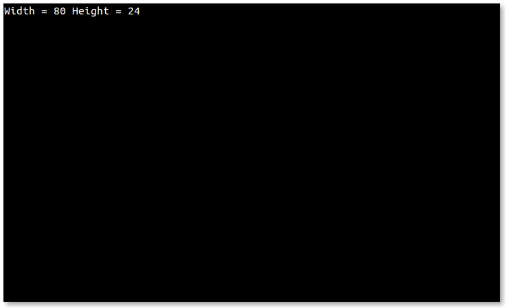
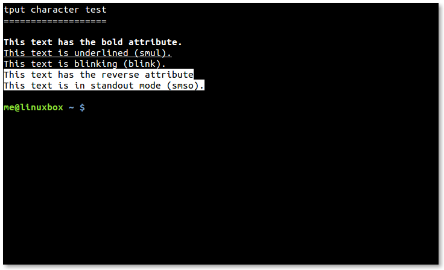
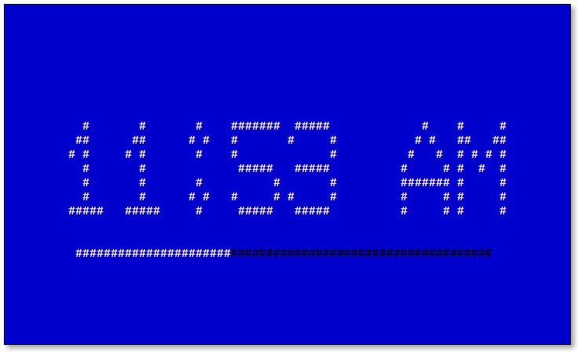

+++
title = "tput"
weight = 5
date = 2023-06-08T14:00:04+08:00
description = ""
isCJKLanguage = true
draft = false
+++

# tput

https://linuxcommand.org/lc3_adv_tput.php

While our command line environment is certainly powerful, it can be be somewhat lacking when it comes to visual appeal. Our terminals cannot create the rich environment of the graphical user interface, but it doesn’t mean we are doomed to always look at plain characters on a plain background.

In this adventure, we will look at `tput`, a command used to manipulate our terminal. With it, we can change the color of text, apply effects, and generally brighten things up. More importantly, we can use `tput` to improve the human factors of our scripts. For example, we can use color and text effects to better present information to our users.

## Availability

`tput` is part of the `ncurses` package and is supplied with most Linux distributions.

## What it Does/How it Works

Long ago, when computers were centralized, interactive computer users communicated with remote systems by using a physical terminal or a terminal emulator program running on some other system. In their heyday, there were many kinds of terminals and they all used different sequences of control characters to manage their screens and keyboards.

When we start a terminal session on our Linux system, the terminal emulator sets the `TERM` environment variable with the name of a *terminal type*. If we examine `TERM`, we can see this:

```
[me@linuxbox ~]$ echo $TERM
xterm
```

In this example, we see that our terminal type is named “xterm” suggesting that our terminal behaves like the classic X terminal emulator program `xterm`. Other common terminal types are “linux” for the Linux console, and “screen” used by terminal multiplexers such as `screen` and `tmux`. While we will encounter these 3 types most often, there are, in fact, thousands of different terminal types. Our Linux system contains a database called *terminfo* that describes them. We can examine a typical terminfo entry using the `infocmp` command followed by a terminal type name:

```
[me@linuxbox ~]$ infocmp screen
#   Reconstructed via infocmp from file: /lib/terminfo/s/screen
screen|VT 100/ANSI X3.64 virtual terminal,
    am, km, mir, msgr, xenl,
    colors#8, cols#80, it#8, lines#24, ncv@, pairs#64,
    acsc=++\,\,--..00``aaffgghhiijjkkllmmnnooppqqrrssttuuvvwwxxyyzz{{||}}~~,
    bel=^G, blink=\E[5m, bold=\E[1m, cbt=\E[Z, civis=\E[?25l,
    clear=\E[H\E[J, cnorm=\E[34h\E[?25h, cr=^M,
    csr=\E[%i%p1%d;%p2%dr, cub=\E[%p1%dD, cub1=^H,
    cud=\E[%p1%dB, cud1=^J, cuf=\E[%p1%dC, cuf1=\E[C,
    cup=\E[%i%p1%d;%p2%dH, cuu=\E[%p1%dA, cuu1=\EM,
    cvvis=\E[34l, dch=\E[%p1%dP, dch1=\E[P, dl=\E[%p1%dM,
    dl1=\E[M, ed=\E[J, el=\E[K, el1=\E[1K, enacs=\E(B\E)0,
    flash=\Eg, home=\E[H, ht=^I, hts=\EH, ich=\E[%p1%d@,
    il=\E[%p1%dL, il1=\E[L, ind=^J, is2=\E)0, kbs=\177,
    kcbt=\E[Z, kcub1=\EOD, kcud1=\EOB, kcuf1=\EOC, kcuu1=\EOA,
    kdch1=\E[3~, kend=\E[4~, kf1=\EOP, kf10=\E[21~,
    kf11=\E[23~, kf12=\E[24~, kf2=\EOQ, kf3=\EOR, kf4=\EOS,
    kf5=\E[15~, kf6=\E[17~, kf7=\E[18~, kf8=\E[19~, kf9=\E[20~,
    khome=\E[1~, kich1=\E[2~, kmous=\E[M, knp=\E[6~, kpp=\E[5~,
    nel=\EE, op=\E[39;49m, rc=\E8, rev=\E[7m, ri=\EM, rmacs=^O,
    rmcup=\E[?1049l, rmir=\E[4l, rmkx=\E[?1l\E>, rmso=\E[23m,
    rmul=\E[24m, rs2=\Ec\E[?1000l\E[?25h, sc=\E7,
    setab=\E[4%p1%dm, setaf=\E[3%p1%dm,
    sgr=\E[0%?%p6%t;1%;%?%p1%t;3%;%?%p2%t;4%;%?%p3%t;7%;%?%p4%t;5%;m%?%p9%t\016%e\017%;,
    sgr0=\E[m\017, smacs=^N, smcup=\E[?1049h, smir=\E[4h,
    smkx=\E[?1h\E=, smso=\E[3m, smul=\E[4m, tbc=\E[3g,
```

The example above is the terminfo entry for the terminal type “screen”. What we see in the output of `infocmp` is a comma-separated list of *terminal capability names* or *capnames*. Some of the capabilities are standalone - like the first few in the list - while others are assigned cryptic values. Standalone terminal capabilities indicate something the terminal can do. For example, the capability “am” indicates the terminal has an automatic right margin. Terminal capabilities with assigned values contain strings, which are interpreted as commands by the terminal. The values starting with “\E” (which represents the escape character) are sequences of control codes that cause the terminal to perform an action such as moving the cursor to a specified location, or setting the text color.

The `tput` command can be used to test for a particular capability or to output the assigned value. Here are some examples:

```
tput longname
```

This outputs the full name of the current terminal type. We can specify another terminal type by including the `-T` option. Here, we will ask for the full name of the terminal type named “screen”:

```
tput -T screen longname
```

We can inquire values from the terminfo database, like the number of supported colors and the number of columns in the current terminal:

```
tput colors
tput cols
```

We can test for particular capability. For example, to see if the current terminal supports “bce” (background color erase - meaning that clearing or erasing text will be done using the currently defined background color) we type:

```
tput bce && echo "True"
```

We can send instructions to the terminal. For example, to move the cursor to the position 20 characters to the right and 5 rows down:

```
tput cup 5 20
```

There are many different terminal types defined in the terminfo database and there are many terminal capnames. The terminfo man page contains a complete list. Note, however, that in general practice, there are only a relative handful of capnames supported by all of the terminal types we are likely to encounter on Linux systems.

## Reading Terminal Attributes

For the following capnames, `tput` outputs a value to stdout:

| Capname    | Description                       |
| :--------- | :-------------------------------- |
| `longname` | Full name of the terminal type    |
| `lines`    | Number of lines in the terminal   |
| `cols`     | Number of columns in the terminal |
| `colors`   | Number of colors available        |

The `lines` and `cols` values are dynamic. That is, they are updated as the size of the terminal window changes. Here is a handy alias that creates a command to view the current size of our terminal window:

```
alias term_size=`echo "Rows=$(tput lines) Cols=$(tput cols)"'
```

If we define this alias and execute it, we will see the size of the current terminal displayed. If we then change the size of the terminal window and execute the alias a second time, we will see the values have been updated.

One interesting feature we can use in our scripts is the SIGWINCH signal. This signal is sent each time the terminal window is resized. We can include a signal handler (i.e., a trap) in our scripts to detect this signal and act upon it:

```
    #!/bin/bash
    # term_size2 - Dynamically display terminal window size

    redraw() {
        clear
        echo "Width = $(tput cols) Height = $(tput lines)"
    }

    trap redraw WINCH

    redraw
    while true; do
        :
    done
```

With this script, we start an empty infinite loop, but since we set a trap for the SIGWINCH signal, each time the terminal window is resized the trap is triggered and the new terminal size is displayed. To exit this script, we type `Ctrl-c`.

term_size2

## Controlling the Cursor

The capnames below output strings containing control codes that instruct the terminal to manipulate the cursor:

| Capname           | Description                                |
| :---------------- | :----------------------------------------- |
| `sc`              | Save the cursor position                   |
| `rc`              | Restore the cursor position                |
| `home`            | Move the cursor to upper left corner (0,0) |
| `cup <row> <col>` | Move the cursor to position row, col       |
| `cud1`            | Move the cursor down 1 line                |
| `cuu1`            | Move the cursor up 1 line                  |
| `civis`           | Set to cursor to be invisible              |
| `cnorm`           | Set the cursor to its normal state         |

We can modify our previous script to use cursor positioning and to place the window dimensions in the center as the terminal is resized:

```
    #!/bin/bash
    # term_size3 - Dynamically display terminal window size
    #              with text centering

    redraw() {
        local str width height length
        
        width=$(tput cols)
        height=$(tput lines)
        str="Width = $width Height = $height"
        length=${#str}
        clear
        tput cup $((height / 2)) $(((width / 2) - (length / 2)))
        echo "$str"
    }

    trap redraw WINCH

    redraw
    while true; do
        :
    done
```

As in the previous script, we set a trap for the SIGWINCH signal and start an infinite loop. The redraw function in this script is a bit more complicated, since it has to calculate the center of the terminal window each time its size changes.

term_size3

## Text Effects

Like the capnames used for cursor manipulation, the following capnames output strings of control codes that affect the way our terminal displays text characters:

| Capname         | Description             |
| :-------------- | :---------------------- |
| `bold`          | Start bold text         |
| `smul`          | Start underlined text   |
| `rmul`          | End underlined text     |
| `rev`           | Start reverse video     |
| `blink`         | Start blinking text     |
| `invis`         | Start invisible text    |
| `smso`          | Start “standout” mode   |
| `rmso`          | End “standout” mode     |
| `sgr0`          | Turn off all attributes |
| `setaf <value>` | Set foreground color    |
| `setab <value>` | Set background color    |

Some capabilities, such as underline and standout, have capnames to turn the attribute both on and off while others only have a capname to turn the attribute on. In these cases, the `sgr0` capname can be used to return the text rendering to a “normal” state. Here is a simple script that demonstrates the common text effects:

```
    #!/bin/bash

    # tput_characters - Test various character attributes

    clear

    echo "tput character test"
    echo "==================="
    echo

    tput bold;  echo "This text has the bold attribute.";     tput sgr0

    tput smul;  echo "This text is underlined (smul).";       tput rmul

    # Most terminal emulators do not support blinking text (though xterm
    # does) because blinking text is considered to be in bad taste ;-)
    tput blink; echo "This text is blinking (blink).";        tput sgr0

    tput rev;   echo "This text has the reverse attribute";   tput sgr0

    # Standout mode is reverse on many terminals, bold on others. 
    tput smso;  echo "This text is in standout mode (smso)."; tput rmso

    tput sgr0
    echo
```

tput_characters

### Text Color

Most terminals support 8 foreground text colors and 8 background colors (though some support as many as 256). Using the `setaf` and `setab` capabilities, we can set the foreground and background colors. The exact rendering of colors is a little hard to predict. Many desktop managers impose “system colors” on terminal windows, thereby modifying foreground and background colors from the standard. Despite this, here are what the colors should be:

| Value | Color                  |
| :---- | :--------------------- |
| 0     | Black                  |
| 1     | Red                    |
| 2     | Green                  |
| 3     | Yellow                 |
| 4     | Blue                   |
| 5     | Magenta                |
| 6     | Cyan                   |
| 7     | White                  |
| 8     | Not used               |
| 9     | Reset to default color |

The following script uses the `setaf` and `setab` capabilities to display the available foreground/background color combinations:

```
    #!/bin/bash

    # tput_colors - Demonstrate color combinations.

    for fg_color in {0..7}; do
        set_foreground=$(tput setaf $fg_color)
        for bg_color in {0..7}; do
            set_background=$(tput setab $bg_color)
            echo -n $set_background$set_foreground
            printf ' F:%s B:%s ' $fg_color $bg_color
        done
        echo $(tput sgr0)
    done
```

tput_colors

## Clearing the Screen

These capnames allow us to selectively clear portions of the terminal display:

| Capname | Description                                        |
| :------ | :------------------------------------------------- |
| `smcup` | Save screen contents                               |
| `rmcup` | Restore screen contents                            |
| `el`    | Clear from the cursor to the end of the line       |
| `el1`   | Clear from the cursor to the beginning of the line |
| `ed`    | Clear from the cursor to the end of the screen     |
| `clear` | Clear the entire screen and home the cursor        |

Using some of these terminal capabilities, we can construct a script with a menu and a separate output area to display some system information:

```
    #!/bin/bash

    # tput_menu: a menu driven system information program

    BG_BLUE="$(tput setab 4)"
    BG_BLACK="$(tput setab 0)"
    FG_GREEN="$(tput setaf 2)"
    FG_WHITE="$(tput setaf 7)"

    # Save screen
    tput smcup

    # Display menu until selection == 0
    while [[ $REPLY != 0 ]]; do
      echo -n ${BG_BLUE}${FG_WHITE}
      clear
      cat <<- _EOF_
        Please Select:

        1. Display Hostname and Uptime
        2. Display Disk Space
        3. Display Home Space Utilization
        0. Quit

    _EOF_

      read -p "Enter selection [0-3] > " selection
      
      # Clear area beneath menu
      tput cup 10 0
      echo -n ${BG_BLACK}${FG_GREEN}
      tput ed
      tput cup 11 0

      # Act on selection
      case $selection in
        1)  echo "Hostname: $HOSTNAME"
            uptime
            ;;
        2)  df -h
            ;;
        3)  if [[ $(id -u) -eq 0 ]]; then
              echo "Home Space Utilization (All Users)"
              du -sh /home/* 2> /dev/null
            else
              echo "Home Space Utilization ($USER)"
              du -s $HOME/* 2> /dev/null | sort -nr
            fi
            ;;
        0)  break
            ;;
        *)  echo "Invalid entry."
            ;;
      esac
      printf "\n\nPress any key to continue."
      read -n 1
    done

    # Restore screen
    tput rmcup
    echo "Program terminated."
```

tput_menu

## Making Time

For our final exercise, we will make something useful; a large character clock. To do this, we first need to install a program called `banner`. The `banner` program accepts one or more words as arguments and displays them like so:

```
[me@linuxbox ~]$ banner "BIG TEXT"
######    ###    #####          ####### ####### #     # #######
#     #    #    #     #            #    #        #   #     #
#     #    #    #                  #    #         # #      #
######     #    #  ####            #    #####      #       #
#     #    #    #     #            #    #         # #      #
#     #    #    #     #            #    #        #   #     #
######    ###    #####             #    ####### #     #    #
```

This program has been around for a long time and there are several different implementations. On Debian-based systems (such as Ubuntu) the package is called “sysvbanner”, on Red Hat-based systems the package is called simply “banner”. Once we have `banner` installed we can run this script to display our clock:

```
    #!/bin/bash

    # tclock - Display a clock in a terminal

    BG_BLUE="$(tput setab 4)"
    FG_BLACK="$(tput setaf 0)"
    FG_WHITE="$(tput setaf 7)"

    terminal_size() { # Calculate the size of the terminal
      
      terminal_cols="$(tput cols)"
      terminal_rows="$(tput lines)"
    }

    banner_size() {

      # Because there are different versions of banner, we need to
      # calculate the size of our banner's output

      banner_cols=0
      banner_rows=0
      
      while read; do
        [[ ${#REPLY} -gt $banner_cols ]] && banner_cols=${#REPLY}
        ((++banner_rows))
      done < <(banner "12:34 PM")
    }

    display_clock() {
      
      # Since we are putting the clock in the center of the terminal,
      # we need to read each line of banner's output and place it in the
      # right spot.
      
      local row=$clock_row
      
      while read; do
        tput cup $row $clock_col
        echo -n "$REPLY"
        ((++row))
      done < <(banner "$(date +'%I:%M %p')")
    }

    # Set a trap to restore terminal on Ctrl-c (exit).
    # Reset character attributes, make cursor visible, and restore
    # previous screen contents (if possible).

    trap 'tput sgr0; tput cnorm; tput rmcup || clear; exit 0' SIGINT

    # Save screen contents and make cursor invisible
    tput smcup; tput civis

    # Calculate sizes and positions
    terminal_size
    banner_size
    clock_row=$(((terminal_rows - banner_rows) / 2))
    clock_col=$(((terminal_cols - banner_cols) / 2))
    progress_row=$((clock_row + banner_rows + 1))
    progress_col=$(((terminal_cols - 60) / 2))

    # In case the terminal cannot paint the screen with a background
    # color (tmux has this problem), create a screen-size string of 
    # spaces so we can paint the screen the hard way.

    blank_screen=
    for ((i=0; i < (terminal_cols * terminal_rows); ++i)); do
      blank_screen="${blank_screen} "
    done

    # Set the foreground and background colors and go!
    echo -n ${BG_BLUE}${FG_WHITE}
    while true; do

      # Set the background and draw the clock
      
      if tput bce; then # Paint the screen the easy way if bce is supported
        clear
      else # Do it the hard way
        tput home
        echo -n "$blank_screen"
      fi
      tput cup $clock_row $clock_col
      display_clock
      
      # Draw a black progress bar then fill it in white
      tput cup $progress_row $progress_col
      echo -n ${FG_BLACK}
      echo -n "###########################################################"
      tput cup $progress_row $progress_col
      echo -n ${FG_WHITE}

      # Advance the progress bar every second until a minute is used up
      for ((i = $(date +%S);i < 60; ++i)); do
        echo -n "#"
        sleep 1
      done
    done
```

tclock script in action

Our script paints the screen blue and places the current time in the center of the terminal window. This script does not dynamically update the display’s position if the terminal is resized (that’s an enhancement left to the reader). A progress bar is displayed beneath the clock and it is updated every second until the next minute is reached, when the clock itself is updated.

One interesting feature of the script is how it deals with painting the screen. Terminals that support the “bce” capability erase using the current background color. So, on terminals that support bce, this is easy. We simply set the background color and then clear the screen. Terminals that do not support bce always erase to the default color (usually black).

To solve this problem, our this script creates a long string of spaces that will fill the screen. On terminal types that do not support bce (for example, screen) the background color is set, the cursor is moved to the home position and then the string of spaces is drawn to fill the screen with the desired background color.

## Summing Up

Using `tput`, we can easily add visual enhancements to our scripts. While it’s important not to get carried away, lest we end up with a garish, blinking mess, adding text effects and color can increase the visual appeal of our work and improve the readability of information we present to our users.

## Further Reading

- The terminfo man page contains the entire list of terminal capabilities defined terminfo database.
- On most systems, the `/lib/terminfo` and `/usr/share/terminfo` directories contain the all of the terminals supported by terminfo.
- [Bash Hacker’s Wiki](http://wiki.bash-hackers.org/scripting/terminalcodes/) has a good entry on the subject of text effects using `tput`. The page also has some interesting example scripts.
- [Greg’s Wiki](http://mywiki.wooledge.org/BashFAQ/037) contains useful information about setting text colors using `tput`.
- [Bash Prompt HOWTO](https://tldp.org/HOWTO/Bash-Prompt-HOWTO/x405.html) discusses using `tput` to apply text effects to the shell prompt.