+++
title = "Vim, with Vigor"
weight = 10
date = 2023-06-08T14:01:24+08:00
description = ""
isCJKLanguage = true
draft = false

+++

# Vim, with Vigor

https://linuxcommand.org/lc3_adv_vimvigor.php

TLCL Chapter 12 taught us the basic skills necessary to use the vim text editor. However, we barely scratched the surface of its capabilities. Vim is a very powerful program. In fact, it’s safe to say that vim can do anything. It’s just a question of figuring out how. In this adventure, we will acquire an intermediate level of skill in this popular tool. In particular, we will look at ways to improve our productivity writing shell programs, configuration files, and documentation. Even better, after we get the hang of some of these additional features, using vim is actually fun.

In this adventure, we will look at some of the features that make vim so popular among developers and administrators. The community supporting vim is large and vigorous. Because vim is extremely rich in features and scriptable, there are many plugins and add-ons available. However, we are going to restrict ourselves to stock vim and the plugins that normally ship with it.

A note about nomenclature: in TLCL we used the terms “command”, “insert”, and “ex” to identify the three primary modes of vim. We did this to match the traditional modes of vim’s ancestor, vi. Since this is an all-vim adventure, we will switch to the names used in the vim documentation which are *normal*, *insert*, and *command*.

## Let’s Get Started

First, we need to be sure we are running the full version of vim. Many distributions only ship with an abbreviated version. To get the full version, install the “vim” package if it’s not already installed. This is also be a good time to add an alias to the `.bashrc` file to make “vi” run vim (some distributions symbolically link ‘vi’ to vim, so this step might not be needed).

```
alias vi='vim'
```

Next, let’s create a minimal `.vimrc`, its main configuration file.

```
[me@linuxbox ~]$ vi ~/.vimrc
```

Edit the file so it contains these two lines:

```
set nocompatible
filetype plugin on
```

This will ensure that vim is not restricted to the vi feature set, and load a standard plugin that lets vim recognize different file types. After inserting the two lines of text, return to normal mode and (just for fun) type lowercase ‘m’ followed by uppercase ‘V’.

```
mV
```

Nothing will appear to happen, and that’s OK. We’ll come back to that later. Save the file and exit vim.

```
:wq
```

## Getting Help

Vim has an extensive built-in help system. If we start vim:

```
[me@linuxbox ~]$ vi
```

and enter the command:

```
:help
```

It will appear at the top of the display.

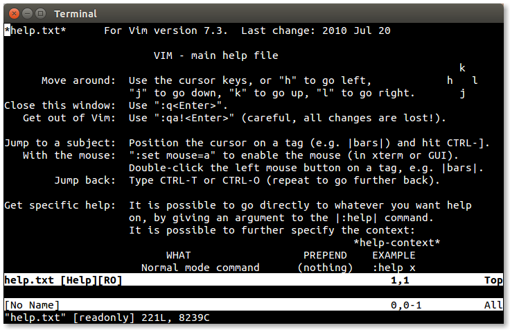Vim help window

Though help is extensive and very useful, it immediately presents a problem because it creates a *split* in the display. This is a rather advanced feature that needs some explanation.

Vim can divide the display into multiple panes, which in vim parlance are called *windows*. These are very useful when working with multiple files and other vim features such as help. When the display is divided this way, we can toggle between the windows by typing `Ctrl-w` twice. We can manipulate vim windows with the following commands:

```
:split          Create a new window
Ctrl-w Ctrl-w   Toogle between windows
Ctrl-w _        Enlarge the active window
Ctrl-w =        Make windows the same size
:close          Close active window
:only           Close all other windows
```

When working with files, it’s important to note that “closing” a window (with either `:q` or `:close`) does not remove the buffer containing the window’s content; we can recall it at any time. However, when we close the final window, vim terminates.

To exit help, make sure the cursor is in the help window and enter the quit command.

```
:q
```

But enough about windows, let’s get back to help. If we scroll around the initial help file, we see it is a hypertext document full of links to various topics and it begins with the commands we need to navigate the help system. This is all well and good, but it’s not the most interesting way to use it.

The best way is to type :h followed by the topic we are interested in. The fact we don’t have to type out “:help” reveals that most vim commands can be abbreviated. This saves a lot of work. In general, commands can be shortened to their smallest non-ambiguous form. Frequently used commands, like help, are often shortened to a single character but the system of abbreviations isn’t predictable, so we have to use help to find them. For the remainder of this adventure, we will try to use the shortest available form.

There is an important table near the beginning of the initial help file:

```
    WHAT                  PREPEND    EXAMPLE
Normal mode command      (nothing)   :help x
Visual mode command         v_       :help v_u
Insert mode command         i_       :help i_<Esc>
Command-line command        :        :help :quit
Command-line editing        c_       :help c_<Del>
Vim command argument        -        :help -r
Option                      '        :help 'textwidth'

Search for help:  Type ":help word", then hit CTRL-D to see
                  matching help entries for "word".
```

This table describes how we should ask for help in particular contexts. We’re familiar with the normal mode command ‘i’ which invokes insert mode. In the case of such a normal mode command, we simply type:

```
:h i
```

to display its help page. For command mode commands, we precede the command with a ‘:’, for example:

```
:h :q
```

gets help with the `:quit` command.

There are other contexts for modes we have yet to cover. We’ll get to those in a little bit.

As we go along, feel free to use help to learn more about the commands we discuss. As this adventure goes on, the text will include suggested help topics to explore.

Oh, and while we’re on the subject of command mode, now is a good time to point out that command mode has command line history similar to the shell. After typing ‘:’ we can use the up and down arrows to scroll through past commands.

**Help topics:** `:split :close :only ^w`

## Starting a Script

In order to demonstrate features in vim, we’re going to write a shell script. What it does is not important, in fact, it won’t do anything at all except to show how we can edit scripts. To begin, let’s start vim with the name of an non-existent script file:

```
[me@linuxbox ~]$ vi fooscript
```

and we will get our familiar “new file” window:

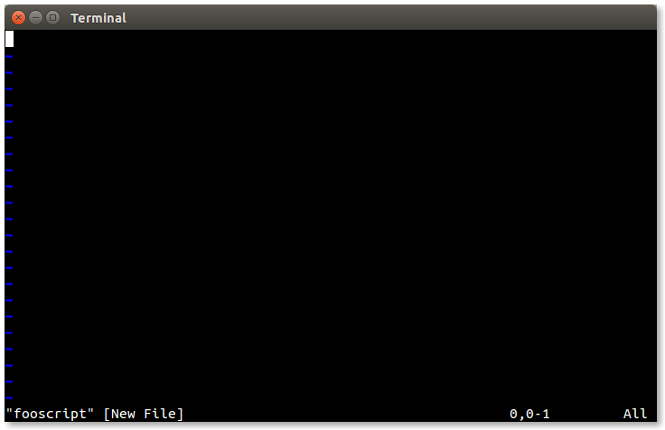New file

### Setting the Filetype

At this point vim has no idea what kind of file we are creating. If we had named the file `fooscript.sh` the filetype plugin would have determined that we were editing a shell script. We can verify this by asking vim what the current filetype is:

```
:set ft?
```

When we use the `set` command this way, it displays the current value of an option– in this case the `ft` (short for `filetype`) option. It should respond with the following indicating that the `ft` option is unset:

```
filetype=
```

For the curious, we can ask for help like this to get more information:

```
:h :set
:h 'ft'
```

To see all the current option settings, we can do this and the entire list will appear:.

```
:set
```

Since we want our new file to be treated as a shell script, we can set the filetype manually:

```
:set ft=sh
```

Next, let’s enter insert mode and type the first couple of lines in our script:

```
#!/bin/bash

# Script to test editing with vim 
```

Exit insert mode by pressing the `Esc` key and save the file:

```
:w
```

Now that our file contains the shebang on the first line, the filetype plugin will recognize the file as a shell script whenever it is loaded.

## Using the Shell

One thing we can do with filetypes is create a configuration file for each of the supported types. Normally, these are placed in the `~/.vim/ftplugin` directory. To do this, we need to create the directory.

We don’t have leave vim to do this; we can launch a shell from within vim. This is easily done by entering the command:

```
:sh
```

After doing this, a shell prompt will appear and we can enter our shell command:

```
[me@linuxbox ~]$ mkdir -p ~/.vim/ftplugin
```

When we’re done with the shell, we return to vim by exiting the shell:

```
[me@linuxbox ~]$ exit
```

Now that we have a place for our configuration file to live, let’s create it. We’ll open a new file:

```
:e ~/.vim/ftplugin/sh.vim
```

The filename `sh.vim` is required.

**Help topics:** `:sh`

## Buffers

Before we start editing our new file, let’s look at what vim is doing. Each file that we edit is stored in a *buffer*. We can look the current list of buffers this way:

```
:ls
```

This will display the list. There are several ways that we can switch buffers. The first way is to cycle between them:

```
:bn
```

This command (short for `:bnext`) cycles through the buffer list, wrapping around at the end. Likewise, there is a `:bp` (`:bprevious`) command which cycles through the buffer list backwards. We can also select a buffer by number:

```
:b 2
```

We can even refer to a buffer by using a portion of the file name:

```
:b fooscript
```

Let’s cycle back to our new buffer and add this line to our configuration file:

```
setlocal number
```

This will turn on line numbering each time we load a shell script. Notice that we use the `setlocal` command rather than `set`. This is because `set` will apply an option globally, whereas the `setlocal` command only applies the option to the current buffer. This will prevent settings conflicts when we edit multiple files of different types.

We can also control syntax highlighting while we’re here. We can turn it on with:

```
syntax on
```

Or turn it off with:

```
syntax off
```

We’ll save this file now, but before we do that, let’s type `mS` (lowercase m uppercase S), similar to what we did when we saved our initial `.vimrc`.

**Help topics:** `:ls :buffers :bnext :bprevious :setlocal 'number' :syntax`

## Tabs

Before we leave the subject of buffers, let’s take a look a possible way of using them. We have already discussed splits and windows, but recent versions of vim include a useful alternative called *tabs*. As the name suggests, this feature allows each buffer to appear in its own tab.

To create a new tab, we type the following command:

```
:tabnew
```

This will open a new tab. Since we haven’t associated the tab with a buffer yet, the tab will be labeled “[No Name]”.

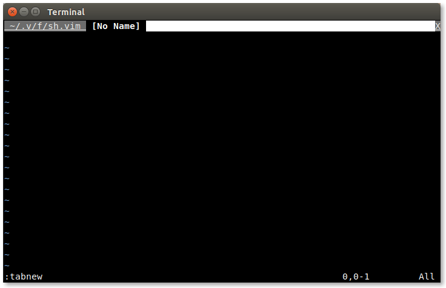New tab

While we are in the newly created tab, we can switch to one of the existing buffers as before by typing:

```
:bn
```

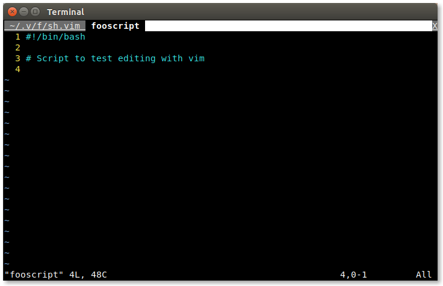Displaying a buffer in a tab

We can open files in tabs, too. It works much like the `:e` command. To open a file in a tab, we type `:tabe` followed by the name of the file.

Switching tabs is easy. To cycle through the tabs forward, we type `gt`. To cycle backwards, we type `gT`. If mouse support is enabled, tabs can be selected by clicking on them and new tabs can be opened by double clicking on the tab bar at the top of the screen.

It’s also possible to start vim with multiple files loaded in tabs by adding the `-p` option to the command line. For example:

```
[me@linuxbox ~]$ vim -p file1 file2
```

To close tabs, we use `:q` command just like closing a vim window. When only one tab remains, vim leaves tabbed mode and the display returns to its usual state.

There are a lot of tab-related features in vim. See the help topic for full details.

**Help topics:** `tabpage`

## Color Schemes

If we return to the buffer containing our shell script, we should see the effects of our `sh.vim` file. When syntax highlighting is turned on (`:syn on` will do the trick) it assumes the current color scheme. Vim ships with a bunch of different ones. To see the name of the current scheme, type this command:

```
:colo
```

and it will display the name. To see the entire set of available color schemes, type `:colo` followed by a space, then the tab key. This will trigger vim’s autocomplete and we should see the first name in the list. Subsequent use of the tab key will cycle through the list and we can try each one.

The ‘desert’ color scheme looks pretty good with shell scripts, so let’s add this to our `sh.vim` file. To do this, switch to the buffer containing that file and add the following line:

```
colorscheme desert
```

Notice that we used the long form of the `colorscheme` command. We could have used the abbreviated form `colo` but it’s a common custom to use the long names in configuration files for clarity.

There are many additional color schemes for vim on the Internet. To use one, first create a `~/.vim/colors` directory and then download the new scheme into it. The new scheme will appear when we cycle through the list.

Now, save the file and return to our shell script.

**Help topics:** `:colorscheme`

## Marks and File Marks

We know there are various ways of moving around within document in vim. For example, to get to the top, we can type:

```
gg
```

To go to the bottom we can type:

```
G
```

Vim (and real vi for that matter) also allows us to *mark* an arbitrary location within a document that we can recall at will. To demonstrate this, go to the top of the script and type:

```
ma
```

Next, go to the bottom of the document and type:

```
mb
```

We have just set two marks, the first called “a” and the second called “b”. To recall a mark, we precede the name of the mark with the ’ character, like so and we are taken to the top of the file again:

```
'a
```

We can use any lowercase letter to name a mark. Now, the clever among us will remember that we set marks in both the `.vimrc` file, and the `sh.vim` file but we used uppercase letters.

Yes we did, because they’re special. They’re called *file marks* and they let us set a mark in a file that vim will remember between sessions. Since we set the V mark in the `.vimrc` file and the S mark in `sh.vim` file, if we ever type:

```
'V
```

vim will immediately take us to that mark even if vim has to load the file to do it. By doing this to `.vimrc` and `sh.vim`, we’re set up to edit our configuration files anytime we get another bright idea about customizing vim.

**Help topics:** `m '`

## Visual Mode

Among the best features that vim adds to ordinary vi is *visual mode*. This mode allows us to visually select text in our document. If we type:

```
v
```

An indicator will appear at the bottom of the screen showing that we have entered this mode. While in visual mode, when we move the cursor (using any of the available movement commands), the text is both visually highlighted and selected. Once this is done we can apply the normal editing commands on the selected text such as `c` (change), `d` (delete), and `y` (yank). Typing `v` a second time will exit visual mode. If we type:

```
V
```

we again enter visual mode, but this time selection is done on a line-by-line basis rather than by individual characters. This is handy when cutting and copying blocks of code.

There is a third way of using visual mode. If we type:

```
Ctrl-v
```

we are able to select rectangular blocks of text by columns. For example, we could select a column from a table.

**Help topics:** `v V ^v`

## Indentation

We’re going to continue working on our shell script, but first we need to talk a little about *indentation*. As we know, indentation is used in programming to help communicate program structure. The shell does not require any particular style of indentation; it’s purely for the benefit of the humans trying to read the code. However, some other computer languages, such as Python, require indentation to express program structure.

Indentation is accomplished in one of two ways; either by inserting tab characters or by inserting a sequence of spaces. To understand the difference, we have to go way back in time to typewriters and teletype machines.

In the beginning, there were typewriters. On a typewriter, in order to make indenting the first line of a paragraph easier, someone invented a mechanical device that would move the carriage over a set amount of space. Over time, these devices became more sophisticated and allowed multiple tab stops to be set. When teletype machines came about, they implemented tabs with a specific ASCII character called HT (horizontal tab, code 9) which, by default, was rendered by moving the cursor to the next character position evenly divisible by 8.

In the early days of computing, when memory was precious, it made sense to conserve space in text files by using tab characters to avoid having to pad the text file with spaces.

Using tab characters creates a problem, though. Since a tab character has no intrinsic width (it only signifies the desire to move to the next tab stop), it’s up to the receiving program to render the tab with some defined width. This means that a file containing tabs could be rendered in different ways in different programs and in different contexts.

Since memory is no longer expensive, and using tabs creates this rendering confusion, modern practice calls for spaces instead of tabs to perform indentation (though this remains somewhat controversial). Vim provides a number of options for setting tabs and indentation. An excerpt from the help file for the `tabstop` option explains the ways vim can treat tabs:

```
There are four main ways to use tabs in Vim:

1. Always keep 'tabstop' at 8, set 'softtabstop' and
   'shiftwidth' to 4 (or 3 or whatever you prefer) and use
   'noexpandtab'.  Then Vim will use a mix of tabs and
   spaces, but typing <Tab> and <BS> will behave like a tab
   appears every 4 (or 3) characters.

2. Set 'tabstop' and 'shiftwidth' to whatever you prefer
   and use 'expandtab'.  This way you will always insert
   spaces.  The formatting will never be messed up when
   'tabstop' is changed.

3. Set 'tabstop' and 'shiftwidth' to whatever you prefer and
   use a |modeline| to set these values when editing the
   file again.  Only works when using Vim to edit the file.

4. Always set 'tabstop' and 'shiftwidth' to the same value,
   and 'noexpandtab'.  This should then work (for initial
   indents only) for any tabstop setting that people use.
   It might be nice to have tabs after the first non-blank
   inserted as spaces if you do this though.  Otherwise,
   aligned comments will be wrong when 'tabstop' is
   changed.
```

### Indentation Settings For Scripts

For our purposes, we will use method 2 and add the following lines to our `sh.vim` file to set tabs to indent 2 spaces. This is a popular setting specified in some shell script coding standards.

```
setlocal tabstop=2
setlocal shiftwidth=2
setlocal expandtab
setlocal softtabstop=2
setlocal autoindent
setlocal smartindent
```

In addition to the tab settings, we also included the `autoindent` and `smartindent` settings, which will automate indentation when we write blocks of code.

After adding the indentation settings to our `sh.vim` file, we’ll add some more lines to our shell script (type this in to see how it behaves):

```
     1  #! /bin/bash
     2  
     3  # This is a shell script to demonstrate features in vim.
     4  # It doesn't really do anything, it just shows what we can do.
     5  
     6  # Constants
     7  A=1
     8  B=2
     9  
    10  if [[ "$A" == "$B" ]]; then
    11    echo "This shows how smartindent works."
    12    echo "This shows how autoindent works."
    13    echo "A and B match."
    14  else
    15    echo "A and B do not match."
    16  fi
    17  
    18  afunction() {
    19    cmd1
    20    cmd2
    21  }
    22  
    23  if [[ -e file ]]; then
    24    cmd1
    25    cmd2
    26  fi
```

As we type these additional lines into our script, we notice that vim can now automatically provide indentation as needed. The `autoindent` option causes vim to repeat the previous line’s indention while the `smartindent` option provides indention for certain program structures such as the function and `if` statements. This saves a lot of time while coding and ensures that our code stays nice and neat.

If we find ourselves editing an existing script with a indentation scheme differing from our current settings, vim can convert the file. This is done by typing:

```
:retab
```

The file will have its tabs adjusted to match our current indentation style.

**Help topics:** `'tabstop' 'shiftwidth' 'expandtab' 'softtabstop' 'autoindent' 'smartindent'`

## Power Moves

As we learned in TLCL, vim has lots of *movement commands* we can use to quickly navigate around our documents. These commands can be employed in many useful ways.

Here is a list of the common movement commands. Some of this is review, some is new.

```
h       Move left (also left-arrow)
l       Move right (also right-arrow)
j       Move down (also down-arrow)
k       Move up (also up-arrow)
0       First character on the line (also the Home key)
^       First non-whitespace character on the line
$       Last character on the line (also the End key)
f{char} Move right to the next occurrence of char on the current
        line
t{char} Move right till (i.e., just before) the next occurrence of
        char on the current line
;       Repeat last f or t command
gg      Go to first line
G       Go to last line. If a count is specified, go to that line.
w       Move forward (right) to beginning of next word
b       Move backward (left) to beginning of previous word
e       Move forward to end of word
)       Move forward to beginning of next sentence
(       Move backward to beginning previous sentence
}       Move forward to beginning of next paragraph
{       Move backward to beginning of previous paragraph
```

Remember, each of these commands can be preceded with a count of how many times the command is to be performed.

### Operators

Movement commands are often used in conjunction with *operators*. The movement command determines how much of the text the operator affects. Here is a list of the most commonly used operators:

```
c   Change (i.e., delete then insert)
d   Delete/cut
y   Yank (i.e., copy)
~   Toggle case
gu  Make lowercase
gU  Make uppercase
gq  Format text (a topic we'll get to shortly)
g?  ROT13 encoding (for obfiscating text)
>   Shift (i.e., indent) right
<   Shift left
```

We can use visual mode to easily demonstrate the movement commands. Move the cursor to the beginning of line 3 of our script and type:

```
vf.
```

This will select the text from the beginning of the line to the end of the first sentence. Press `v` again to cancel visual mode. Next, return to the beginning line 3 and type:

```
v)
```

to select the first sentence. Cancel visual mode again and type:

```
v}
```

to select the entire paragraph (any block of text delimited by a blank line). Pressing } again extends the selection to the next paragraph.

### Text Object Selection

In addition to the traditional vi movement commands, vim adds a related feature called *text object selection*. These commands only work in conjunction with operators. These commands are:

```
a   Select entire (all) text object.
i   Select interior (in) of text object.
```

The text objects are:

```
w   Word
s   Sentence
p   Paragraph
t   Tag block (such as <aaa>...</aaa> used in HTML)
[   [ enclosed block
(   ( enclosed block (b can also be used)
{   { enclosed block (B can also be used)
"   " quoted string
'   ' quoted string
 
```

The way these work is very interesting. If we place our cursor on a word for example, and type:

```
caw
```

(short for “change all word”), vim selects the entire word, deletes it, and switches to insert mode. Text objects work with visual mode too. Try this: move to line 11 and place the cursor inside the quoted string and type:

```
vi"
```

The interior of the quoted string will be selected. If we instead type:

```
va"
```

the entire string including the quotes is selected.

**Help topics:** `motion.txt text-objects`

## Text Formatting

Let’s say we wanted to add a license header to the beginning of our script. This would consist of a comment block near the top of the file that includes the text of the copyright notice.

We’ll move to line 3 of our script and add the text, but before we start, let’s tell vim how long we want the lines of text to be. First we’ll ask vim what the current setting is:

```
:set tw?
```

Vim should respond:

```
textwidth=0
```

“tw” is short for `textwidth`, the length of lines setting. A value of zero means that vim is not enforcing a limit on line length. Let’s set textwidth to another value:

```
:set tw=75
```

Vim will now wrap lines (at word boundaries) when the length of a line exceeds this value.

### Formatting Paragraphs

Normally, we wouldn’t want to set a text width while writing code (though keeping line length below 80 characters is a good practice), but for this task it will be useful.

So let’s add our text. Type this in:

```
# This program is free software: you can redistribute it and/or modify it
# under the terms of the GNU General Public License as published by the
# Free Software Foundation, either version 3 of the License, or (at your
# option) any later version.

# This program is distributed in the hope that it will be useful, but
# WITHOUT ANY WARRANTY; without even the implied warranty of
# MERCHANTABILITY or FITNESS FOR A PARTICULAR PURPOSE.  See the GNU General
# Public License at <http://www.gnu.org/licenses/> for more details.
```

Notice the magic of vim as we type. Each time the length of the line reaches the text width, vim automatically starts a new line including, the comment symbol. While the filetype is set for shell scripting, vim understands certain things about shell syntax and tries to help. Very handy.

Now let’s say we were not happy with the length of these lines, or that we have edited the text in such a way that some of the lines are either too long or too short to maintain our well-formatted text. Wouldn’t be great is we could reformat our comment block? Well, we can. Very easily, in fact.

To demonstrate, let’s change the text width to 65 characters:

```
:set tw=65
```

Now place the cursor inside the comment block and type:

```
gqip
```

(meaning “format in paragraph”) and watch what happens. Presto, the block is reformatted to the new text width! A little later, we will show how to reduce this four key sequence down to a single key.

### Comment Blocks

There is a fun trick we can perform on this comment block. When we write code, we frequently perform testing and debugging by commenting out sections. Vim makes this process pretty easy. To try this out, let’s first remove the commenting from our block. We will do this by using visual mode to select a block. Place the cursor on the first column of the first line of the comment block, then enter visual mode:

```
Ctrl-v
```

Then, move the cursor right one column and then down to the bottom of the block.

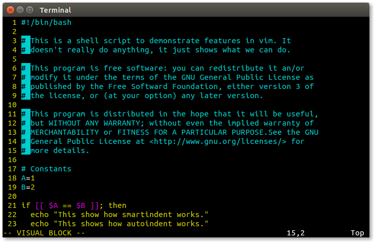Visual block select

Next, type:

```
d
```

This will delete the contents of the selected area. Now our block is uncommented.

To comment the block again, move the cursor to the first character of the block and, using visual block selection, select the first 2 columns of the block.

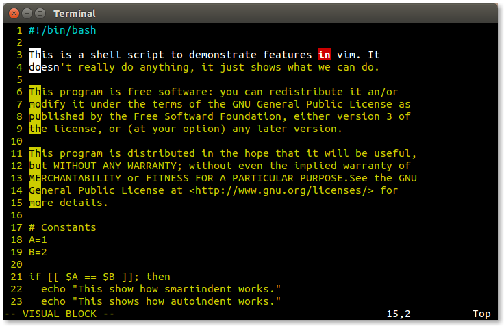Column selection

Next, enter insert mode using `Shift-i` (command to insert at the beginning of the line), then type the `#` symbol followed by a space. Finally, press the `Esc` key twice. Vim will insert the `#` symbol and space into each line of the block.

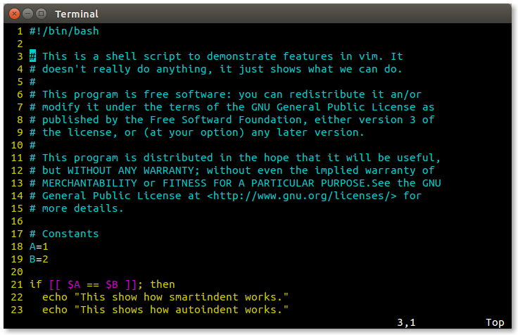Completed block

### Case Conversion

Sometimes, we need to change text from upper to lower case and vice versa. vim has the following case conversion commands:

```
~       Toggle the case of the current character
gU      Convert text to upper case
gu      Convert text to lower case
```

Both the `gU` and `gu` commands can be applied to text selected in visual mode or used in conjunction with either movement commands or text object selections. For example:

```
gUis    Convert the current sentence to upper case
guf:    Convert text from the cursor position to the next ':'
        character on the current line
```

### File Format Conversion

Once in a while, we are inflicted with a text file that was created on a DOS/Windows system. These files will contain an extra carriage return at the end of each line. Vim will indicate this after loading the file by displaying a “DOS” message at the bottom of the editing window. To correct this annoying condition, do the following:

```
:set fileformat=unix
:w
```

The file will be rewritten in the correct format.

**Help topics:** `'textwidth' gq 'fileformat' ~ gu gU`

## Macros

Text editing sometimes means we get stuck with a tedious repetitive editing task where we do the same set of operations over and over again. This is the bane of every computer user. Fortunately, vim provides us a way to record a sequence of operations we can later playback as needed. These recordings are called *macros*.

To create a macro, we begin recording by typing `q` followed by a single letter. The character typed after the `q` becomes the name of the macro. After we start recording, everything we type gets stored in the macro. To conclude recording, we type `q` again.

To demonstrate, let’s consider our comment block again. To create a macro that will remove a comment symbol from the beginning of the line, we would do this: move to the first line in the comment block and type the following command:

```
qa^xxjq
```

Let’s break down what this sequence does:

```
qa      Start recording macro "a"
^       Move to the first non-whitespace character in the line
xx      Delete the first two characters under the cursor
j       Move down one line
q       End recording
```

Now that we have removed the comment symbol from the first line and our cursor is on the second line, we can replay our macro by typing:

```
@a
```

The recorded sequence will be performed. To repeat the macro on succeeding lines, we can use the repeat last macro command which is:

```
@@
```

Or we could precede the macro invocation with a count as with other commands. For example, if we type:

```
5@a
```

the macro will be repeated 5 times.

We can undo the effect of the macro by repeatedly typing:

```
u
```

One nice thing about macros is that vim remembers them. Each time we exit vim, the current macro definitions are stored and ready for reuse the next time we start another editing session.

**Help topics:** `q @`

## Registers

We are no doubt familiar with the idea of copying and pasting in text editors. With vim, we know `y` performs a yank (copy) of the selected text, while `p` and `P` each paste text at the current cursor location. The way vim does this involves the use of *registers*.

Registers are named areas of memory where vim stores text. We can think of them as a series of string variables. Vim uses one particular set to store text that we delete, but there are others that we can use to store text and restore it as we desire. It’s like having a multi-element clipboard.

To refer to a register, we type " followed by a lowercase letter or a digit (though these have a special use), for example:

```
"a
```

refers to the register named “a”. To place something in the register, we follow the register with an operation like “yank to end of the line”:

```
"ay$
```

To recall the contents of a register, we follow the name of the register with a paste operation like so:

```
"ap
```

Using registers enables us to place many chunks of text into our clipboard at the same time. But even without consciously trying to use registers, vim is using them while we perform deletes and yanks.

As we mentioned earlier, the registers named 0-9 have a special use. When we perform ordinary yanks and deletes, vim places our latest yank in register 0 and our last nine deletes in registers 1-9. As we continue to make deletions, vim moves the previous deletion to the next number, so register 1 will contain our most recent deletion and register 9 the oldest.

Knowing this allows us to overcome the problem of performing a yank and then a delete and losing the text we yanked (a common hazard when using vim). We can always recall the latest yank by referencing register 0.

To see the current contents of the registers we can use the command:

```
:reg
```

**Help topics:** `" :registers`

## Insert Sub-Modes

While it’s not obvious, vim has a set of commands inside of insert mode. Most of these commands invoke some form of automatic completion to make our typing faster. They’re a little clumsy, but might be worth a try.

### Automatically Complete Word Ctrl-n

Let’s go to the bottom of our script file and enter insert mode to add a new line at the bottom. We want the line to read:

```
afunction && echo "It worked."
```

We start to type the first few characters (“afun”) and press `Ctrl-n`. Vim should automatically complete the function name “afunction” after we press it. In those cases where vim presents us with more than one choice, use `Ctrl-n` and `Ctrl-p` to move up and down the list. Typing any another character, such as a space, to continue our typing will accept our selection and end the automatic completion. `Ctrl-e` can be use to exit the sub-mode immediately.

### Insert Register Contents - Ctrl-r

Typing `Ctrl-r` followed by a single character register name will insert the contents of that register. Unlike doing an ordinary paste using `p` or `P`, a register insert honors text formatting and indentation settings such as `textwidth` and `autoindent`.

### Automatically Complete Line - Ctrl-x Ctrl-l

Typing `Ctrl-x` while in insert mode launches a sub-mode of automatic completion features. A small menu will appear at the bottom of the display with a list of keys we can type to perform different completions.

If we have typed the first few letters of a line found in this or any other file that vim has open, typing `Ctrl-x` `Ctrl-l` will attempt to automatically complete the line, copying the line to the current location.

### Automatically Complete Filename Ctrl-x Ctrl-f

This will perform filename completion. If we start the name of an existing path/file, we can type `Ctrl-x` `Ctrl-f` and vim will attempt to complete the name.

### Dictionary Lookup - Ctrl-x Ctrl-k

If we define a dictionary (i.e., a sorted list of words), by adding this line to our configuration file:

```
setlocal dictionary=/usr/share/dict/words
```

which is the default dictionary on most Linux systems, we can begin typing a word, type `Ctrl-x` `Ctrl-k`, and vim will attempt to automatically complete the word using the dictionary. We will be presented with a list of words from which we can choose the desired entry.

**Help topics:** `i_^n i_^p i_^x^l i_^x^r i_^x^f i_^x^k 'dictionary'`

## Mapping

Like many interactive command line programs, vim allows users to remap keys to customize vim’s behavior. It has a specific command for this, `map`, that allows a key to be assigned the function of another key or a sequence of keys. Further, vim allows us to say that a key is to be remapped only in a certain mode, for example only in normal mode but not in insert nor command modes.

Before we go on, we should point out that use of the `map` command is discouraged. It can create nasty side effects in some situations. Vim provides another set of mapping commands that are safer to use.

Earlier, we looked at the paragraph reformatting command sequence `gqip`, which means “format in paragraph.” To demonstrate a useful remapping, we will map the `Q` key to generate this sequence. We can do this by entering:

```
:nnoremap Q gqip
```

After executing this command, pressing the `Q` key in normal mode will cause the normal mode sequence `gqip` to be performed.

The `nnoremap` command is one of the `noremap` commands, the safe version of `map` command. The members of this family include:

```
noremap     Map key regardless of mode
nnoremap    Map normal mode key
inoremap    Map insert mode key
cnoremap    Map command mode key
```

Most of the time we will be remapping normal mode keys, so the `nnoremap` command will be the used most often. Here is another example:

```
:nnoremap S :split<Return>
```

This command maps the `S` key to enter command mode, type the `split` command and a carriage return. The “<Return>” is called a *key notation*. For non-printable characters, vim has a representation that can be used to indicate the key when we specifying mapping. To see the entire list of possible codes, enter:

```
:h key-notation
```

So how do we know which keys are available for remapping assignment? As vim uses almost every key for something, we have to make a judgment call as to what native functionality we are willing to give up to get the mapping we want. In the case of the Q key, which we used in our first example, it is normally used to invoke ex mode, a very rarely used feature. There are many such cases in vim; we just have to be selective. It is best to check the key first by doing something like:

```
:h Q
```

to see how a key is being used before we apply our own mapping.

To make mappings permanent, we can add these mapping commands to our `.vimrc` file:

```
nnoremap Q gqip
nnoremap S :split<Return>
```

**Help topics:** `:map key-notation`

## Snippets

Mapping is not restricted to single characters. We can use sequences too. This is often helpful when we want to create a number of easily remembered, related commands of our own design. Take for example, inserting boilerplate text into a document. If we had a collection of these snippets, we might want to uniquely name them but have a common structure to the name for easily recollection.

We added the GPL notice to the comment block at the beginning of our script. As this is rather tedious to type, and we might to use it again, it makes a good candidate for being a snippet.

To do this, we’ll first go out to the shell and create a directory to store our snippet text files. It doesn’t matter where we put the snippet files, but in the interest of keeping all the vim stuff together, we’ll put them with our other vim-related files.

```
:sh
[me@linuxbox ~]$ mkdir ~/.vim/snippets
[me@linuxbox ~]$ exit
```

Next, we’ll copy the license by highlighting the text in visual mode and yanking it. To create the snippet file, we’ll open a new buffer:

```
:e ~/.vim/snippets/gpl.sh
```

Thus creating a new file called gpl.sh. Finally, we’ll paste the copied text into our new file and save it:

```
p
:w
```

Now that we have our snippet file in place, we are ready to define our mapping:

```
:nnoremap ,GPL :r ~/.vim/snippets/gpl.sh<Return>
```

We map “,GPL” to a command that will cause vim to read the snippet file into the current buffer. The leading comma is used as a *leader character*. The comma is a rarely used command that is usually safe to remap. Using a leader character will reduce the number of actual vim commands we have to remap if we create a lot of snippets.

As we add mappings, it’s useful to know what they all are. To display a list of mappings, we use the `:map` command followed by no arguments:

```
:map
```

Once we are satisfied with our remapping, we can add it to one of our vim configuration files. If we want it to be global (that is, it applies to all types of files), we could put it in our `.vimrc` file like this:

```
nnoremap ,GPL :r ~/.vim/snippets/gpl.sh<Return>
```

If, on the other hand, we want it to be specific to a particular file type, we would put it in the appropriate file such as `~/.vim/ftplugin/sh.vim` like this:

```
nnoremap <buffer> ,GPL :r ~/.vim/snippets/gpl.sh<Return>
```

In this case, we add the special argument <buffer> to make the mapping local to the current buffer containing the particular file type.

**Help topics:** `:map <buffer>`

## Finishing Our Script

With all that we have learned so far, it should be pretty easy to go ahead and finish our script:

```
#! /bin/bash

# ---------------------------------------------------------------
# This is a shell script to demonstrate features in vim. It
# doesn't really do anything, it just shows what we can do.
# 
# This program is free software: you can redistribute it an/or
# modify it under the terms of the GNU General Public License as
# published by the Free Software Foundation, either version 3 of
# the license, or (at your option) any later version.
# 
# This program is distributed in the hope that it will be useful,
# but WITHOUT ANY WARRANTY; without even the implied warranty of
# MERCHANTABILITY or FITNESS FOR A PARTICULAR PURPOSE.See the GNU
# General Public License at <http://www.gnu.org/licenses/> for
# more details.
# ---------------------------------------------------------------

# ---------------------------------------------------------------
# Constants
# ---------------------------------------------------------------

A=1
B=2

# ---------------------------------------------------------------
# Functions
# ---------------------------------------------------------------

afunction() {
  cmd1
  cmd2
}

# ---------------------------------------------------------------
# Main Logic
# ---------------------------------------------------------------

if [[ $A == $B ]]; then
  echo "This shows how smartindent works."
  echo "This shows how autoindent works."
  echo "A and B match."
else
  echo "A and B do not match."
fi

if [[ -e file ]]; then
  cmd1
  cmd2
fi
```

## Using External Commands

Vim is able to execute external commands and add the result to the current buffer or to filter a text selection using an external command.

### Loading Output From a Command Into the Buffer

Let’s edit an old friend. If we don’t have a copy to edit, we can make one. First we’ll open a buffer:

```
:e dir-list.txt
```

Next, we’ll load the buffer with some appropriate text:

```
:r ! ls -l /usr/bin
```

This will read the results of the specified external command into our buffer.

### Running an External Command on the Current File

Let’s save our file and then run an external command on it:

```
:w
:! wc -l %
```

Here we tell vim to execute the `wc` command on the current file `dir-list.txt`. This does not affect the current buffer, just the file when we specify it with the % symbol.

### Using an External Command to Filter the Current Buffer

Let’s apply a filter to the text. To do this, we need to select some text. The easiest way to do this is with visual mode:

```
ggVG
```

This will move the cursor to the beginning of the file and enter visual mode then move to the end of the file, thus selecting the entire buffer.

We’ll filter the selection to remove everything except lines containing the string “zip”. When we start entering a command after performing a visual selection, the presence of the selection will be indicated this way:

```
:'<,'>
```

This actually signifies a range. We could just as easily specify a pair of line numbers such as 1, 100 instead. To complete our command, we add our filter:

```
:'<,'> ! grep zip
```

We are not limited to a single command. We can also specify pipelines, for example:

```
:'<,'> ! grep zip | sort
```

After running this command, our buffer contains a small selection of files, each containing the letters “zip” in the name.

**Help topics:** : `! filter`

## File System Management and Navigation

We know that we can load files into vim by specifying them on the command line when we initially invoke vim, and that we can load files from within vim with the `:edit` and `:read` commands. But vim also provides more advanced ways of working with the file system.

### netrw

When we load the filetype plugin (as we have set up our `.vimrc` file to do), vim also loads another plugin called *netrw*. This plugin can, as its name suggests, read and write files from the local file system and from remote systems over the network. In this adventure, we’re going concern ourselves with using netrw as a local file browser.

To start the browser in the current window, we use the `:Ex` (short for `:Explore`) command. To start the browser in a split window, we use the amusingly named `:Sex` (short for `:Sexplore`) command. The browser looks like this:

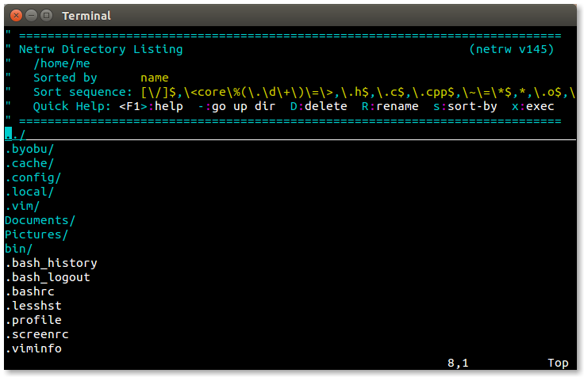File browser

At the top, we have the banner which provides some clues to the browser’s operation, followed by a vertical list of directories and files. We can toggle the banner on and off with `Shift-i` and cycle through available listing views by pressing the `i` key. The sort order (name, time, size) may be changed with `s` key.

Using the browser is easy. To select a file or directory, we can use the up and down arrows (or `Ctrl-p` and `Ctrl-n`) to move the cursor. Pressing Enter will open the selected file or directory.

### :find

The `:find` command loads a file by searching a path variable maintained by vim. With `:find` we can specify a partial file name, and vim will attempt to locate the file and automatically complete the name when Tab key is pressed.

The action of the `:find` command can be enhanced if the characters “**” are appended to the end of the path. The best way to do this is:

```
:set path+=**
```

Adding this to the path allows `:find` to search directories recursively. For example, we could change the current working directory to the top of a project’s source file tree and use `:find` to load any file in the entire tree.

### wildmenu

Another cool enhancement we can apply is the *wildmenu*. This is a highlighted bar that will appear above the command line when we are entering file names. The word “wild” in the name refers to use of the “wild” key, by default the Tab key. When the wild key is pressed, automatic completion is attempted with the list of possible matches displayed in the wildmenu. Using the left and right arrow keys (or `Ctrl-p` and `Ctrl-n`) allows us to choose one of the displayed items.

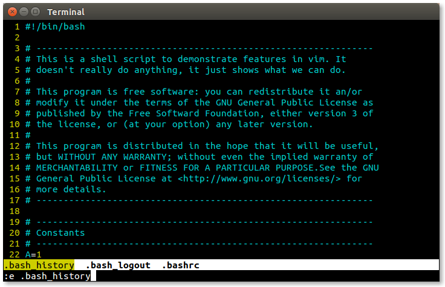The wildmenu

We can turn on the wildmenu with this command:

```
:set wildmenu
```

### Opening Files Named in a Document

If the document we are editing contains a file name, we can open that file by placing the cursor on the file name and typing either of these commands:

```
gf      Open file name under cursor
^w^f    Open file name under cursor in new window
```

**Help topics:** `netrw :find 'path' 'wildmenu' gf ^w^f`

## One Does Not Live by Code Alone

While vim is most often associated with writing code of all sorts, it’s good at writing ordinary prose as well. Need proof? All of the adventures were written using vim running on a Raspberry Pi!

We can configure vim to work well with text by creating a file for the text file type in the `~/.vim/ftplugin` directory:

```
"### ~/.vim/ftplugin/text.vim
setlocal textwidth=75
setlocal tabstop=4
setlocal shiftwidth=4
setlocal expandtab
```

This configuration will automatically wrap lines at word boundaries once the line length exceeds 75 characters, and will set tabs to 4 spaces wide. Remember that when `textwidth` is non-zero, vim will automatically constrain line length, and we can use the `gqip` command to reformat paragraphs to the specified width.

### Spell Checking

When we write text, it’s handy to perform spell checking while we type. Fortunately, vim can do this, too. If we add the following lines to our `text.vim file`, vim will help fix those pesky spelling mistakes:

```
setlocal spelllang=en_us
setlocal dictionary=/usr/share/dict/words
setlocal spell
```

The first line defines the language for spell checking, in this case US English. Next, we specify the dictionary file to use. Most Linux distributions include this list of words, but other dictionary files can be used. The final line turns on the spell checker. When active, the spell checker highlights misspelled words (that is, any word not found in the dictionary) as we type.

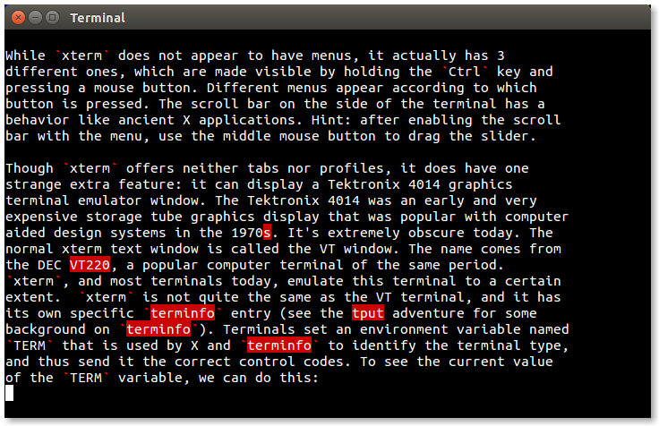Highlighted misspellings

Correcting misspelled words is pretty easy. Vim provides the following commands:

```
]s                      Next misspelled word
[s                      Previous misspelled word
z=                      Display suggested corrections
zg                      Add word to personal dictionary
```

To correct a misspelling, we place the cursor on the highlighted word and type:

```
z=
```

Vim will display a list of suggested corrections and we choose from the list. It is also possible to maintain a personal dictionary of words not found in the main dictionary, for example specialized technical terms. Vim creates the personal dictionary automatically (in `~/.vim/spell`) and words are added to it when we place the cursor on the highlighted word and type:

```
zg
```

Once the word is added to our personal dictionary it will no longer be marked as misspelled by the spelling checker.

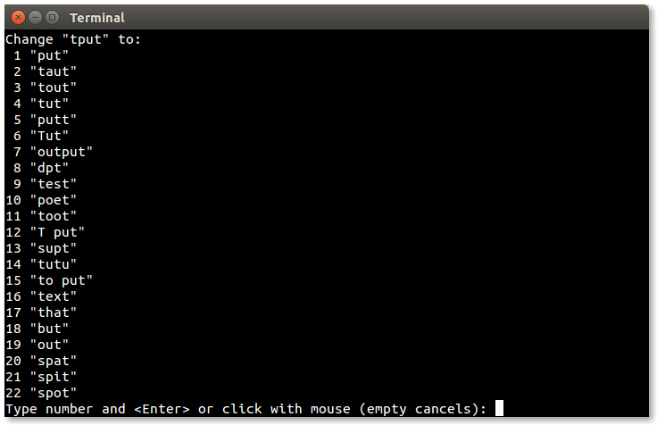Suggested corrections

**Help topics:** `'spelllang' 'spell'`

## More .vimrc Tricks

Before we go, there are a few more features we can add to our `.vimrc` file to juice things up a bit. The first one:

```
set laststatus=2
```

This will cause vim to display a status bar near the bottom of the display. It will normally appear when more than one window is open (`lastatatus=1`), but changing this value to 2 causes it to always be displayed regardless of the number of windows. Next, we have:

```
set ruler
```

will display the cursor position (row, column, relative %) in the window status bar. Handy for knowing where we are within a file.

Finally, we’ll add mouse support (not that we should ever use a mouse ;-):

```
if has('mouse')
  set mouse=a
endif
```

This will activate mouse support if vim detects a mouse. Mouse support allows us to position the cursor, switching windows if needed. It works in visual mode too.

**Help topics:** `'laststatus' 'ruler' 'mouse'`

## Summing Up

We can sometimes think of vim as being a metaphor for the command line itself. Both are arcane, vast, and capable of many amazing feats. Despite its ancient ancestry, vim remains a vital and popular tool for developers and administrators.

Here are the final versions of our 3 configuration files:

```
"### ~/.vimrc
set nocompatible
filetype plugin on
nnoremap Q gqip
nnoremap S :split<Return>
set path+=**
set wildmenu
set spelllang=en_us
if has('mouse')
  set mouse=a
endif
set laststatus=2
set ruler

"### ~/.vim/ftplugin/sh.vim
setlocal number
colorscheme desert
syntax off
setlocal tabstop=2
setlocal shiftwidth=2
setlocal expandtab
setlocal softtabstop=2
setlocal autoindent
setlocal smartindent

"### ~/.vim/ftplugin/text.vim
colorscheme desert
setlocal textwidth=75
setlocal tabstop=4
setlocal shiftwidth=4
setlocal expandtab
setlocal complete=.,w,b,u,t,i
setlocal dictionary=/usr/share/dict/words
setlocal spell
```

We covered a lot of ground in this adventure and it will take some time for it to all sink in. The best advice was given back in TLCL. The only way to become a vim master is to “practice, practice, practice!”

## Further Reading

Vim has a large and enthusiastic user community. As a result, there are many online help and training resources. Here are some that I found useful during my research for this adventure.

- The eternal struggle between tabs and spaces in indentation: https://www.jwz.org/doc/tabs-vs-spaces.html
- List of key notations used when remapping keys: http://vimdoc.sourceforge.net/htmldoc/intro.html#key-notation
- A concise tutorial on vim registers: https://www.brianstorti.com/vim-registers/
- Learn Vimscript the Hard Way is a detailed tutorial of the vim scripting language useful for customizing vim and even writing your own plugins: [https://learnvimscriptthehardway.stevelosh.com](https://learnvimscriptthehardway.stevelosh.com/)
- From the same source, a discussion of the leader key: https://learnvimscriptthehardway.stevelosh.com/chapters/06.html
- Using external commands and the shell while inside vim: https://www.linux.com/training-tutorials/vim-tips-working-external-commands
- Vim: you don’t need NERDtree or (maybe) netrw https://shapeshed.com/vim-netrw/#removing-the-banner
- A tutorial on using the vim spell checker: https://www.linux.com/training-tutorials/using-spell-checking-vim/

### Videos

There are also a lot of video tutorials for vim. Here are a few:

- How to Do 90% of What Plugins Do (With Just Vim): https://youtu.be/XA2WjJbmmoM
- Let Vim do the Typing: https://youtu.be/3TX3kV3TICU
- Damian Conway, “More Instantly Better Vim” - OSCON 2013: https://youtu.be/aHm36-na4-4
- vim + tmux - OMG!Code: https://youtu.be/5r6yzFEXajQ