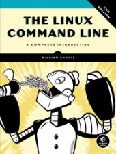

+++
title = "Books"
date = 2023-06-08T10:52:16+08:00
description = ""
isCJKLanguage = true
draft = false
+++

# Linux命令行 The Linux Command Line

# by William Shotts

**Fifth Internet Edition Available Now!**

**第五版已经上线！**

Designed for the new command line user, this 555-page volume covers the same material as LinuxCommand.org but in much greater detail. In addition to the basics of command line use and shell scripting, *The Linux Command Line* includes chapters on many common programs used on the command line, as well as more advanced topics.

​	这本555页的书籍专为新的命令行用户设计，内容涵盖了LinuxCommand.org上的相同材料，但更加详细。除了介绍命令行使用和Shell脚本的基础知识外，《Linux命令行》还包括许多常用的命令行程序以及更高级的主题。

- **Released under a Creative Commons [license](https://creativecommons.org/licenses/by-nc-nd/3.0/), this book is available for free download in PDF format.** Download it [here](https://sourceforge.net/projects/linuxcommand/files/TLCL/19.01/TLCL-19.01.pdf/download).

- **本书以[知识共享许可证](https://creativecommons.org/licenses/by-nc-nd/3.0/)发布，可以免费下载PDF格式的电子版。** 在这里下载：[链接](https://sourceforge.net/projects/linuxcommand/files/TLCL/19.01/TLCL-19.01.pdf/download)。

- **The book is available in printed form, published by [No Starch Press](https://nostarch.com/tlcl2).** Copies may be purchased wherever fine books are sold. No Starch Press also offers electronic formats for popular e-readers.

- **该书也有印刷版，由[No Starch Press](https://nostarch.com/tlcl2)出版。** 可以在各大书店购买。No Starch Press还提供流行电子阅读器的电子版。

  **In addition to English, the printed book is also available in the following languages:**

  **除了英文版，该书还提供以下语言版本：**

  - **Korean:** available from [BJ PUBLIC](https://bjpublic.tistory.com/)
  - **Serbian:** available from [Mikro Knjiga](http://www.mikroknjiga.rs/)
  - **Chinese (Traditional):** available from [GOTOP](http://books.gotop.com.tw/)
  - **Chinese (Simplified):** available from [PT Press](http://www.ptpress.com.cn/)
  - **Russian:** available from [Piter](https://www.piter.com/)
  - **Polish:** available from [Helion](https://helion.pl/)
  - **韩文：** 可从[BJ PUBLIC](https://bjpublic.tistory.com/)获得
  - **塞尔维亚文：** 可从[Mikro Knjiga](http://www.mikroknjiga.rs/)获得
  - **繁体中文：** 可从[GOTOP](http://books.gotop.com.tw/)获得
  - **简体中文：** 可从[PT Press](http://www.ptpress.com.cn/)获得
  - **俄文：** 可从[Piter](https://www.piter.com/)获得
  - **波兰文：** 可从[Helion](https://helion.pl/)获得

- **Read reviews at [No Starch Press](https://nostarch.com/tlcl2#reviews) and [Amazon](https://www.amazon.com/Linux-Command-Line-2nd-Introduction/product-reviews/1593279523/ref=cm_cr_dp_d_show_all_btm?ie=UTF8&reviewerType=all_reviews).**

- **阅读[No Starch Press](https://nostarch.com/tlcl2#reviews)和[Amazon](https://www.amazon.com/Linux-Command-Line-2nd-Introduction/product-reviews/1593279523/ref=cm_cr_dp_d_show_all_btm?ie=UTF8&reviewerType=all_reviews)上的评论。**

- **Find The Linux Command Line at [your local library](https://www.worldcat.org/title/linux-command-line-a-complete-introduction/oclc/714726098&referer=brief_results).**

- **在[你所在地的图书馆](https://www.worldcat.org/title/linux-command-line-a-complete-introduction/oclc/714726098&referer=brief_results)中找到《Linux命令行》。**

- **Want to translate the Creative Commons version of \*The Linux Command Line\*?** Please see the [Community Translation Policy](https://linuxcommand.org/lc3_translations.php) for details.

- **想要翻译《Linux命令行》的知识共享版本吗？** 请查看[社区翻译政策](https://linuxcommand.org/lc3_translations.php)获取详细信息。

  **The following community translations are now available:**

  **以下社区翻译现已可用：**
  
  - **[Arabic](https://sourceforge.net/projects/omlx/files/open books/TLCL/The_Linux_Command_Line-arabic-14.07.pdf/download)** Translation by Abd Allatif Eymsh
  - **Portuguese (in progress).** Translation by [Matheus Sales](mailto:ms.matheus01@gmail.com)
  - **Italian (in progress).** Translation by [Francesco Cargiuli](mailto:francesco.cargiuli@gmail.com)
  - **Romanian (in progress).** Translation by [Paval Vlad](mailto:wladpaul@yahoo.com)
  - **Turkish (in progress).** Translation by [Herkes için Linux](mailto:herkesicinlinux@protonmail.com)
  - **Farsi (in progress).** Translation by [Amirhosain Shahsavari](mailto:shvb2007@gmail.com)
  - **Dutch (in progress).** Translation by [Tom Van Looy](mailto:tom@ctors.net)
  - **French (in progress).** Translation by [Vincent de Paul BAKPATINA](mailto:vincent.bakpatina@ipnetinstitute.com)
  - **[阿拉伯语](https://sourceforge.net/projects/omlx/files/open books/TLCL/The_Linux_Command_Line-arabic-14.07.pdf/download)：** 由Abd Allatif Eymsh翻译
  - **葡萄牙语（进行中）：** 由[Matheus Sales](mailto:ms.matheus01@gmail.com)翻译
  - **意大利语（进行中）：** 由[Francesco Cargiuli](mailto:francesco.cargiuli@gmail.com)翻译
  - **罗马尼亚语（进行中）：** 由[Paval Vlad](mailto:wladpaul@yahoo.com)翻译
  - **土耳其语（进行中）：** 由[Herkes için Linux](mailto:herkesicinlinux@protonmail.com)翻译
  - **波斯语（进行中）：** 由[Amirhosain Shahsavari](mailto:shvb2007@gmail.com)翻译
  - **荷兰语（进行中）：** 由[Tom Van Looy](mailto:tom@ctors.net)翻译
  - **法语（进行中）：** 由[Vincent de Paul BAKPATINA](mailto:vincent.bakpatina@ipnetinstitute.com)翻译

------

# 与Linux命令行冒险 Adventures with the Linux Command Line

## by William Shotts

**First Internet Edition Available Now!**

**第一版已经上线！**

In this 250+ page sequel/suplement to *The Linux Command Line* we'll look at even more cool tools and fun command line topics. With 14 action-packed chapters, it's perfect for makers, students, and anyone wanting to learn additional Linux history, techniques, and skills.

​	在这本250多页的续集/补充中，我们将探索更多有趣的工具和命令行主题。这本书有14个充满动作的章节，非常适合创客、学生以及任何想要了解更多Linux历史、技术和技能的人。 

- **Released under a Creative Commons [license](https://creativecommons.org/licenses/by-nc-nd/3.0/), this book is available for free download in PDF format.** Download it [here](https://sourceforge.net/projects/linuxcommand/files/AWTLCL/21.10/AWTLCL-21.10.pdf/download).
- **本书以[知识共享许可证](https://creativecommons.org/licenses/by-nc-nd/3.0/)发布，可以免费下载PDF格式的电子版。** 在这里下载：[链接](https://sourceforge.net/projects/linuxcommand/files/AWTLCL/21.10/AWTLCL-21.10.pdf/download)。