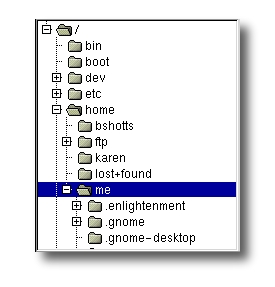

+++
title = "导航"
date = 2023-06-08T10:54:43+08:00
weight = 2
description = ""
isCJKLanguage = true
draft = false

+++

# 导航 Navigation

https://linuxcommand.org/lc3_lts0020.php

In this lesson, we will introduce our first three commands: `pwd` (print working directory), `cd` (change directory), and `ls` (list files and directories).

​	在本课程中，我们将介绍我们的前三个命令：`pwd`（打印当前工作目录）、`cd`（切换目录）和`ls`（列出文件和目录）。

Those new to the command line will need to pay close attention to this lesson since the concepts will take some getting used to.

​	对于命令行不熟悉的人来说，需要特别注意这节课，因为这些概念需要一些时间来适应。

## 文件系统组织 File System Organization

Like Windows, the files on a Linux system are arranged in what is called a *hierarchical directory structure*. This means that they are organized in a tree-like pattern of *directories* (called folders in other systems), which may contain files and *subdirectories*. The first directory in the file system is called the *root directory*. The root directory contains files and subdirectories, which contain more files and subdirectories and so on and so on.

​	与Windows一样，Linux系统上的文件以所谓的*分层目录结构*进行排列。这意味着它们以一种类似树状的模式组织在*目录*中（其他系统中称为文件夹），这些目录中可能包含文件和*子目录*。文件系统中的第一个目录称为*根目录*。根目录包含文件和子目录，这些子目录又包含更多的文件和子目录，以此类推。

Most graphical environments include a file manager program used to view and manipulate the contents of the file system. Often we will see the file system represented like this: 

​	大多数图形界面都包含一个文件管理器程序，用于查看和操作文件系统的内容。通常，我们会看到文件系统以这样的方式表示：

One important difference between Windows and Unix-like operating systems such as Linux is that Linux does not employ the concept of drive letters. While Windows drive letters split the file system into a series of different trees (one for each device), Linux always has a single tree. Different storage devices may be different branches of the tree, but there is always just a single tree.

​	Windows和Linux等类Unix操作系统之间一个重要的区别是，Linux不使用驱动器字母的概念。而Windows的驱动器字母将文件系统分割为一系列不同的树（每个设备对应一个树），Linux始终只有一棵树。不同的存储设备可能是树的不同分支，但始终只有一棵树。

## pwd

Since the command line interface cannot provide graphic pictures of the file system structure, we must have a different way of representing it. To do this, think of the file system tree as a maze, and that we are standing in it. At any given moment, we are located in a single directory. Inside that directory, we can see its files and the pathway to its *parent directory* and the pathways to the subdirectories of the directory in which we are standing.

​	由于命令行界面无法提供文件系统结构的图形图片，我们必须采用不同的方式来表示它。为此，将文件系统树视为一个迷宫，并且我们正在其中。在任何给定的时刻，我们位于单个目录中。在该目录中，我们可以看到其文件以及到其*父目录*和所处目录的子目录的路径。

The directory we are standing in is called the *working directory*. To see the name of the working directory, we use the `pwd` command.

​	我们所处的目录称为*工作目录*。要查看工作目录的名称，我们使用`pwd`命令。

```bash
[me@linuxbox me]$ pwd
/home/me
```

When we first log on to our Linux system, the working directory is set to our *home directory*. This is where we put our files. On most systems, the home directory will be called /home/user_name, but it can be anything according to the whims of the system administrator.

​	当我们首次登录到Linux系统时，工作目录设置为我们的*主目录*。这是我们放置文件的地方。在大多数系统上，主目录将被称为/home/user_name，但根据系统管理员的喜好，它可以是任何名称。

To list the files in the working directory, we use the `ls` command.

​	要列出工作目录中的文件，我们使用`ls`命令。

```bash
[me@linuxbox me]$ ls
Desktop    Downloads         foo.txt  Pictures  Templates
Documents  examples.desktop  Music    Public    Videos
```

We will come back to `ls` in the next lesson. There are a lot of fun things you can do with it, but we have to talk about pathnames and directories a bit first.

​	我们将在下一课中回到`ls`命令。你可以用它做很多有趣的事情，但首先我们需要讨论路径名和目录的一些内容。

## cd

To change the working directory (where we are standing in the maze) we use the `cd` command. To do this, we type `cd` followed by the *pathname* of the desired working directory. A pathname is the route we take along the branches of the tree to get to the directory we want. Pathnames can be specified two different ways; *absolute pathnames* or *relative pathnames*. Let's look with absolute pathnames first.

​	要更改工作目录（我们在迷宫中的位置），我们使用`cd`命令。为此，我们输入`cd`，然后输入所需工作目录的*路径名*。路径名是我们沿树的分支行进以到达所需目录或文件的路径。路径名可以用两种不同的方式指定：*绝对路径名*或*相对路径名*。让我们首先看一下绝对路径名。

An absolute pathname begins with the root directory and follows the tree branch by branch until the path to the desired directory or file is completed. For example, there is a directory on your system in which most programs are installed. The pathname of the directory is `/usr/bin`. This means from the root directory (represented by the leading slash in the pathname) there is a directory called "usr" which contains a directory called "bin".

​	绝对路径名以根目录开始，沿树的每个分支一直到完成到达所需目录或文件的路径。例如，你的系统上有一个大多数程序安装在其中的目录。该目录的路径名为`/usr/bin`。这意味着从根目录（路径名中的前导斜杠表示根目录）开始，有一个名为"usr"的目录，其中包含一个名为"bin"的目录。

Let's try this out:

​	让我们试一下：

```bash
me@linuxbox me]$ cd /usr/bin
me@linuxbox bin]$ pwd
/usr/bin
me@linuxbox bin]$ ls
'['                                   mshortname
 2to3-2.7                             mshowfat
 411toppm                             mtools
 a2ps                                 mtoolstest
 a2ps-lpr-wrapper                     mtr
 aa-enabled                           mtrace
 aa-exec                              mtr-packet
 aclocal                              mtvtoppm
 aclocal-1.15                         mtype
 aconnect                             mutter
 acpi_listen                          mxtar
 add-apt-repository                   mzip
 addpart                              namei

and many more...
```

Now we can see that we have changed the current working directory to `/usr/bin` and that it is full of files. Notice how the shell prompt has changed? As a convenience, it is usually set up to display the name of the working directory.

​	现在我们可以看到我们已经将当前工作目录更改为`/usr/bin`，而且它充满了文件。注意到shell提示符已经改变了吗？作为方便起见，它通常设置为显示工作目录的名称。

Where an absolute pathname starts from the root directory and leads to its destination, a relative pathname starts from the working directory. To do this, it uses a couple of special notations to represent relative positions in the file system tree. These special notations are "." (dot) and ".." (dot dot).

​	绝对路径名从根目录开始并导向目标目录，而相对路径名从工作目录开始。为此，它使用两个特殊符号来表示文件系统树中的相对位置。这些特殊符号是"."（点）和".."（点点）。

The "." notation refers to the working directory itself and the ".." notation refers to the working directory's parent directory. Here is how it works. Let's change the working directory to /usr/bin again:

​	"."符号表示工作目录本身，".."符号表示工作目录的父目录。以下是它的工作原理。让我们再次将工作目录更改为`/usr/bin`：

```bash
me@linuxbox me]$ cd /usr/bin
me@linuxbox bin]$ pwd
/usr/bin
```

O.K., now let's say that we wanted to change the working directory to the parent of `/usr/bin` which is `/usr`. We could do that two different ways. First, with an absolute pathname:

​	好了，现在假设我们想将工作目录更改为`/usr/bin`的父目录，即`/usr`。我们可以用两种不同的方式来做到这一点。首先，使用绝对路径名：

```bash
me@linuxbox bin]$ cd /usr
me@linuxbox usr]$ pwd
/usr
```

Or, with a relative pathname:

或者，使用相对路径名：

```bash
me@linuxbox bin]$ cd ..
me@linuxbox usr]$ pwd
/usr
```

Two different methods with identical results. Which one should we use? The one that requires the least typing!

​	两种方法得到相同的结果。我们应该使用哪个方法呢？使用输入最少的那个！

Likewise, we can change the working directory from `/usr` to `/usr/bin` in two different ways. First using an absolute pathname:

​	同样地，我们可以用两种不同的方式将工作目录从`/usr`更改为`/usr/bin`。首先使用绝对路径名：

```bash
me@linuxbox usr]$ cd /usr/bin
me@linuxbox bin]$ pwd
/usr/bin
```

Or, with a relative pathname:

或者，使用相对路径名：

```bash
me@linuxbox usr]$ cd ./bin
me@linuxbox bin]$ pwd
/usr/bin
```

Now, there is something important that we must point out here. In most cases, we can omit the "./". It is implied. Typing:

​	现在，这里有一些重要的事情要指出。在大多数情况下，我们可以省略"./"，它会被默认添加。输入：

```bash
me@linuxbox usr]$ cd bin
```

would do the same thing. In general, if we do not specify a pathname to something, the working directory will be assumed. There is one important exception to this, but we won't get to that for a while.

​	将会产生相同的效果。通常情况下，如果我们没有指定路径名，那么将假定为工作目录。但有一个重要的例外，不过我们要等一会儿再讨论它。

## 一些快捷方式 A Few Shortcuts

If we type `cd` followed by nothing, `cd` will change the working directory to our home directory.

​	如果我们只输入`cd`而不跟任何内容，`cd`命令将会将工作目录切换为我们的主目录。

A related shortcut is to type `cd ~user_name`. In this case, `cd` will change the working directory to the home directory of the specified user.

​	相关的快捷方式是输入`cd ~user_name`。这种情况下，`cd`将会将工作目录切换为指定用户的主目录。

Typing `cd -` changes the working directory to the previous one.

​	输入`cd -`将工作目录切换为上一个目录。

## 文件名的重要事实 Important facts about file names

1. File names that begin with a period character are hidden. This only means that `ls` will not list them unless we say `ls -a`. When your account was created, several hidden files were placed in your home directory to configure things for your account. Later on we will take a closer look at some of these files to see how you can customize our *environment*. In addition, some applications will place their configuration and settings files in your home directory as hidden files.
2. 以句点字符开头的文件名是隐藏的。这仅意味着除非我们使用`ls -a`命令，否则`ls`不会列出它们。在创建您的帐户时，系统会在主目录中放置一些隐藏文件来为您的帐户配置一些东西。稍后我们将仔细查看其中的一些文件，了解如何自定义我们的*环境*。此外，一些应用程序会将它们的配置和设置文件作为隐藏文件放置在您的主目录中。
3. File names in Linux, like Unix, are case sensitive. The file names "File1" and "file1" refer to different files.
4. Linux中的文件名（如Unix）区分大小写。文件名"File1"和"file1"表示不同的文件。
5. Linux has no concept of a "file extension" like Windows systems. You may name files any way you like. However, while Linux itself does not care about file extensions, many application programs do.
6. Linux没有类似于Windows系统的"文件扩展名"的概念。您可以按任意方式命名文件。但是，尽管Linux本身不关心文件扩展名，但许多应用程序程序则关心。
7. Though Linux supports long file names which may contain embedded spaces and punctuation characters, limit the punctuation characters to period, dash, and underscore. **Most importantly, do not embed spaces in file names.** If you want to represent spaces between words in a file name, use underscore characters. You will thank yourself later.
8. 虽然Linux支持长文件名，可以包含嵌入的空格和标点符号字符，但标点符号字符应限制为句点、破折号和下划线。**最重要的是，不要在文件名中嵌入空格**。如果要表示文件名中的单词之间的空格，请使用下划线字符。以后您会感谢自己这么做。