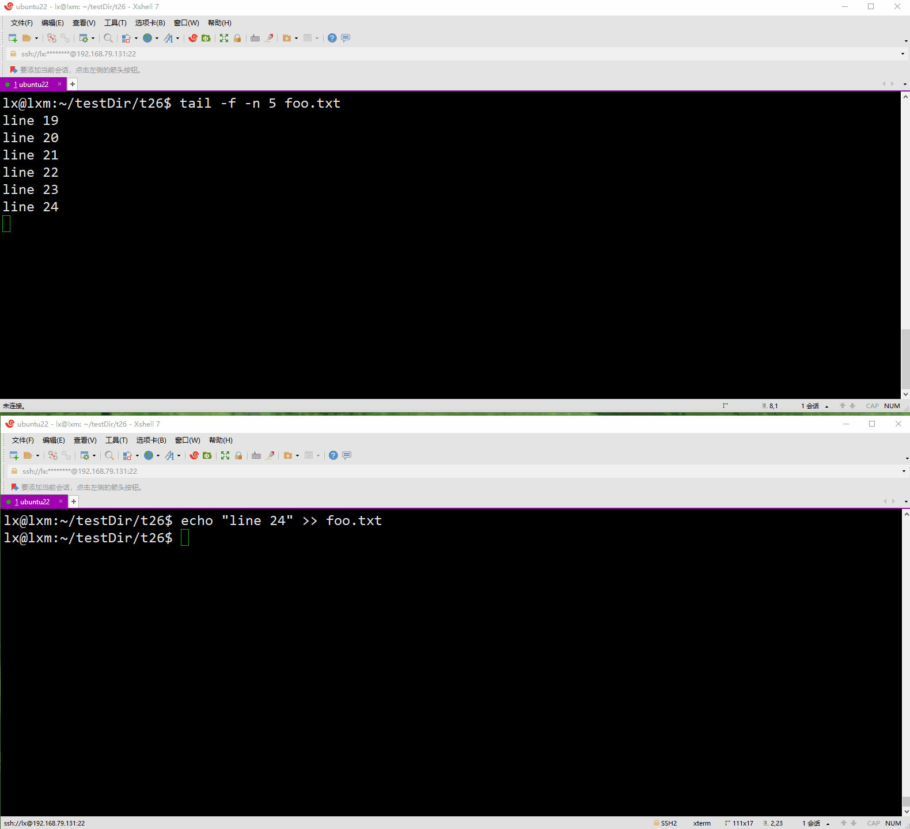
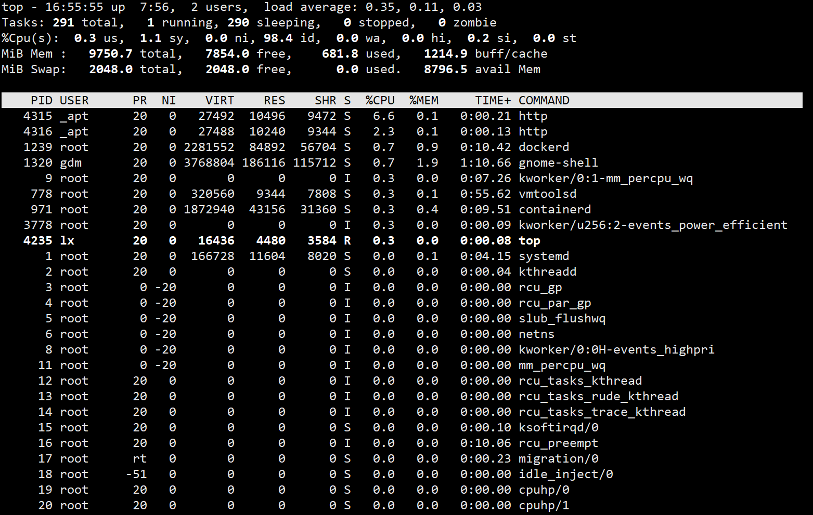

+++
title = "笔记"
date = 2024-04-23T19:48:52+08:00
weight = 1
type = "docs"
description = ""
isCJKLanguage = true
draft = false

+++

## bash shell 基础命令

### 启动 shell

​	系统启动的shell程序取决于用户账户的配置。

​	可通过查看/etc/paswd获知某个用户默认的shell。

​	例如，获取 root用户的默认shell：

```cmd
grep -e ^root /etc/passwd
```


### 使用shell提示符

​	Ubuntu系统的默认shell提示符组成规则：

```
# 普通用户
用户名@主机名:路径$
# root用户
root@主机名:路径#
```

​	CentOS系统的默认shell提示符组成规则：

```
# 普通用户
[用户名@主机名 路径]$
# root用户
[root@主机名 路径]#
```

> 如何获取用户名？
>
> ​	方法1：
>
> ```cmd
> lx@lxm:~$ echo $USER
> lx
> ```
>
> ​	方法2：
>
> ```
> lx@lxm:~$ whoami
> lx
> ```
>
> ​	方法3：
>
> ```cmd
> lx@lxm:~$ logname
> lx
> ```
>
> 

> 如何获取主机名？
>
> ```
> lx@lxm:~$ hostname
> lxm
> ```
>
> 

​	可以根据需要修改提示符。

### 与bash手册交互

#### man

方式1：通过`man`命令

​	`man`命令可以查看`非内置命令`、函数、配置文件的手册页。

​	按`Enter`键，逐行读手册页；

​	按`箭头上下键`，上下逐行读手册页；

​	按`PgUp`或`PgDn`或空格键，逐页读手册页；

​	输入`/`加上`需要搜索的内容`接着按`Enter`键进行搜索，接着可按`n`键跳至下一匹配项，按`N(即 SHIFT + n)`键跳至前一匹配项，按`p`键跳至手册页的第一个匹配项。

​	按`Q`键退出手册页。

​	在命令行执行`man man`这个命令，可在`DESCRIPTION`这里看到手册页的节描述，以下是在Ubuntu 22.04上得到的结果：（其中的1到9被称为`节编号`）

```
man  is  the  system's manual pager.  Each page argument given to man is normally the name of a program, utility or function.  The manual page associated with each of these arguments is then found and displayed.  A section, if provided, will direct man to look only in that section of the manual.The default action is to search in all of the available sections following a pre-defined order (see DEFAULTS), and to show only the first page found, even if page exists in several sections.

	man是系统的手册浏览器。man命令通常接收的参数是程序、实用工具或函数的名称。然后找到并显示与每个参数关联的手册页。如果提供了一个节（section），man将仅在手册的该节中查找。默认操作是按照预定义的顺序（见DEFAULTS）搜索所有可用的节，并且只显示找到的第一页，即使页面存在于多个节中。


The table below shows the section numbers of the manual followed by the types of pages they contain.
	下表显示了手册的节编号，以及它们包含的页面类型。

       1   Executable programs or shell commands 可执行程序或shell命令
       2   System calls (functions provided by the kernel) 系统调用（内核提供的函数）
       3   Library calls (functions within program libraries) 库调用（程序库中的函数）
       4   Special files (usually found in /dev) 特殊文件（通常可在/dev目录中找到）
       5   File formats and conventions, e.g. /etc/passwd 文件格式和约定，例如 /etc/passwd
       6   Games 游戏
       7   Miscellaneous (including macro packages and conventions), e.g. man(7), groff(7), man-pages(7) 杂项（包括宏包和约定）
       8   System administration commands (usually only for root) 系统管理命令（通常只给root用户使用）
       9   Kernel routines [Non standard] 内核例程[非标准]

```

​	`节编号`，在手册页中的第一行所显示的命令名的右边括号中显示。例如：

```cmd
man man
```

其在手册页的第一行是

```cmd
MAN(1)                                                         Manual pager utils                                                         MAN(1)
```

而

```cmd
man wget
```

其在手册页的第一行是

```cmd
WGET(1)                                                             GNU Wget                                                             WGET(1)
```


> 注意
>
> ​	手册页可能包含一些非标准的节编号，例如，`1p`对应于可移植操作系统接口命令，`3n`对应于网络函数。

> 注意
>
> ​	有些命令名可能存在于多个节编号中，可以通过`man -f 命令名`或`whatis 命令名`来查看该命令所在的节编号。例如：
>
> ```cmd
> lx@lxm:~$ whatis passwd
> passwd (1)           - change user password
> passwd (1ssl)        - OpenSSL application commands
> passwd (5)           - the password file
> lx@lxm:~$ man -f passwd
> passwd (1)           - change user password
> passwd (1ssl)        - OpenSSL application commands
> passwd (5)           - the password file
> lx@lxm:~$ whatis hostname
> hostname (7)         - hostname resolution description
> hostname (1)         - show or set the system's host name
> hostname (5)         - Local hostname configuration file
> lx@lxm:~$ man -f hostname
> hostname (7)         - hostname resolution description
> hostname (1)         - show or set the system's host name
> hostname (5)         - Local hostname configuration file
> lx@lxm:~$ whatis wget
> wget (1)             - The non-interactive network downloader.
> lx@lxm:~$ man -f wget
> wget (1)             - The non-interactive network downloader.
> ```
>
> ​	若要查看指定节编号下的手册页，可通过`man 节编号 命令名`来查看。例如：
>
> ```cmd
> lx@lxm:~$ man 7 hostname
> lx@lxm:~$ man 1ssl passwd
> ```
>
> 

#### info

方式2：通过`info`命令，查看命令、函数、配置文件的手册信息

> `man`命令和`info`命令的异同
>
> ​	在 Linux 下，`man` 和 `info` 命令都用于查看命令、函数或配置文件等的手册信息，但它们在展示内容和使用方式上有一些不同之处：
>
> 1. **内容格式**：
>    - `man` 命令显示的是传统的 Unix 手册页，通常以简洁的文本形式呈现，内容较为紧凑，适合快速查阅。
>    - `info` 命令显示的是 GNU 项目的 info 文档，内容结构化更丰富，具有更多的超链接和交互式功能，以节点（node）的形式组织信息。
> 2. **导航方式**：
>    - `man` 命令通常使用键盘上的箭头键、Page Up、Page Down 等来上下翻页，查看手册页的不同部分。
>    - `info` 命令则提供更多的交互式功能，可以使用方向键、Tab 键等进行导航，还支持内部搜索、跳转到不同的节点等。
> 3. **内容结构**：
>    - `man` 手册页通常较为简洁，以线性方式呈现，主要包含命令的简要描述、用法、选项等信息。
>    - `info` 文档结构更为复杂，通常包含更多的章节、子章节和交叉引用，信息更为详尽，适合深入学习和了解。
> 4. **可扩展性**：
>    - `man` 手册页通常由系统安装的软件包提供，更新频率较低，信息相对固定。
>    - `info` 文档则更具有扩展性，GNU 项目的软件通常提供更多的信息和更新，因此可能更适合查阅最新的文档。
>
> 总的来说，`man` 命令更适合快速查找和浏览基本的命令信息，而 `info` 命令则更适合深入学习和了解复杂的软件或工具。

#### help

方式3：通过`命令名 --help`或`help 命令名`获取指定命令的帮助文档

### 浏览文件系统

#### Linux文件系统

​	Windows系统中使用驱动器盘符来标识文件路径，例如：`C:\Users\lx\.gitconfig`、`D:\testFile1.xls`、`E:\testFile2.doc`，可看出可有多个根目录。

​	而Linux系统则将文件存放在虚拟目录的单个目录下，例如：`/home/lx/testFile1.md`、`/tmp/temp.log`，且在Linux中只有一个根目录（即`/`）。

​	在Linux系统中安装的第一块硬盘，被称为`根驱动器`，根驱动器包含了虚拟目录的核心，其他目录要么从这里构建，要么挂载在根驱动器上的特殊目录（这些特殊目录被称为`挂载点`，用于分配给其他存储设备使用，这样出现在其他物理驱动器上的文件或目录，就会出现在这些挂载点目录中）。

> 注意
>
> ​	实际上任何目录都可以作为挂载点，但，通常会选择一些空目录或专为此目的创建的目录作为挂载点。
>
> ​	常见的Linux挂载点有：
>
> - `/`：根目录，用于挂载根文件系统
> - `/boot`：用于挂载引导文件系统
> - `/home`：用于挂载用户主目录
> - `/mnt`：用于临时挂载文件系统
> - `/media`：用于挂载可移动设备（例如USB驱动器、CD、DVD和外部硬盘）
> - `/var`：用于存储可变数据，例如日志文件和缓存
> - `/tmp`：用于存储临时文件

​	可以通过`man hier`命令，来查看系统的文件系统层级，例如在Ubuntu 22.04系统上，`man hier`的信息如下：

```
HIER(7)                                   Linux Programmer's Manual                                  HIER(7)

NAME
       hier - description of the filesystem hierarchy

DESCRIPTION
       A typical Linux system has, among others, the following directories:

       /      This is the root directory.  This is where the whole tree starts.

       /bin   This  directory contains executable programs which are needed in single user mode and to bring
              the system up or repair it.

       /boot  Contains static files for the boot loader.  This directory holds  only  the  files  which  are
              needed  during the boot process.  The map installer and configuration files should go to /sbin
              and /etc.  The operating system kernel (initrd for example) must be located  in  either  /  or
              /boot.

       /dev   Special or device files, which refer to physical devices.  See mknod(1).

       /etc   Contains  configuration  files which are local to the machine.  Some larger software packages,
              like X11, can have their own subdirectories below /etc.  Site-wide configuration files may  be
              placed here or in /usr/etc.  Nevertheless, programs should always look for these files in /etc
              and you may have links for these files to /usr/etc.

       /etc/opt
              Host-specific configuration files for add-on applications installed in /opt.

       /etc/sgml
              This directory contains the configuration files for SGML (optional).

       /etc/skel
              When a new user account is created, files from this directory  are  usually  copied  into  the
              user's home directory.

       /etc/X11
              Configuration files for the X11 window system (optional).

       /etc/xml
              This directory contains the configuration files for XML (optional).

       /home  On  machines  with  home  directories for users, these are usually beneath this directory, di‐
              rectly or not.  The structure of this directory depends on local administration decisions (op‐
              tional).

       /lib   This directory should hold those shared libraries that are necessary to boot the system and to
              run the commands in the root filesystem.

       /lib<qual>
              These directories are variants of /lib on system which support more than one binary format re‐
              quiring separate libraries (optional).

       /lib/modules
              Loadable kernel modules (optional).

       /lost+found
              This directory contains items lost in the filesystem.  These items are usually chunks of files
              mangled as a consequence of a faulty disk or a system crash.

       /media This directory contains mount points for removable media such as  CD  and  DVD  disks  or  USB
              sticks.   On  systems  where more than one device exists for mounting a certain type of media,
              mount directories can be created by appending a digit to the name  of  those  available  above
              starting with '0', but the unqualified name must also exist.

       /media/floppy[1-9]
              Floppy drive (optional).

       /media/cdrom[1-9]
              CD-ROM drive (optional).

       /media/cdrecorder[1-9]
              CD writer (optional).

       /media/zip[1-9]
              Zip drive (optional).

       /media/usb[1-9]
              USB drive (optional).

       /mnt   This  directory is a mount point for a temporarily mounted filesystem.  In some distributions,
              /mnt contains subdirectories intended to  be  used  as  mount  points  for  several  temporary
              filesystems.

       /opt   This directory should contain add-on packages that contain static files.

       /proc  This  is  a mount point for the proc filesystem, which provides information about running pro‐
              cesses and the kernel.  This pseudo-filesystem is described in more detail in proc(5).

       /root  This directory is usually the home directory for the root user (optional).

       /run   This directory contains information which describes the system since it was booted.  Once this
              purpose was served by /var/run and programs may continue to use it.

       /sbin  Like  /bin, this directory holds commands needed to boot the system, but which are usually not
              executed by normal users.

       /srv   This directory contains site-specific data that is served by this system.

       /sys   This is a mount point for the sysfs filesystem, which provides information  about  the  kernel
              like /proc, but better structured, following the formalism of kobject infrastructure.

       /tmp   This directory contains temporary files which may be deleted with no notice, such as by a reg‐
              ular job or at system boot up.

       /usr   This directory is usually mounted from a separate partition.  It should hold  only  shareable,
              read-only data, so that it can be mounted by various machines running Linux.

       /usr/X11R6
              The X-Window system, version 11 release 6 (present in FHS 2.3, removed in FHS 3.0).

       /usr/X11R6/bin
              Binaries  which  belong  to the X-Window system; often, there is a symbolic link from the more
              traditional /usr/bin/X11 to here.

       /usr/X11R6/lib
              Data files associated with the X-Window system.

       /usr/X11R6/lib/X11
              These contain miscellaneous files needed to run X;  Often,  there  is  a  symbolic  link  from
              /usr/lib/X11 to this directory.

       /usr/X11R6/include/X11
              Contains  include  files  needed  for  compiling programs using the X11 window system.  Often,
              there is a symbolic link from /usr/include/X11 to this directory.

       /usr/bin
              This is the primary directory for executable programs.  Most programs executed by normal users
              which  are  not needed for booting or for repairing the system and which are not installed lo‐
              cally should be placed in this directory.

       /usr/bin/mh
              Commands for the MH mail handling system (optional).

       /usr/bin/X11
              is the traditional place to look for X11 executables; on Linux, it usually is a symbolic  link
              to /usr/X11R6/bin.

       /usr/dict
              Replaced by /usr/share/dict.

       /usr/doc
              Replaced by /usr/share/doc.

       /usr/etc
              Site-wide  configuration files to be shared between several machines may be stored in this di‐
              rectory.  However, commands should always reference those  files  using  the  /etc  directory.
              Links from files in /etc should point to the appropriate files in /usr/etc.

       /usr/games
              Binaries for games and educational programs (optional).

       /usr/include
              Include files for the C compiler.

       /usr/include/bsd
              BSD compatibility include files (optional).

       /usr/include/X11
              Include  files for the C compiler and the X-Window system.  This is usually a symbolic link to
              /usr/X11R6/include/X11.

       /usr/include/asm
              Include files which declare some assembler functions.  This used to  be  a  symbolic  link  to
              /usr/src/linux/include/asm.

       /usr/include/linux
              This  contains  information which may change from system release to system release and used to
              be a symbolic link to /usr/src/linux/include/linux to get at operating-system-specific  infor‐
              mation.

              (Note  that  one should have include files there that work correctly with the current libc and
              in user space.  However, Linux kernel source is not designed to be used with user programs and
              does not know anything about the libc you are using.  It is very likely that things will break
              if you let /usr/include/asm and /usr/include/linux point at a random kernel tree.  Debian sys‐
              tems don't do this and use headers from a known good kernel version, provided in the libc*-dev
              package.)

       /usr/include/g++
              Include files to use with the GNU C++ compiler.

       /usr/lib
              Object libraries, including dynamic libraries, plus some executables which usually are not in‐
              voked directly.  More complicated programs may have whole subdirectories there.

       /usr/libexec
              Directory  contains  binaries  for internal use only and they are not meant to be executed di‐
              rectly by users shell or scripts.

       /usr/lib<qual>
              These directories are variants of /usr/lib on system which support more than one binary format
              requiring separate libraries, except that the symbolic link /usr/lib<qual>/X11 is not required
              (optional).

       /usr/lib/X11
              The usual place for data files associated with X programs, and configuration files for  the  X
              system itself.  On Linux, it usually is a symbolic link to /usr/X11R6/lib/X11.

       /usr/lib/gcc-lib
              contains executables and include files for the GNU C compiler, gcc(1).

       /usr/lib/groff
              Files for the GNU groff document formatting system.

       /usr/lib/uucp
              Files for uucp(1).

       /usr/local
              This is where programs which are local to the site typically go.

       /usr/local/bin
              Binaries for programs local to the site.

       /usr/local/doc
              Local documentation.

       /usr/local/etc
              Configuration files associated with locally installed programs.

       /usr/local/games
              Binaries for locally installed games.

       /usr/local/lib
              Files associated with locally installed programs.

       /usr/local/lib<qual>
              These  directories are variants of /usr/local/lib on system which support more than one binary
              format requiring separate libraries (optional).

       /usr/local/include
              Header files for the local C compiler.

       /usr/local/info
              Info pages associated with locally installed programs.

       /usr/local/man
              Man pages associated with locally installed programs.

       /usr/local/sbin
              Locally installed programs for system administration.

       /usr/local/share
              Local application data that can be shared among different architectures of the same OS.

       /usr/local/src
              Source code for locally installed software.

       /usr/man
              Replaced by /usr/share/man.

       /usr/sbin
              This directory contains program binaries for system administration which are not essential for
              the boot process, for mounting /usr, or for system repair.

       /usr/share
              This  directory  contains  subdirectories  with  specific application data, that can be shared
              among different architectures of the same OS.  Often one finds stuff here that used to live in
              /usr/doc or /usr/lib or /usr/man.

       /usr/share/color
              Contains  color  management  information, like International Color Consortium (ICC) Color pro‐
              files (optional).

       /usr/share/dict
              Contains the word lists used by spell checkers (optional).

       /usr/share/dict/words
              List of English words (optional).

       /usr/share/doc
              Documentation about installed programs (optional).

       /usr/share/games
              Static data files for games in /usr/games (optional).

       /usr/share/info
              Info pages go here (optional).

       /usr/share/locale
              Locale information goes here (optional).

       /usr/share/man
              Manual pages go here in subdirectories according to the man page sections.

       /usr/share/man/<locale>/man[1-9]
              These directories contain manual pages for the specific locale in source code  form.   Systems
              which use a unique language and code set for all manual pages may omit the <locale> substring.

       /usr/share/misc
              Miscellaneous data that can be shared among different architectures of the same OS.

       /usr/share/nls
              The message catalogs for native language support go here (optional).

       /usr/share/ppd
              Postscript Printer Definition (PPD) files (optional).

       /usr/share/sgml
              Files for SGML (optional).

       /usr/share/sgml/docbook
              DocBook DTD (optional).

       /usr/share/sgml/tei
              TEI DTD (optional).

       /usr/share/sgml/html
              HTML DTD (optional).

       /usr/share/sgml/mathtml
              MathML DTD (optional).

       /usr/share/terminfo
              The database for terminfo (optional).

       /usr/share/tmac
              Troff macros that are not distributed with groff (optional).

       /usr/share/xml
              Files for XML (optional).

       /usr/share/xml/docbook
              DocBook DTD (optional).

       /usr/share/xml/xhtml
              XHTML DTD (optional).

       /usr/share/xml/mathml
              MathML DTD (optional).

       /usr/share/zoneinfo
              Files for timezone information (optional).

       /usr/src
              Source files for different parts of the system, included with some packages for reference pur‐
              poses.  Don't work here with your own projects, as files below /usr should be read-only except
              when installing software (optional).

       /usr/src/linux
              This  was the traditional place for the kernel source.  Some distributions put here the source
              for the default kernel they ship.  You should probably use  another  directory  when  building
              your own kernel.

       /usr/tmp
              Obsolete.   This  should  be  a link to /var/tmp.  This link is present only for compatibility
              reasons and shouldn't be used.

       /var   This directory contains files which may change in size, such as spool and log files.

       /var/account
              Process accounting logs (optional).

       /var/adm
              This directory is superseded by /var/log and should be a symbolic link to /var/log.

       /var/backups
              Reserved for historical reasons.

       /var/cache
              Data cached for programs.

       /var/cache/fonts
              Locally generated fonts (optional).

       /var/cache/man
              Locally formatted man pages (optional).

       /var/cache/www
              WWW proxy or cache data (optional).

       /var/cache/<package>
              Package specific cache data (optional).

       /var/catman/cat[1-9] or /var/cache/man/cat[1-9]
              These directories contain preformatted manual pages according to their man page section.  (The
              use of preformatted manual pages is deprecated.)

       /var/crash
              System crash dumps (optional).

       /var/cron
              Reserved for historical reasons.

       /var/games
              Variable game data (optional).

       /var/lib
              Variable state information for programs.

       /var/lib/color
              Variable files containing color management information (optional).

       /var/lib/hwclock
              State directory for hwclock (optional).

       /var/lib/misc
              Miscellaneous state data.

       /var/lib/xdm
              X display manager variable data (optional).

       /var/lib/<editor>
              Editor backup files and state (optional).

       /var/lib/<name>
              These directories must be used for all distribution packaging support.

       /var/lib/<package>
              State data for packages and subsystems (optional).

       /var/lib/<pkgtool>
              Packaging support files (optional).

       /var/local
              Variable data for /usr/local.

       /var/lock
              Lock  files  are  placed  in  this  directory.  The naming convention for device lock files is
              LCK..<device> where <device> is the device's name in the filesystem.  The format used is  that
              of  HDU  UUCP lock files, that is, lock files contain a PID as a 10-byte ASCII decimal number,
              followed by a newline character.

       /var/log
              Miscellaneous log files.

       /var/opt
              Variable data for /opt.

       /var/mail
              Users' mailboxes.  Replaces /var/spool/mail.

       /var/msgs
              Reserved for historical reasons.

       /var/preserve
              Reserved for historical reasons.

       /var/run
              Run-time variable files, like files holding process identifiers (PIDs) and logged user  infor‐
              mation (utmp).  Files in this directory are usually cleared when the system boots.

       /var/spool
              Spooled (or queued) files for various programs.

       /var/spool/at
              Spooled jobs for at(1).

       /var/spool/cron
              Spooled jobs for cron(8).

       /var/spool/lpd
              Spooled files for printing (optional).

       /var/spool/lpd/printer
              Spools for a specific printer (optional).

       /var/spool/mail
              Replaced by /var/mail.

       /var/spool/mqueue
              Queued outgoing mail (optional).

       /var/spool/news
              Spool directory for news (optional).

       /var/spool/rwho
              Spooled files for rwhod(8) (optional).

       /var/spool/smail
              Spooled files for the smail(1) mail delivery program.

       /var/spool/uucp
              Spooled files for uucp(1) (optional).

       /var/tmp
              Like /tmp, this directory holds temporary files stored for an unspecified duration.

       /var/yp
              Database files for NIS, formerly known as the Sun Yellow Pages (YP).

CONFORMING TO
       The    Filesystem    Hierarchy    Standard   (FHS),   Version   3.0,   published   March   19,   2015
       ⟨https://refspecs.linuxfoundation.org/fhs.shtml⟩.

BUGS
       This list is not exhaustive; different distributions and systems may be configured differently.

SEE ALSO
       find(1), ln(1), proc(5), file-hierarchy(7), mount(8)

       The Filesystem Hierarchy Standard

COLOPHON
       This page is part of release 5.10 of the Linux man-pages project.  A description of the project,  in‐
       formation   about   reporting   bugs,  and  the  latest  version  of  this  page,  can  be  found  at
       https://www.kernel.org/doc/man-pages/.

Linux                                            2020-06-09                                          HIER(7)
```

​	常见的Linux目录名都是基于[文件系统层级标准（Filesystem Hierarchy Standard，FHS）](https://www.pathname.com/fhs/)。

#### 遍历目录

##### cd

​	`cd 目录路径`：将当前shell会话所在目录切换至指定目录。其中指定的目录路径可以使用`绝对路径（以/开头）`或`相对路径（以.或..或目录名开头）`。

​	`pwd`：获取当前shell会话所在目录。

### 列出文件和目录

#### 显示基本列表

##### ls

​	`ls`：列出指定目录下的文件和目录（按字母排序，且按列排序）；

​	`ls -a`：列出的列表含隐藏文件。

 	`ls -F`：列出的列表会在列表项末尾添加`一个符号`方便用户分辨：

- `/`：表示目录名
- `*`：表示可执行文件
- `@`：表示符号链接
- `|`：表示FIFO文件，即命名管道
- `=`：表示套接字文件
- `>`：表示块设备文件
- `<`：表示字符设备文件

​	`ls -R`：递归列出指定目录下所有子目录和子文件。

​	`ls -i`：列出指定目录下目录名、文件名以及`inode编号`。

#### 显示长列表

##### ls -l

​	`ls -l`：以长列表的形式列出当前目录下的文件和目录。

​	例如：

```cmd
lx@lxm:~$ ls -l
total 212
drwxr-xr-x 2 lx lx  4096  4月 22 19:20 Desktop
drwxr-xr-x 2 lx lx  4096  4月  7 14:34 Documents
drwxr-xr-x 2 lx lx  4096  4月  7 15:52 Downloads
-rw-rw-r-- 1 lx lx    13  4月 21 21:54 hello.txt
-rw-rw-r-- 1 lx lx 34162  4月 24 14:29 infols.txt
-rw-rw-r-- 1 lx lx 19035  4月 24 13:58 manhier.txt
drwxr-xr-x 2 lx lx  4096  4月  7 14:34 Music
drwxr-xr-x 2 lx lx  4096  4月  7 14:34 Pictures
drwxr-xr-x 2 lx lx  4096  4月  7 14:34 Public
drwxrwxr-x 4 lx lx  4096  4月 12 10:49 redis
drwxrwxr-x 2 lx lx  4096  4月 22 15:51 shtool-2.0.8
-rw-rw-r-- 1 lx lx 97033  4月 22 15:46 shtool-2.0.8.tar.gz
drwx------ 6 lx lx  4096  4月 11 20:13 snap
drwxr-xr-x 2 lx lx  4096  4月  7 14:34 Templates
-rw------- 1 lx lx     0  4月 21 13:32 te.q7JjOl
-rwxrw-r-- 1 lx lx   184  4月 18 20:35 test12
-rwxrw-r-- 1 lx lx   180  4月 21 18:54 test4copy.sh
drwxrwxr-x 2 lx lx  4096  4月 23 13:27 testDir
drwxr-xr-x 2 lx lx  4096  4月  7 14:34 Videos
```

其中各列按从左到右分别表示：

1. 文件类型和文件的权限。

   其中文件类型：

   `d`表示目录，

   `-`表示文件，

   `l`表示链接文件，

   `c`表示字符设备，

   `b`表示块设备，

   `p`表示命名管道，

   `s`表示网络套接字

   文件权限从左到右分别是：属主的权限、属组的权限、其他的权限。

2. 文件的硬链接数。

3. 文件的属主。

4. 文件的属组。

5. 文件的大小。

6. 文件上一次修改时间。

7. 文件名或目录名。

> 提示
>
> ​	可以使用`ls -g`来列出除属主之外的列，例如：
>
> ```cmd
> drwxr-xr-x 2 lx  4096  4月 22 19:20 Desktop
> drwxr-xr-x 2 lx  4096  4月  7 14:34 Documents
> drwxr-xr-x 2 lx  4096  4月  7 15:52 Downloads
> -rw-rw-r-- 1 lx    13  4月 21 21:54 hello.txt
> -rw-rw-r-- 1 lx 34162  4月 24 14:29 infols.txt
> -rw-rw-r-- 1 lx 19035  4月 24 13:58 manhier.txt
> drwxr-xr-x 2 lx  4096  4月  7 14:34 Music
> drwxr-xr-x 2 lx  4096  4月  7 14:34 Pictures
> drwxr-xr-x 2 lx  4096  4月  7 14:34 Public
> drwxrwxr-x 4 lx  4096  4月 12 10:49 redis
> drwxrwxr-x 2 lx  4096  4月 22 15:51 shtool-2.0.8
> -rw-rw-r-- 1 lx 97033  4月 22 15:46 shtool-2.0.8.tar.gz
> drwx------ 6 lx  4096  4月 11 20:13 snap
> drwxr-xr-x 2 lx  4096  4月  7 14:34 Templates
> -rw------- 1 lx     0  4月 21 13:32 te.q7JjOl
> -rwxrw-r-- 1 lx   184  4月 18 20:35 test12
> -rwxrw-r-- 1 lx   180  4月 21 18:54 test4copy.sh
> drwxrwxr-x 2 lx  4096  4月 23 13:27 testDir
> drwxr-xr-x 2 lx  4096  4月  7 14:34 Videos
> ```

#### 过滤输出列表

​	可以在`ls`命令上添加过滤条件。

​	可以使用标准通配符（wildcard）：

- `?`：表示任意单个字符；

  例如：

  ```cmd
  lx@lxm:~/testDir/test1$ ls
  fat.txt  feet.txt  fet.txt  fit.txt  foot.txt  foo.txt
  lx@lxm:~/testDir/test1$ ls -l f?t.txt
  -rw-rw-r-- 1 lx lx 6  4月 24 17:44 fat.txt
  -rw-rw-r-- 1 lx lx 6  4月 24 17:42 fet.txt
  -rw-rw-r-- 1 lx lx 6  4月 24 17:44 fit.txt
  ```

  

- `*`：表示零个或多个字符；

  例如：

  ```cmd
  lx@lxm:~/testDir/test1$ ls
  fat.txt  feet.txt  fet.txt  fit.txt  foot.txt  foo.txt
  lx@lxm:~/testDir/test1$ ls -l f*t.txt
  -rw-rw-r-- 1 lx lx 6  4月 24 17:44 fat.txt
  -rw-rw-r-- 1 lx lx 6  4月 24 17:42 feet.txt
  -rw-rw-r-- 1 lx lx 6  4月 24 17:42 fet.txt
  -rw-rw-r-- 1 lx lx 6  4月 24 17:44 fit.txt
  -rw-rw-r-- 1 lx lx 6  4月 24 17:42 foot.txt
  ```

  可以使用`[]`或`[!]`来匹配单个字符，例如：

  ```cmd
  lx@lxm:~/testDir/test1$ ls
  fat.txt  feet.txt  fet.txt  fit.txt  foot.txt  foo.txt
  lx@lxm:~/testDir/test1$ ls -l f[aei]t.txt
  -rw-rw-r-- 1 lx lx 6  4月 24 17:44 fat.txt
  -rw-rw-r-- 1 lx lx 6  4月 24 17:42 fet.txt
  -rw-rw-r-- 1 lx lx 6  4月 24 17:44 fit.txt
  lx@lxm:~/testDir/test1$ ls -l f[!i]t.txt
  -rw-rw-r-- 1 lx lx 6  4月 24 17:44 fat.txt
  -rw-rw-r-- 1 lx lx 6  4月 24 17:42 fet.txt
  lx@lxm:~/testDir/test1$ ls -l f[a-z]t.txt
  -rw-rw-r-- 1 lx lx 6  4月 24 17:44 fat.txt
  -rw-rw-r-- 1 lx lx 6  4月 24 17:42 fet.txt
  -rw-rw-r-- 1 lx lx 6  4月 24 17:44 fit.txt
  ```

  

### 处理文件

#### 创建文件

##### touch

​	用`touch`命令创建空文件，例如：

```cmd
lx@lxm:~/testDir/test2$ touch main.go
lx@lxm:~/testDir/test2$ ls
main.go
```

​	用输出重定向来创建文件，例如：

```cmd
lx@lxm:~/testDir/test2$ echo "hello world" > hello.txt
lx@lxm:~/testDir/test2$ ls
hello.txt  main.go
```


#### 复制文件

##### cp

​	用`cp`命令来复制文件，例如：

```cmd
lx@lxm:~/testDir/test2$ cp hello.txt hello.txt.bak
lx@lxm:~/testDir/test2$ ls
hello.txt  hello.txt.bak  main.go

# 加上 -i 选项，强制shell在遇到已有文件是否进行覆盖
lx@lxm:~/testDir/test2$ ls -l
total 8
-rw-rw-r-- 1 lx lx 12  4月 24 17:55 hello.txt
-rw-rw-r-- 1 lx lx 12  4月 24 17:58 hello.txt.bak
-rw-rw-r-- 1 lx lx  0  4月 24 17:53 main.go
lx@lxm:~/testDir/test2$ cp -i hello.txt hello.txt.bak
cp: overwrite 'hello.txt.bak'? y
lx@lxm:~/testDir/test2$ ls -l
total 8
-rw-rw-r-- 1 lx lx 12  4月 24 17:55 hello.txt
-rw-rw-r-- 1 lx lx 12  4月 24 18:01 hello.txt.bak
-rw-rw-r-- 1 lx lx  0  4月 24 17:53 main.go

# 加上 -R 选项，用于复制整个目录下的所有文件（即包含所有子目录中文件和目录）
# 目的目录已存在的情况1：
lx@lxm:~/testDir$ mkdir test3
lx@lxm:~/testDir$ ls -a test3/
.  ..
lx@lxm:~/testDir$ cp -R ./test2/ ./test3/
lx@lxm:~/testDir$ tree test3
test3
└── test2
    ├── hello.txt
    ├── hello.txt.bak
    └── main.go

# 目的目录已存在的情况2：
lx@lxm:~/testDir$ mkdir test5
lx@lxm:~/testDir$ cp -R ./test2/* ./test5/
lx@lxm:~/testDir$ ls -a test5
.  ..  hello.txt  hello.txt.bak  main.go


# 目的目录不存在的情况1：
lx@lxm:~/testDir$ ls test4
ls: cannot access 'test4': No such file or directory
lx@lxm:~/testDir$ cp -R ./test2/ ./test4/
lx@lxm:~/testDir$ ls -a test4
.  ..  hello.txt  hello.txt.bak  main.go

# 目的目录不存在的情况2：
lx@lxm:~/testDir$ cp -R ./test2/* ./test6/
cp: target './test6/' is not a directory

```


#### 使用命令行补全

​	在命令行中输入文件名或目录名时，可以只输入一些开头的字符（包括中文等字符），若指定路径中`恰好有一个匹配的`文件名或目录名，此时按`Tab`键，即可补全剩余的文件名或目录名。

#### 链接文件

​	有两类文件链接：符号链接（symbolic link 又称软链接）和硬链接（hard link）。

​	创建符号链接，原始文件必须存在，用`ln -s 原始文件路径 新的符号链接文件存放路径`，例如：

```cmd
lx@lxm:~/testDir/test8$ ls -l
total 4
-rw-rw-r-- 1 lx lx 12  4月 24 22:15 hello.txt
lx@lxm:~/testDir/test8$ ln -s hello.txt slink_hello.txt
lx@lxm:~/testDir/test8$ ls -li
total 4
152787 -rw-rw-r-- 1 lx lx 12  4月 24 22:15 hello.txt
152790 lrwxrwxrwx 1 lx lx  9  4月 24 22:16 slink_hello.txt -> hello.txt
```

​	可以发现符号链接文件与原始文件的inode编号、文件大小不一样，进一步说明两者是不同文件。

​	创建硬链接，原始文件也必须存在，用`ln 原始文件路径 新的硬链接文件存放路径`，例如：

```cmd
lx@lxm:~/testDir/test9$ ls -li
total 4
152793 -rw-rw-r-- 1 lx lx 12  4月 24 22:21 hello.txt
lx@lxm:~/testDir/test9$ ln hello.txt hlink_hello.txt
lx@lxm:~/testDir/test9$ ls -li
total 8
152793 -rw-rw-r-- 2 lx lx 12  4月 24 22:21 hello.txt
152793 -rw-rw-r-- 2 lx lx 12  4月 24 22:21 hlink_hello.txt
```

​	可以发现硬链接文件与原始文件的inode编号、文件大小都一样，进一步说明两者是相同的文件。

> 注意
>
> ​	     可以对不同存储设备的文件创建符号链接，
>
> 但，不可以对不同存储设备的文件创建硬链接！
>
> ​	即：硬链接不能跨文件系统，而符号链接可以跨文件系统。

#### 文件重命名

##### mv

​	用`mv 原始文件路径 新文件路径`修改文件名或目录名、移动文件或目录。

​	修改文件名或目录名，例如：

```cmd
lx@lxm:~/testDir/test10$ ls -l
total 4
-rw-rw-r-- 1 lx lx 6  4月 24 22:30 hello.txt
lx@lxm:~/testDir/test10$ mv hello.txt hello.go
lx@lxm:~/testDir/test10$ ls -l
total 4
-rw-rw-r-- 1 lx lx 6  4月 24 22:30 hello.go
```

​	移动文件或目录，例如：

​	（a）移动文件到指定目录下（不修改文件名）

```cmd
lx@lxm:~/testDir/test10$ mkdir ../test11
lx@lxm:~/testDir/test10$ ls -l ../test11
total 0
lx@lxm:~/testDir/test10$ mv hello.go ../test11/
lx@lxm:~/testDir/test10$ ls -l
total 0
lx@lxm:~/testDir/test10$ ls -l ../test11
total 4
-rw-rw-r-- 1 lx lx 6  4月 24 22:30 hello.go
```

​	（b）移动文件到指定目录下（并且修改文件名）

```cmd
lx@lxm:~/testDir/test10$ ls -l
total 0
lx@lxm:~/testDir/test10$ ls -l ../test11
total 4
-rw-rw-r-- 1 lx lx 6  4月 24 22:30 hello.go
lx@lxm:~/testDir/test10$ ls -l
total 0
lx@lxm:~/testDir/test10$ ls -l ../test11
total 4
-rw-rw-r-- 1 lx lx 6  4月 24 22:30 hello.go
lx@lxm:~/testDir/test10$ mv ../test11/hello.go ./hello.txt
lx@lxm:~/testDir/test10$ ls -l ../test11
total 0
lx@lxm:~/testDir/test10$ ls -l
total 4
-rw-rw-r-- 1 lx lx 6  4月 24 22:30 hello.txt
```

​	（c）移动整个目录下的内容到指定目录下（指定目录已经存在的情况 -> 实际则会删除旧目录名，且将其直接移至指定目录下）

```cmd
lx@lxm:~/testDir$ ls -li test12/
total 8
152798 -rw-rw-r-- 1 lx lx  6  4月 24 22:51 hello.txt
152799 -rw-rw-r-- 1 lx lx 12  4月 24 22:51 world.txt
lx@lxm:~/testDir$ ls -li test13/
total 0
lx@lxm:~/testDir$ mv test12 test13
lx@lxm:~/testDir$ ls -li test12/
ls: cannot access 'test12/': No such file or directory
lx@lxm:~/testDir$ ls -li test13/
total 4
152797 drwxrwxr-x 2 lx lx 4096  4月 24 22:52 test12
lx@lxm:~/testDir$ tree ./test13/test12
./test13/test12
├── hello.txt
└── world.txt

0 directories, 2 files
```

​	（d） 移动整个目录下的内容到指定目录下（指定目录还不存在的情况 -> 实际则会删除旧目录名，且将其其下的内容移至指定目录下）

```cmd
lx@lxm:~/testDir$ ls -l test14/
total 8
-rw-rw-r-- 1 lx lx  6  4月 24 22:57 hello.txt
-rw-rw-r-- 1 lx lx 12  4月 24 22:57 world.txt
lx@lxm:~/testDir$ ls -l test15
ls: cannot access 'test15': No such file or directory
lx@lxm:~/testDir$ mv test14 test15
lx@lxm:~/testDir$ ls -l test14
ls: cannot access 'test14': No such file or directory
lx@lxm:~/testDir$ ls -l test15
total 8
-rw-rw-r-- 1 lx lx  6  4月 24 22:57 hello.txt
-rw-rw-r-- 1 lx lx 12  4月 24 22:57 world.txt
```

​	使用`mv -i` 可以在新文件名已经存在，或复制的文件已经存在于指定目录中的情况下给出提示。

​	新文件名已经存在的情况下，进行复制文件：

```cmd
lx@lxm:~/testDir/test15$ ls -l
total 8
-rw-rw-r-- 1 lx lx  6  4月 24 22:57 hello.txt
-rw-rw-r-- 1 lx lx 12  4月 24 22:57 world.txt
lx@lxm:~/testDir/test15$ mv -i hello.txt world.txt
mv: overwrite 'world.txt'? n
lx@lxm:~/testDir/test15$ ls -l
total 8
-rw-rw-r-- 1 lx lx  6  4月 24 22:57 hello.txt
-rw-rw-r-- 1 lx lx 12  4月 24 22:57 world.txt
```

​	要复制的文件名已经存在于指定目录中的情况下，进行复制文件：

```cmd
lx@lxm:~/testDir$ ls -li test15/
total 8
152805 -rw-rw-r-- 1 lx lx 6  4月 24 23:19 hello.txt
152806 -rw-rw-r-- 1 lx lx 6  4月 24 23:19 world.txt
lx@lxm:~/testDir$ ls -li test16/
total 8
152802 -rw-rw-r-- 1 lx lx 18  4月 24 23:06 hello.txt
152803 -rw-rw-r-- 1 lx lx  9  4月 24 23:06 world.txt
lx@lxm:~/testDir$ mv -i test15/* test16/
mv: overwrite 'test16/hello.txt'? y
mv: overwrite 'test16/world.txt'? y
lx@lxm:~/testDir$ ls -li test16/
total 8
152805 -rw-rw-r-- 1 lx lx 6  4月 24 23:19 hello.txt
152806 -rw-rw-r-- 1 lx lx 6  4月 24 23:19 world.txt
lx@lxm:~/testDir$ ls -li test15/
total 0
```


#### 删除文件

##### rm

​	用`rm 要删除的文件路径`来删除已有文件，例如：

```cmd
lx@lxm:~/testDir/t17$ ls -a
.  ..  foo.go
lx@lxm:~/testDir/t17$ rm foo.go
lx@lxm:~/testDir/t17$ ls -a
.  ..
lx@lxm:~/testDir/t17$ 
```

​	用`rm -i 要删除的文件路径`可以在删除时得到提示，这也是推荐的好习惯，例如：

```cmd
lx@lxm:~/testDir$ ls -a t17/
.  ..  foo.go
lx@lxm:~/testDir$ rm -i ./t17/foo.go 
rm: remove regular empty file './t17/foo.go'? y
lx@lxm:~/testDir$ ls -a t17/
.  ..
```

​	用`rm -f 要删除的文件路径`可以强制删除指定文件，`但千万小心，防止误删了文件`！例如：

```cmd
lx@lxm:~/testDir$ ls -a t17/
.  ..  foo.go
lx@lxm:~/testDir$ rm -f ./t17/foo.go 
lx@lxm:~/testDir$ ls -a t17/
.  ..
```


### 管理目录

#### 创建目录 

##### mkdir

​	用`mkdir 要创建的目录路径`来创建空目录，例如：

```cmd
lx@lxm:~/testDir$ mkdir t18
lx@lxm:~/testDir$ ls -l t18
total 0
lx@lxm:~/testDir$ ls -dl t18
drwxrwxr-x 2 lx lx 4096  4月 25 09:25 t18
```

​	用`mkdir -p 要创建的目录路径`来批量创建目录和子目录，例如：

```cmd
lx@lxm:~/testDir$ ls -dl t19
ls: cannot access 't19': No such file or directory
lx@lxm:~/testDir$ mkdir -p t19/t1901/t19001
lx@lxm:~/testDir$ tree t19
t19
└── t1901
    └── t19001

2 directories, 0 files
```


#### 删除目录

##### rmdir

​	用`rmdir 要删除的空目录路径`来删除指定空目录，例如：

```cmd
lx@lxm:~/testDir$ ls -l t20
total 0
lx@lxm:~/testDir$ rmdir t20
lx@lxm:~/testDir$ ls -l t20
ls: cannot access 't20': No such file or directory
```

##### rm

​	用`rm -r 要删除的目录路径`或`rm -R 要删除的目录路径`来向下进入指定目录删除其其中的内容和目录，例如：

```cmd
lx@lxm:~/testDir$ ls t21
bar.go  foo.go
lx@lxm:~/testDir$ rm -r t21
lx@lxm:~/testDir$ ls t21
ls: cannot access 't21': No such file or directory
```

​	用`rm -ir 要删除的目录路径`或`rm -iR 要删除的目录路径`来向下进入指定目录删除其其中的内容和目录，但删除前给出提示，例如：

```cmd
lx@lxm:~/testDir$ ls t22
bar.go  foo.go
lx@lxm:~/testDir$ rm -ir t22
rm: descend into directory 't22'? y
rm: remove regular empty file 't22/bar.go'? y
rm: remove regular empty file 't22/foo.go'? y
rm: remove directory 't22'? y
lx@lxm:~/testDir$ ls t22
ls: cannot access 't22': No such file or directory

lx@lxm:~/testDir$ ls t23
bar.go  foo.go
lx@lxm:~/testDir$ rm -iR t23
rm: descend into directory 't23'? y
rm: remove regular empty file 't23/bar.go'? y
rm: remove regular empty file 't23/foo.go'? y
rm: remove directory 't23'? y
lx@lxm:~/testDir$ ls t23
ls: cannot access 't23': No such file or directory
```


### 查看文件内容

#### 查看文件类型

##### file

​	用`file 文件或目录路径`来查看指定文件的类型，例如：

```cmd
152812 -rw-rw-r-- 1 lx lx   51  4月 25 09:46 bar.sh
152811 -rw-rw-r-- 2 lx lx   73  4月 25 09:44 foo.go
152811 -rw-rw-r-- 2 lx lx   73  4月 25 09:44 hlink_foo.go
152810 lrwxrwxrwx 1 lx lx   10  4月 25 09:47 slink_foo.go -> t24/foo.go
152815 drwxrwxr-x 2 lx lx 4096  4月 25 09:47 t2401
lx@lxm:~/testDir/t24$ file bar.sh
bar.sh: Bourne-Again shell script, ASCII text executable
lx@lxm:~/testDir/t24$ file foo.go 
foo.go: C source, ASCII text
lx@lxm:~/testDir/t24$ file hlink_foo.go 
hlink_foo.go: C source, ASCII text
lx@lxm:~/testDir/t24$ file slink_foo.go 
slink_foo.go: broken symbolic link to t24/foo.go
lx@lxm:~/testDir/t24$ file t2401
t2401: directory
```


#### 查看整个文件

##### cat

​	用`cat 文件路径`来查看文件中的内容，例如：

```cmd
lx@lxm:~/testDir/t25$ ls
bar.sh  foo.go  hlink_foo.go  slink_foo.go  t2401
lx@lxm:~/testDir/t25$ cat foo.go
package main

import "fmt"

func main() {
	fmt.Println("Hello World!")
}
```

​	用`cat -n 文件路径`来查看文件中的内容，并加上行号，例如：

```cmd
lx@lxm:~/testDir/t25$ cat -n foo.go
     1	package main
     2	
     3	import "fmt"
     4	
     5	func main() {
     6		fmt.Println("Hello World!")
     7	}
```

##### more

​	用`more 文件路径`来查看文件中的内容，但会按页进行展示，按`空格`键或`PgUp`、`PgDn`键进行翻页，按`Enter`键进行逐行查看，按`q`键退出查看。

##### less

​	用`less 文件路径`来查看文件中的内容，但会按页进行展示，按`空格`键或`PgUp`、`PgDn`键进行翻页，按`Enter`键进行逐行查看，按`q`键退出查看，同时还可以使用上下箭头进行逐行查看，以及进行高级搜索（输入`/要搜索的内容`，再按`Enter`进行搜索，按`n`键跳至下一匹配项所在行，按`N（即Shift + n）`跳至上一匹配项所在行，按`p`键）。


#### 查看部分文件

##### tail

​	用`tail 文件路径`来查看部分文件内容，默认显示文件最后10行，例如：

```cmd
xxxxxxxxxx136 1lx@lxm:~/testDir/t26$ cat foo.txt 2line 13line 24line 35line 46line 57line 68line 79line 810line 911line 1012line 1113line 1214line 1315line 1416line 1517line 1618line 1719line 1820line 1921line 2022line 2123line 2224line 2325lx@lxm:~/testDir/t26$ tail foo.txt 26line 1427line 1528line 1629line 1730line 1831line 1932line 2033line 2134line 2235line 23	
```

​	用`tail -n 正整数 文件路径`或 `tail -正整数 文件路径`来查看部分文件内容，显示文件最后`正整数`行，例如：

```cmd
lx@lxm:~/testDir/t26$ tail -n 5 foo.txt 
line 19
line 20
line 21
line 22
line 23
lx@lxm:~/testDir/t26$ tail -5 foo.txt 
line 19
line 20
line 21
line 22
line 23
```

​	用`tail -f 文件路径`来实时追踪查看部分文件内容，显示文件最后几行，例如：

​	先在一个命令行窗口中使用`tail -f foo.txt`，然后在另个命令行窗口中往`foo.txt`文件追加几行内容：



##### head

​	用`head 文件路径`来查看部分文件内容，默认显示文件开头10行，例如：

```cmd
lx@lxm:~/testDir/t26$ head foo.txt
line 1
line 2
line 3
line 4
line 5
line 6
line 7
line 8
line 9
line 10
```

​	用`head -n 正整数 文件路径`或 `head -正整数 文件路径`来查看部分文件内容，显示文件开头`正整数`行，例如：

```cmd
lx@lxm:~/testDir/t26$ head -n 5 foo.txt
line 1
line 2
line 3
line 4
line 5
lx@lxm:~/testDir/t26$ head -5 foo.txt
line 1
line 2
line 3
line 4
line 5
```


## 更多的bash shell 命令

### 监测程序

#### 探查进程

##### ps

​	`ps`命令默认只显示运行在当前终端中属于当前用户的进程，例如：

```cmd
lx@lxm:~$ ps
    PID TTY          TIME CMD
   2058 pts/0    00:00:00 bash
   3022 pts/0    00:00:00 ps
```

​	其中PID表示进程ID（process ID，PID），TTY表示该进程运行所在的终端，TIME表示该进程占用的CPU时间，CMD表示启动该进程的程序名称或命令。

###### Unix风格

​	`ps -l`命令，（`-l`选项，显示长列表）也是默认只显示运行在当前终端中属于当前用户的进程，但会比直接使用`ps`命令多显示几列，例如：

```cmd
lx@lxm:~$ ps -l
F S   UID     PID    PPID  C PRI  NI ADDR SZ WCHAN  TTY          TIME CMD
0 S  1000    2058    2057  0  80   0 -  3656 do_wai pts/0    00:00:00 bash
0 R  1000    3445    2058  0  80   0 -  3941 -      pts/0    00:00:00 ps
```

​	其中

- F：表示内核分配给该进程的系统标志

- S：表示该进程的状态，有以下几种形式：

  O：代表正在运行；

  S：代表在休眠；

  R：代表可运行，正等待运行；

  Z：代表僵化，已终止但找不到其父进程；

  T：代表停止。
  
- UID：表示启动该进程的用户ID

- PID：表示该进程ID

- PPID：表示该进程的父进程ID

- C：表示该进程生命期中的CPU利用率

- PRI：Priority，表示该进程的优先级（数字越大，优先级越低）

- NI：Nice Value，表示该进程的谦让度，用于决定优先级

- ADDR：Address，表示该进程的内存地址

- SZ：Size，表示该进程被换出时所需交换空间的大致大小

- WCHAN：Wait Channel，该进程休眠的内核函数地址

- TTY：Teletype，表示该进程运行所在的终端

- TIME：表示该进程累计占用的CPU时间

- CMD：表示启动该进程的程序名称或命令

​	`ps -ef`命令，（`-e`选项，用于显示所有进程；`-f`选项，用于显示完整格式的输出，有点矛盾，因为`-F`选项比`-f`选项显示更多列）显示系统中运行的所有进程，例如：

```cmd
lx@lxm:~$ ps -ef | head -10
UID          PID    PPID  C STIME TTY          TIME CMD
root           1       0  0 08:59 ?        00:00:03 /sbin/init splash
root           2       0  0 08:59 ?        00:00:00 [kthreadd]
root           3       2  0 08:59 ?        00:00:00 [rcu_gp]
root           4       2  0 08:59 ?        00:00:00 [rcu_par_gp]
root           5       2  0 08:59 ?        00:00:00 [slub_flushwq]
root           6       2  0 08:59 ?        00:00:00 [netns]
root           8       2  0 08:59 ?        00:00:00 [kworker/0:0H-events_highpri]
root           9       2  0 08:59 ?        00:00:05 [kworker/0:1-events]
root          11       2  0 08:59 ?        00:00:00 [mm_percpu_wq]
```

  	其中，

- STIME：Start Time，该进程启动时的系统时间

  	`ps -eF`命令，（`-F`选项，显示更多的额外输出）显示系统中运行的所有进程，但比`ps -ef`多显示几列，例如：

```
lx@lxm:~$ ps -eF | head -10
UID          PID    PPID  C    SZ   RSS PSR STIME TTY          TIME CMD
root           1       0  0 41682 11604   1 08:59 ?        00:00:03 /sbin/init splash
root           2       0  0     0     0   2 08:59 ?        00:00:00 [kthreadd]
root           3       2  0     0     0   0 08:59 ?        00:00:00 [rcu_gp]
root           4       2  0     0     0   0 08:59 ?        00:00:00 [rcu_par_gp]
root           5       2  0     0     0   0 08:59 ?        00:00:00 [slub_flushwq]
root           6       2  0     0     0   0 08:59 ?        00:00:00 [netns]
root           8       2  0     0     0   0 08:59 ?        00:00:00 [kworker/0:0H-events_highpri]
root           9       2  0     0     0   0 08:59 ?        00:00:06 [kworker/0:1-events]
root          11       2  0     0     0   0 08:59 ?        00:00:00 [mm_percpu_wq]
```

​	其中，

- RSS：Resident Set Size，表示该进程在未被交换出时占用的物理内存大小
- PSR：Processor (CPU) Affinity，表示该进程绑定的处理器编号，在多核系统中，处理器的核心编号通常从`0`开始

​	`ps -o format`命令，仅显示由`format`指定的列，例如：

```cmd
lx@lxm:~$ ps -o uid,pid,cmd,time
  UID     PID CMD                             TIME
 1000    2058 -bash                       00:00:00
 1000    3553 ps -o uid,pid,cmd,time      00:00:00
```

​	可以指定的列有：`uid,pid,ppid,c,sz,rss,psr,stime,tty,time,cmd,pri,ni,addr,wchan`等等

###### BSD风格

​	`ps T`命令，显示与当前终端关联的所有进程，例如：

```cmd
lx@lxm:~$ ps T
    PID TTY      STAT   TIME COMMAND
   2058 pts/0    Ss     0:00 -bash
   3554 pts/0    R+     0:00 ps T
```

​	`ps a`命令，显示与任意终端关联的所有进程，例如：

```cmd
lx@lxm:~$ ps a | head -10
    PID TTY      STAT   TIME COMMAND
   1204 tty1     Ssl+   0:00 /usr/libexec/gdm-wayland-session dbus-run-session -- gnome-session --autostart /usr/share/gdm/greeter/autostart
   1236 tty1     S+     0:00 dbus-run-session -- gnome-session --autostart /usr/share/gdm/greeter/autostart
   1237 tty1     S+     0:00 dbus-daemon --nofork --print-address 4 --session
   1238 tty1     Sl+    0:00 /usr/libexec/gnome-session-binary --autostart /usr/share/gdm/greeter/autostart
   1320 tty1     Sl+    1:04 /usr/bin/gnome-shell
   1507 tty1     Sl+    0:00 /usr/libexec/at-spi-bus-launcher
   1516 tty1     S+     0:00 /usr/bin/dbus-daemon --config-file=/usr/share/defaults/at-spi2/accessibility.conf --nofork --print-address 11 --address=unix:path=/run/user/128/at-spi/bus
   1649 tty1     S+     0:00 /usr/bin/Xwayland :1024 -rootless -noreset -accessx -core -auth /run/user/128/.mutter-Xwaylandauth.23BJM2 -listen 4 -listen 5 -displayfd 6 -initfd 7
   1723 tty1     Sl+    0:00 /usr/libexec/xdg-permission-store
```

​	`ps g`命令，显示包括控制进程在内的所有进程，例如：

```cmd
lx@lxm:~$ ps g
    PID TTY      STAT   TIME COMMAND
   2058 pts/0    Ss     0:00 -bash
   2701 pts/1    Ss+    0:00 -bash
   3592 pts/0    R+     0:00 ps g
```

​	`ps r`命令，仅显示运行中的进程，例如：

```cmd
lx@lxm:~$ ps r
    PID TTY      STAT   TIME COMMAND
   3593 pts/0    R+     0:00 ps r
```

​	`ps l`命令，显示长列表，例如：

```cmd
lx@lxm:~$ ps l
F   UID     PID    PPID PRI  NI    VSZ   RSS WCHAN  STAT TTY        TIME COMMAND
0  1000    2058    2057  20   0  15140  6144 do_wai Ss   pts/0      0:00 -bash
0  1000    2701    2700  20   0  14624  5760 do_wai Ss   pts/1      0:00 -bash
0  1000    3596    2701  20   0  16304  4352 do_sel S+   pts/1      0:00 top
0  1000    3602    2058  20   0  15764  3456 -      R+   pts/0      0:00 ps l
```

​	其中，

- F：内核分配给该进程的系统标志，常见的值有：

  0：

  1：forked but didn't exec

  4：used super-user privileges

- VSZ：表示该进程占用的虚拟内存大小（以KB为单位）

- STAT：表示当前进程状态的多字符状态码，可能值有：

  `<`：该进程以高优先级运行

  N：该进程以低优先级运行

  L：该进程有锁定在内存中的页面

  s：该进程有控制进程

  l：该进程拥有多线程

  +：该进程在前台运行

###### GNU风格

​	`ps --forest`命令，用层级结构显示出进程和父进程之间的关系，例如：

```cmd
lx@lxm:~$ bash
lx@lxm:~$ bash
lx@lxm:~$ bash
lx@lxm:~$ ps --forest
    PID TTY          TIME CMD
   2058 pts/0    00:00:00 bash
   3752 pts/0    00:00:00  \_ bash
   3758 pts/0    00:00:00      \_ bash
   3764 pts/0    00:00:00          \_ bash
   3770 pts/0    00:00:00              \_ ps
```

​	`ps --headers`命令，在每页输出中都显示列名，例如：

```cmd
ps -ef --headers
```

​	`ps --format format`命令，仅显示由`format`指定的列，例如：

```cmd
ps --format uid,pid,ppid,c,sz,rss,psr,stime,tty,time,cmd,pri,ni,addr,wchan
```

​	可以指定的列有：`uid,pid,ppid,c,sz,rss,psr,stime,tty,time,cmd,pri,ni,addr,wchan`等等

#### 实时监测进程

​	`top`命令，实时显示进程信息，例如：

```cmd
top
```



​	可按`PgUp`、`PgDn`键进行翻页查看，按`q`键退出。

​	其中，

- PID：表示该进程ID
- USER：表示该进程的属主的用户名
- PR：表示该进程的优先级，可能值为`[-20, 19]`
- NI：表示进程的谦让度
- VIRT：表示进程占用的虚拟内存总量
- RES：表示该进程占用的物理内存总量
- SHR：表示该进程和其他进程共享的内存总量
- S：表示该进程的状态，D代表可中断的休眠，R代表运行，S代表休眠，T代表被跟踪或停止，Z代表僵化
- `%CPU`：表示该进程使用的CPU时间比例
- `%MEM`：表示该进程使用的可用物理内存比例
- TIME+：表示自该进程启动到目前为止所占用的CPU时间总量
- COMMAND：表示该进程所对应的命令行名称，也就是启动的程序名。

#### 结束进程

##### kill

​	`kill 进程ID列表`命令，默认向指定进程发送TERM信号。

> 注意
>
> ​	只能是进程的属主或root用户，才能向该进程发送信号。

​	`kill -l` 或 `kill -L`可显示信号列表，也可翻译信号的名称，例如：

```cmd
lx@lxm:~$ kill -l
 1) SIGHUP	 2) SIGINT	 3) SIGQUIT	 4) SIGILL	 5) SIGTRAP
 6) SIGABRT	 7) SIGBUS	 8) SIGFPE	 9) SIGKILL	10) SIGUSR1
11) SIGSEGV	12) SIGUSR2	13) SIGPIPE	14) SIGALRM	15) SIGTERM
16) SIGSTKFLT	17) SIGCHLD	18) SIGCONT	19) SIGSTOP	20) SIGTSTP
21) SIGTTIN	22) SIGTTOU	23) SIGURG	24) SIGXCPU	25) SIGXFSZ
26) SIGVTALRM	27) SIGPROF	28) SIGWINCH	29) SIGIO	30) SIGPWR
31) SIGSYS	34) SIGRTMIN	35) SIGRTMIN+1	36) SIGRTMIN+2	37) SIGRTMIN+3
38) SIGRTMIN+4	39) SIGRTMIN+5	40) SIGRTMIN+6	41) SIGRTMIN+7	42) SIGRTMIN+8
43) SIGRTMIN+9	44) SIGRTMIN+10	45) SIGRTMIN+11	46) SIGRTMIN+12	47) SIGRTMIN+13
48) SIGRTMIN+14	49) SIGRTMIN+15	50) SIGRTMAX-14	51) SIGRTMAX-13	52) SIGRTMAX-12
53) SIGRTMAX-11	54) SIGRTMAX-10	55) SIGRTMAX-9	56) SIGRTMAX-8	57) SIGRTMAX-7
58) SIGRTMAX-6	59) SIGRTMAX-5	60) SIGRTMAX-4	61) SIGRTMAX-3	62) SIGRTMAX-2
63) SIGRTMAX-1	64) SIGRTMAX	
lx@lxm:~$ man kill
lx@lxm:~$ kill -l 1
HUP
lx@lxm:~$ kill -l 2
INT
```

​	`kill -s 信号名称 进程ID列表` 或 `kill -信号 进程ID列表`命令，可以给指定进程发送特定信号。

##### pkill


### 监测磁盘空间

#### 挂载存储设备

#### 使用df命令

#### 使用du命令

### 处理数据文件

#### 数据排序

#### 数据搜索

#### 数据压缩

#### 数据归档

## 理解shell


## Linux环境变量


## 理解Linux文件权限


## 管理文件系统


## 安装软件


## 构建基础脚本


## 结构化命令


## 更多的结构化命令


## 处理用户输入


## 呈现数据


## 脚本控制


## 创建函数


## 图形化桌面环境中的脚步


## 初识 sed 和 gawk


## 正则表达式


## sed 进阶


## gawk 进阶


## 使用其他 shell


## 编写简单的脚本实用工具


